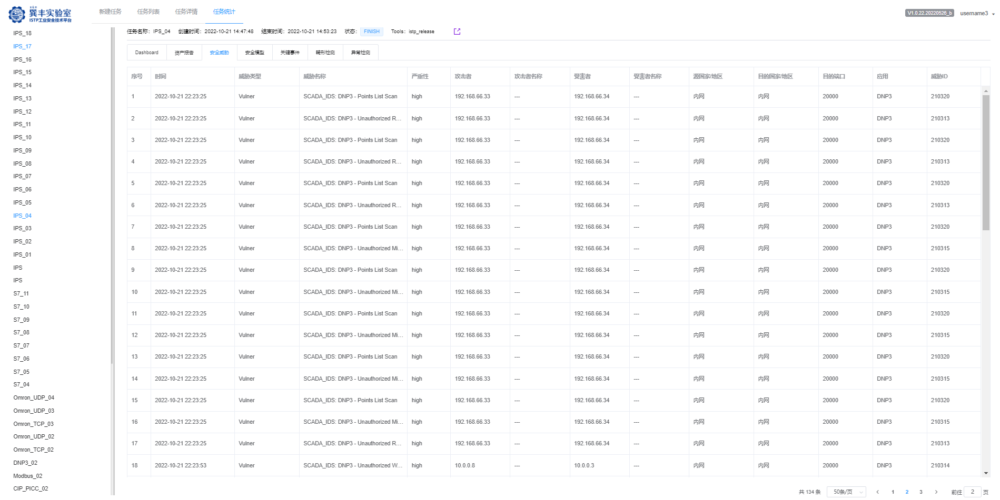

# 1. IPS-ISTP内网平台与竞品对比报告

## 1.1. ISTP内网平台IPS入侵检测能力

### 1.1.1. 测试范围

ISTP内网平台支持31+个厂商，其中漏洞影响31+款硬件设备，漏洞影响32+款软件设备，漏洞涉及8+种协议类型的IPS入侵检测能力。

ISTP内网平台目前不支持34+个厂商，其中漏洞影响21+款硬件设备，漏洞影响33+款软件设备，漏洞涉及8+种协议类型的IPS入侵检测能力。

测试IPS入侵检测覆盖的具体测试范围见下表。

| 序号 | 硬件设备                          | 软件设备                            | 协议        |
|------|-----------------------------------|-------------------------------------|-------------|
| 1    | ABB.AC500系列                     | CoDeSys                             | BACNET      |
| 2    | Beckhoff.twincat                  | CX-ONEV4.5                          | DNP3        |
| 3    | GE.PACSystem RX3i                 | FameView                            | ENIP        |
| 4    | GE.RX7i                           | ForceControl                        | FINS        |
| 5    | Honeywell.HC900-C30               | GE.Software.Proficy_Machine_Edition | Modbus      |
| 6    | MITSUBISHI.FX3U_16M               | Golden FTP                          | Modbus-UMAS |
| 7    | MITSUBISHI.FX5U                   | ICONICS.WebHMI                      | PCOM        |
| 8    | Mitsubishi.Q02U                   | Ifix                                | S7          |
| 9    | Mitsubishi.Q03UDECPU              | IGSS SEIG v9                        |             |
| 10   | Modicon系列M340                   | KingScada                           |             |
| 11   | NM220MCU                          | Kingview                            |             |
| 12   | Omron.CJ2M                        | MACH3                               |             |
| 13   | OMRON.CP1H                        | MACS                                |             |
| 14   | Phoenix ILC 150 ETH               | MICROSYS.PROMOTIC                   |             |
| 15   | RockWell.ControlLogix.1756-EN2T_D | PcVue.SCADA                         |             |
| 16   | RockWell.L33ER                    | PredatorCNCEditor                   |             |
| 17   | RockWell.MicroLogix_1400          | RealInfo                            |             |
| 18   | Schneider.M580_M580               | RealWin.SCADA                       |             |
| 19   | Schneider.Quantum140_CPU_65150    | Rockwell.Software.RSLogix 5000V19CN |             |
| 20   | Schneider PLC ETY Series          | RSLogix5000                         |             |
| 21   | Siemens.CPU1215C                  | Schneider.CitectSCADA               |             |
| 22   | Siemens.CPU416F                   | Schneider.InduSoft Web Studio       |             |
| 23   | Siemens.CPU_314C-2_PNDP           | Schneider.ModbusDriverSuite v3.4    |             |
| 24   | Siemens.CPU_315-2                 | Schneider SEIG SCADA                |             |
| 25   | Siemens.S7-1200                   | Siemens FactoryLink 8               |             |
| 26   | Siemens.S7-300                    | Siemens.DriveMonitor                |             |
| 27   | Siemens.S7_200Smart               | Siemens.Snap7                       |             |
| 28   | 和利时.K系列DCS系统K-CU11 A.1.0   | Solid_Edge                          |             |
| 29   | 和利时.LK202                      | WebAccess.                          |             |
| 30   | 和利时.LK202 2.3.8B               | WinProladder                        |             |
| 31   | 南大傲拓.Nano_10 r81              | Zscada                              |             |
| 32   |                                   | 世纪星组态软件                      |             |

### 1.1.2. 测试结果

上述IPS入侵检测能力已展示到ISTP内网服务平台中（平台地址：<http://test-istp.qianxin-inc.cn>
），目前识别结果如下图所示。

图 IPS识别能力

## 1.2. 竞品IPS入侵检测能力

针对上述IPS分别在5款竞品上测试，并分析5款竞品对上述IPS入侵检测的支持情况，具体如下。

注：5款竞品分别为

1)  威努特.工控安全监测与审计系统.MA5612

2)  六方云.工业审计系统 LinSec-A2000

3)  绿盟.工控安全审计系统（SAS-ICSNX3-310A-C-NDE-02）

4)  启明星辰.天阗工控安全监测与审计系统NT3000-ICS300-HD

5)  长扬科技.工业监测审计系统INA-1000X-2F4E

### 1.2.1. 威努特IPS入侵检测能力

威努特不支持IPS入侵检测

### 1.2.2. 六方云IPS入侵检测能力

六方云上报的入侵事件告警中包含21个工业相关入侵规则，其中包含10个恶意攻击、11个敏感操作（关键事件），如下图所示。

### 1.2.3. 绿盟IPS入侵检测能力

绿盟上报的入侵事件告警中包含27个工业相关入侵规则其中6个恶意攻击，21个敏感操作-关键事件；另外12个均为IT相关入侵规则，如下图所示。

### 1.2.4. 长扬科技IPS入侵检测能力

长扬科技上报的入侵事件告警中包含6个工业相关入侵规则，另外包含2个DDOS告警（DDOS
UDP FLOOD和DDOS SYNC FLOOD）和1个端口扫描告警，如下图所示。

### 1.2.5. 启明星辰IPS入侵检测能力

启明星辰上报的入侵事件告警中包含13个工业相关入侵规则，其中包含2个恶意攻击，11个敏感操作-关键事件；另外11个均为IT相关入侵规则，如下图所示

## 1.3. ISTP内网平台和竞品能力对比分析

基于上述测试结果，IPS入侵检测能力由强到弱，依次为ISTP\>绿盟\>启明星辰\>六方云\>长扬科技\>威努特，对比分析结果见下表。

| **ISTP与竞品** | **检测工控漏洞数** | **检测IT漏洞数** | **影响设备/软件数** | **影响协议数** |
|----------------|--------------------|------------------|---------------------|----------------|
| 威努特         | /                  | /                | /                   | /              |
| 六方云         | 21                 | /                | 3/6                 | 1              |
| 绿盟           | 27                 | 12               | 4/3                 | /              |
| 长扬科技       | 6                  | 3                | 0/2                 | /              |
| 启明星辰       | 13                 | 11               | 5/0                 | /              |
| ISTP           | 230                | 0                | 31/32               | 8              |
