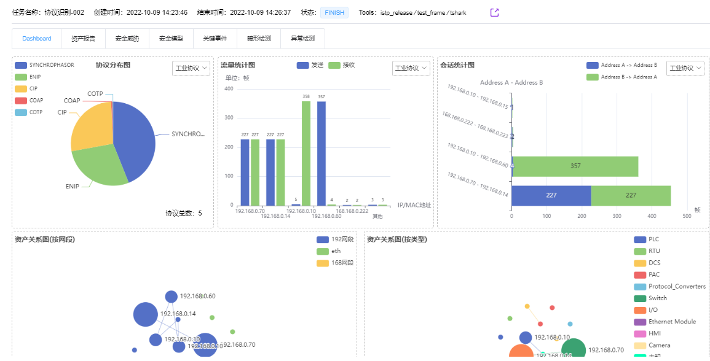
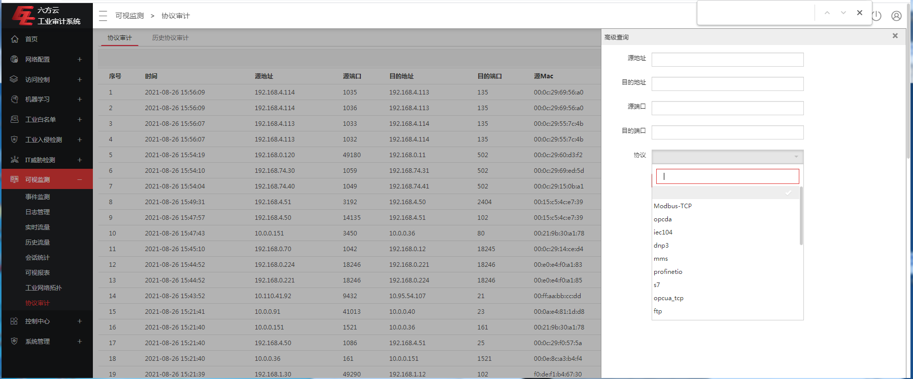
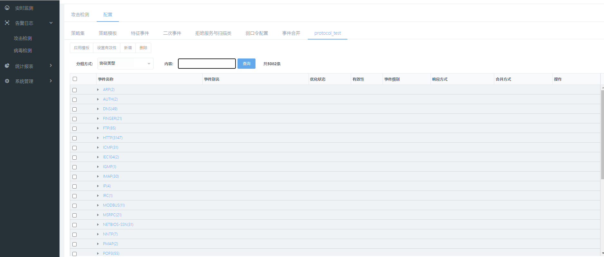

# 1. 协议识别-ISTP内网平台与竞品对比报告

## 1.1. ISTP内网平台协议识别能力

### 1.1.1. 测试范围

针对ISTP内网平台协议识别的测试范围覆盖129种协议，具体见下表。

| **ID** | **协议名称**                 |
|--------|------------------------------|
| 1      | 853协议                      |
| 2      | ATG                          |
| 3      | BACnet协议                   |
| 4      | Beckhoff_AMS_ADS             |
| 5      | C37.118_1PMU_TCP             |
| 6      | C37.118_1PMU_UDP             |
| 7      | CDP                          |
| 8      | CIP协议                      |
| 9      | CoAP协议                     |
| 10     | COTP协议                     |
| 11     | CSPv4_2222                   |
| 12     | CSPv4_6000                   |
| 13     | DHCP协议                     |
| 14     | DICOM_Echo                   |
| 15     | DNP3                         |
| 16     | DNS_UDP协议                  |
| 17     | Echo_TCP                     |
| 18     | ENIP_UDP                     |
| 19     | ENIP协议                     |
| 20     | EtherCAT_L2                  |
| 21     | FF_FMS                       |
| 22     | FF_LR_UDP协议                |
| 23     | FF_SM                        |
| 24     | Focas协议                    |
| 25     | FTP协议                      |
| 26     | GDW_376.1协议                |
| 27     | GE_EGD协议                   |
| 28     | GE_SRTP协议                  |
| 29     | Gryphon                      |
| 30     | HartIP_TCP                   |
| 31     | HartIP_UDP                   |
| 32     | HL7                          |
| 33     | HollySys_DCS_MACS协议        |
| 34     | HollySys_LK-UDP_6000         |
| 35     | HollySys_PLC                 |
| 36     | HoneyWell                    |
| 37     | HoneyWell_FTE                |
| 38     | HSRP                         |
| 39     | HTTP                         |
| 40     | ICCP                         |
| 41     | IEC103协议                   |
| 42     | IEC60870-5-104协议           |
| 43     | IEC61850-GOOSE协议           |
| 44     | IEC61850-MMS协议             |
| 45     | IEC61850-SMV协议             |
| 46     | ifix2ifix                    |
| 47     | ISAKMP                       |
| 48     | KerberosAuthenticationSystem |
| 49     | KingView_TCP_2001            |
| 50     | Lantronix                    |
| 51     | LDAP_TCP_SASL_Digest         |
| 52     | LLC                          |
| 53     | LLDP                         |
| 54     | LLMNR                        |
| 55     | LON                          |
| 56     | LPD                          |
| 57     | Microsoft_SQL_Server         |
| 58     | MITSUBISHI MELSEC_Q\_UDP     |
| 59     | MITSUBISHI_MELSEC_L\_TCP     |
| 60     | Modbus_ASCII                 |
| 61     | Modbus_RTU                   |
| 62     | Modbus_TCP                   |
| 63     | Modbus_UDP                   |
| 64     | Modbus_UMAS                  |
| 65     | MOXA_E1242_UDP               |
| 66     | MQTT                         |
| 67     | NetBios_NS协议               |
| 68     | NTP协议                      |
| 69     | Omron_FINS_TCP协议           |
| 70     | Omron_FINS_UDP协议           |
| 71     | OPC_DA协议                   |
| 72     | OPC_UA协议                   |
| 73     | OpenSafety_SercosIII         |
| 74     | OpenSafety_UDP               |
| 75     | Oracle_TCP                   |
| 76     | Ovation                      |
| 77     | PCWORX                       |
| 78     | PHONENIX_CONTACT             |
| 79     | POP3协议                     |
| 80     | PowerLink_Layer2             |
| 81     | PowerLink_UDP                |
| 82     | PTPv1                        |
| 83     | PTPv2                        |
| 84     | Redlion_Crimson3             |
| 85     | RSSP_1协议                   |
| 86     | SchneiderFoxboro_IA          |
| 87     | Siemens_Profinet_DCP         |
| 88     | Siemens_Profinet_IO_CM       |
| 89     | Siemens_Profinet_MRP         |
| 90     | Siemens_S5                   |
| 91     | Siemens_Profinet_PTCP        |
| 92     | Siemens_S7                   |
| 93     | Siemens_S7Plus               |
| 94     | SinecH1                      |
| 95     | SIP                          |
| 96     | SMB                          |
| 97     | SMTP                         |
| 98     | SNMPv1                       |
| 99     | SNMPv3                       |
| 100    | SSH                          |
| 101    | Supcon_JX300                 |
| 102    | Syslog_WinServer2003         |
| 103    | Telnet                       |
| 104    | TFTP                         |
| 105    | TLS_HTTPs                    |
| 106    | Tridium_Niagara_Fox          |
| 107    | TTE_PCF                      |
| 108    | VNC_UDP                      |
| 109    | VxWorks_Debug_Reboot         |
| 110    | Wago_CoDeSys                 |
| 111    | Yokogawa_Vnet_IP             |
| 112    | ZigBee_UDP                   |
| 113    | 安控_sl304                   |
| 114    | 步科Kinco                    |
| 115    | 大工计控                     |
| 116    | 丹东华通_2000R               |
| 117    | 昆仑通态 MCGS                |
| 118    | 力控实时数据库               |
| 119    | 南大傲拓                     |
| 120    | 南大奥拓_NA-RTU              |
| 121    | 上海新华DCS TCP              |
| 122    | 松下Panasonic                |
| 123    | 上海新华DCS协议 UDP          |
| 124    | 研华Advantech                |
| 125    | 易控                         |
| 126    | 中自DCS                      |
| 127    | Emerson_Deltav               |
| 128    | GSK                          |
| 129    | HNC                          |

### 1.1.2. 测试结果

ISTP内网平台支持协议识别80种，协议识别能力已展示到ISTP内网服务平台中（平台地址：<http://istp.qianxin-inc.cn/>
），目前典型工业协议识别结果展示，如下图所示。

#### 1.1.2.1. Bacnet协议识别

#### 1.1.2.2. CIP协议识别

#### 1.1.2.3. COAP协议识别

#### 1.1.2.4. COTP协议识别

#### 1.1.2.5. DNP3协议识别

#### 1.1.2.6. **ENIP协议识别**

#### 1.1.2.7. FOCAS协议识别

#### 1.1.2.8. GDW3761协议识别

#### 1.1.2.9. GE_SRTP协议识别

#### 1.1.2.10. HARTIP协议识别

#### 1.1.2.11. NR_IEC103协议识别

#### 1.1.2.12. IEC104协议识别

#### 1.1.2.13. GOOSE协议识别

#### 1.1.2.14. IEC_61850_MMS协议识别

#### 1.1.2.15. SV协议识别

#### 1.1.2.16. MODBUS协议识别

#### 1.1.2.17. OMRON协议识别

#### 1.1.2.18. MQTT协议识别

#### 1.1.2.19. OPC-DA协议识别

#### 1.1.2.20. OPC-UA协议识别

#### 1.1.2.21. OVATION-TCP协议识别

#### 1.1.2.22. RSSP-1协议识别

#### 1.1.2.23. PROFINET_DCP协议识别

#### 1.1.2.24. PNIO-CM协议识别

#### 1.1.2.25. PROFINET_MRP协议识别

#### 1.1.2.26. PROFINRT_PTCP协议识别

#### 1.1.2.27. S7COMM协议识别

#### 1.1.2.28. S7PLUS协议识别

#### 1.1.2.29. JX300协议识别

#### 1.1.2.30. ETROL_SL304_TCP协议识别

#### 1.1.2.31. HT_2000R_TCP协议识别

#### 1.1.2.32. NA_RTU_OIL_TCP协议识别

#### 1.1.2.33. FF协议识别

## 1.2. 竞品协议识别能力

针对上述协议分别在5款竞品上测试，并分析5款竞品对上述协议识别的支持情况，具体如下。

注：5款竞品分别为

1)  威努特.工控安全监测与审计系统.MA5612

2)  六方云.工业审计系统 LinSec-A2000

3)  绿盟.工控安全审计系统（SAS-ICSNX3-310A-C-NDE-02）

4)  启明星辰.天阗工控安全监测与审计系统NT3000-ICS300-HD

5)  长扬科技.工业监测审计系统INA-1000X-2F4E

### 1.2.1. 威努特协议识别能力

威努特支持9种工业协议的识别，包括OPC、S7、MODBUS、DNP3、IEC104、MMS、PROFINET、FINS、CISP协议，如下图所示。

### 1.2.2. 六方云协议识别能力

六方云支持16种工业协议的识别，包括atg、cspv4、enip-tcp、fins-tcp、fins-udp、ge-egd、ge-srtp、iec104、mms、Modbus-TCP、Modbus-UDP、opcda、opto、profinetio、redlion-crimson3、s7协议，如下图所示。

### 1.2.3. 绿盟协议识别能力

绿盟支持16种工业协议的识别，包括BACNET、ENIP、CIP、CIP_PCCC
、DNP3、IEC61850MMS、IEC104、61850GOOSE、MODBUS 、OPC_AE、OPC_DA
、OPC_UA 、PROFINET_RPC、S7COMM、S7COMMPLUS、MACS6协议，如下图所示。

### 1.2.4. 长扬科技协议识别能力

长扬科技支持7种工业协议的识别，包括S7、OPCDAS、FINS、MODBUS、MMS、IEC104、ENIPS协议。如下图所示。

### 1.2.5. 启明星辰协议识别能力

启明星辰产品虽然预置了7种工业协议，但是不支持协议识别。

## 1.3. ISTP内网平台和竞品能力对比分析

基于上述测试结果，协议识别能力由强到弱，依次为ISTP\>六方云、绿盟\>威努特\>长扬科技\>启明星辰，对比分析结果见下表。

| **ISTP与竞品** | **工业协议识别数量** |
|----------------|----------------------|
| 威努特         | 9                    |
| 六方云         | 16                   |
| 绿盟           | 16                   |
| 长扬科技       | 7                    |
| 启明星辰       | 0                    |
| ISTP           | 80                   |
