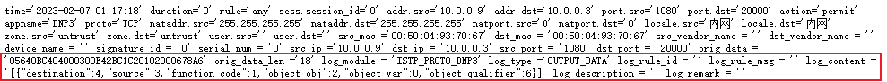
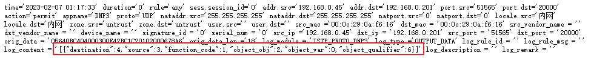
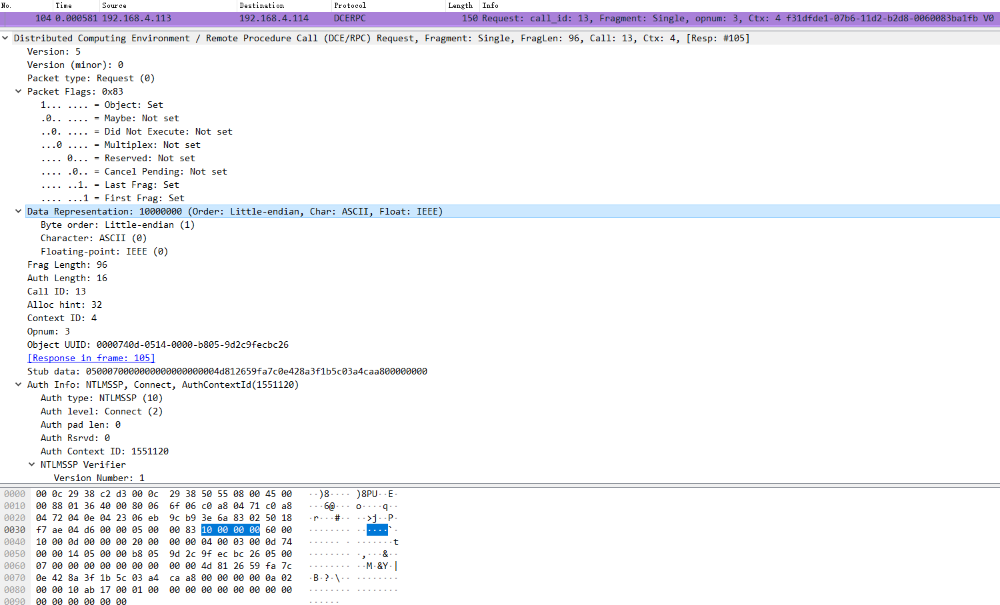
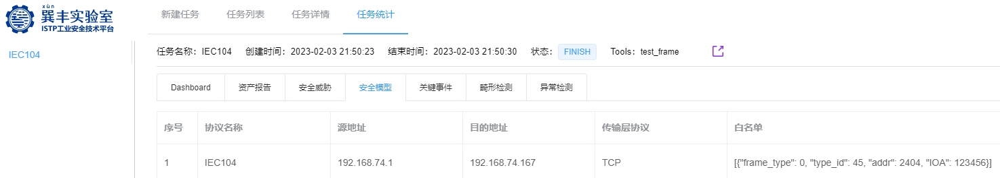
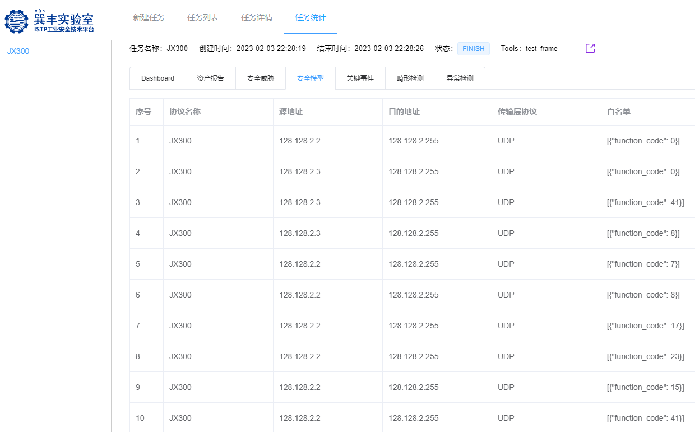
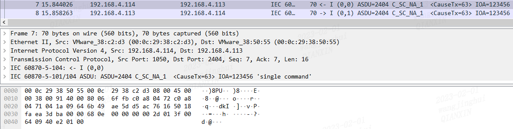
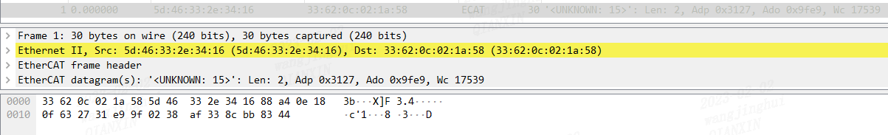
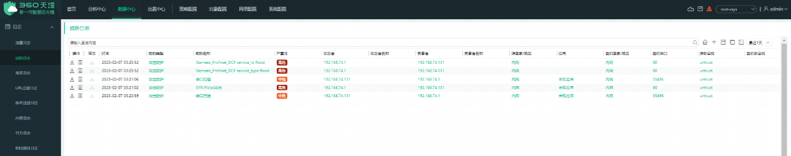
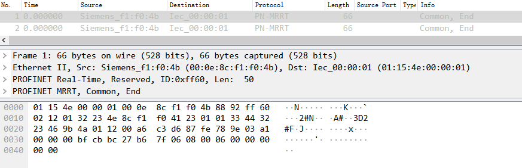
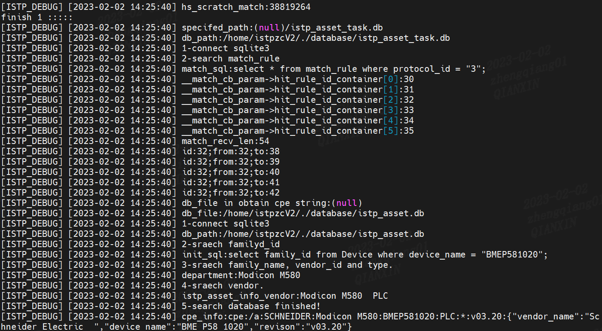

# 1. 功能性

## 1.1. 协议识别

### 1.1.1. 功能说明

流量经过ISTP，通过协议五元组信息，协议字段相关内容，识别是否为该种协议

### 1.1.2. 发布的标准

协议识别功能包含3种识别方式，分别为AI识别，端口识别，代码识别。

> AI识别**：**共计100种协议，协议范围如下

| **序号** | **识别方式** | **协议名称**                 |
|----------|--------------|------------------------------|
| 1        | AI识别       | 853                          |
| 2        | AI识别       | BACnet                       |
| 3        | AI识别       | Beckhoff_AMS_ADS             |
| 4        | AI识别       | C37.118_1PMU_TCP             |
| 5        | AI识别       | C37.118_1PMU_UDP             |
| 6        | AI识别       | CIP                          |
| 7        | AI识别       | CoAP                         |
| 8        | AI识别       | COTP                         |
| 9        | AI识别       | DHCP                         |
| 10       | AI识别       | DICOM_Echo                   |
| 11       | AI识别       | DNP3                         |
| 12       | AI识别       | ENIP                         |
| 13       | AI识别       | FF_LR_UDP                    |
| 14       | AI识别       | Focas                        |
| 15       | AI识别       | GDW_376.1                    |
| 16       | AI识别       | GE_EGD                       |
| 17       | AI识别       | GE_SRTP                      |
| 18       | AI识别       | Gryphon                      |
| 19       | AI识别       | HartIP_TCP                   |
| 20       | AI识别       | HartIP_UDP                   |
| 21       | AI识别       | HL7                          |
| 22       | AI识别       | HollySys_DCS_MACS            |
| 23       | AI识别       | HollySys_LK-UDP_6000         |
| 24       | AI识别       | HollySys_PLC                 |
| 25       | AI识别       | HoneyWell                    |
| 26       | AI识别       | HSRP                         |
| 27       | AI识别       | HTTP                         |
| 28       | AI识别       | ICCP                         |
| 29       | AI识别       | IEC103                       |
| 30       | AI识别       | IEC60870-5-104               |
| 31       | AI识别       | IEC61850-MMS                 |
| 32       | AI识别       | ifix2ifix                    |
| 33       | AI识别       | ISAKMP                       |
| 34       | AI识别       | KerberosAuthenticationSystem |
| 35       | AI识别       | KingView_TCP_2001            |
| 36       | AI识别       | LDAP_TCP_SASL_Digest         |
| 37       | AI识别       | LON                          |
| 38       | AI识别       | LPD                          |
| 39       | AI识别       | Microsoft_SQL_Server         |
| 40       | AI识别       | MITSUBISHI MELSEC_Q\_UDP     |
| 41       | AI识别       | MITSUBISHI_MELSEC_L\_TCP     |
| 42       | AI识别       | Modbus_ASCII                 |
| 43       | AI识别       | Modbus_RTU                   |
| 44       | AI识别       | Modbus_TCP                   |
| 45       | AI识别       | Modbus_UDP                   |
| 46       | AI识别       | Modbus_UMAS                  |
| 47       | AI识别       | MOXA_E1242_UDP               |
| 48       | AI识别       | MQTT                         |
| 49       | AI识别       | Omron_FINS_TCP               |
| 50       | AI识别       | Omron_FINS_UDP               |
| 51       | AI识别       | OPC_DA                       |
| 52       | AI识别       | OPC_UA                       |
| 53       | AI识别       | OpenSafety_UDP               |
| 54       | AI识别       | Oracle_TCP                   |
| 55       | AI识别       | Ovation                      |
| 56       | AI识别       | PCWORX                       |
| 57       | AI识别       | PHONENIX_CONTACT             |
| 58       | AI识别       | PTPv1                        |
| 59       | AI识别       | PTPv2                        |
| 60       | AI识别       | Redlion_Crimson3             |
| 61       | AI识别       | RSSP_1                       |
| 62       | AI识别       | Siemens_Profinet_IO_CM       |
| 63       | AI识别       | Siemens_S7                   |
| 64       | AI识别       | Siemens_S7Plus               |
| 65       | AI识别       | SinecH1                      |
| 66       | AI识别       | SIP                          |
| 67       | AI识别       | SMB                          |
| 68       | AI识别       | SNMPv1                       |
| 69       | AI识别       | SNMPv3                       |
| 70       | AI识别       | Supcon_JX300                 |
| 71       | AI识别       | TFTP                         |
| 72       | AI识别       | TLS_HTTPs                    |
| 73       | AI识别       | Tridium_Niagara_Fox          |
| 74       | AI识别       | VNC_UDP                      |
| 75       | AI识别       | Wago_CoDeSys                 |
| 76       | AI识别       | Yokogawa_Vnet_IP             |
| 77       | AI识别       | 安控_sl304                   |
| 78       | AI识别       | 步科Kinco                    |
| 79       | AI识别       | 大工计控                     |
| 80       | AI识别       | 丹东华通_2000R               |
| 81       | AI识别       | 昆仑通态 MCGS                |
| 82       | AI识别       | 力控实时数据库               |
| 83       | AI识别       | 南大傲拓                     |
| 84       | AI识别       | 南大奥拓_NA-RTU              |
| 85       | AI识别       | 上海新华DCS TCP（XHICAN）    |
| 86       | AI识别       | 松下Panasonic                |
| 87       | AI识别       | 上海新华DCS UDP              |
| 88       | AI识别       | 研华Advantech                |
| 89       | AI识别       | 中自DCS                      |
| 90       | AI识别       | Emerson_Deltav               |
| 91       | AI识别       | GSK                          |
| 92       | AI识别       | HNC                          |
| 93       | AI识别       | MEMOBUS_UDP                  |
| 94       | AI识别       | IPMI                         |
| 95       | AI识别       | Wonderware_Service           |
| 96       | AI识别       | ShangHaiYangBang_BX_5E       |
| 97       | AI识别       | Wonderware_Suitelink         |
| 98       | AI识别       | Wonderware_NmxSvc_tcp        |
| 99       | AI识别       | Wonderware_NmxSvc_udp        |
| 100      | AI识别       | HoneyWell_tcp                |

> 端口识别：共计22种协议，协议范围如下

| **序号** | **识别方式** | **协议名称**         |
|----------|--------------|----------------------|
| 1        | 端口识别     | ATG                  |
| 2        | 端口识别     | CSPv4_2222           |
| 3        | 端口识别     | CSPv4_6000           |
| 4        | 端口识别     | DNS_UDP              |
| 5        | 端口识别     | Echo_TCP             |
| 6        | 端口识别     | ENIP_UDP             |
| 7        | 端口识别     | FF_FMS               |
| 8        | 端口识别     | FF_SM                |
| 9        | 端口识别     | FTP                  |
| 10       | 端口识别     | Lantronix            |
| 11       | 端口识别     | LLMNR                |
| 12       | 端口识别     | NetBios_NS           |
| 13       | 端口识别     | NTP                  |
| 14       | 端口识别     | POP3                 |
| 15       | 端口识别     | PowerLink_UDP        |
| 16       | 端口识别     | SMTP                 |
| 17       | 端口识别     | SSH                  |
| 18       | 端口识别     | Syslog_WinServer2003 |
| 19       | 端口识别     | Telnet               |
| 20       | 端口识别     | VxWorks_Debug_Reboot |
| 21       | 端口识别     | ZigBee_UDP           |
| 22       | 端口识别     | 易控                 |

> 代码识别：共计18种协议，协议范围如下

| **序号** | **识别方式** | **协议名称**          |
|----------|--------------|-----------------------|
| 1        | 代码识别     | CDP                   |
| 2        | 代码识别     | EtherCAT_L2           |
| 3        | 代码识别     | HoneyWell_FTE         |
| 4        | 代码识别     | IEC61850-GOOSE协议    |
| 5        | 代码识别     | IEC61850-SMV协议      |
| 6        | 代码识别     | LLC                   |
| 7        | 代码识别     | LLDP                  |
| 8        | 代码识别     | OpenSafety_SercosIII  |
| 9        | 代码识别     | PowerLink_Layer2      |
| 10       | 代码识别     | SchneiderFoxboro_IA   |
| 11       | 代码识别     | Siemens_Profinet_DCP  |
| 12       | 代码识别     | Siemens_Profinet_MRP  |
| 13       | 代码识别     | Siemens_S5            |
| 14       | 代码识别     | Siemens_Profinet_PTCP |
| 15       | 代码识别     | TTE_PCF               |
| 16       | 代码识别     | Siemens_Profinet_MRRT |
| 17       | 代码识别     | Siemens_Profinet_RTC3 |
| 18       | 代码识别     | Siemens_Profinet_RTC1 |

协议识别测试标准

> TCP/UDP消息无协议不识别、漏识别或误识别的情况，二层协议数据帧无协议不识别、漏识别或误识别的情况

测试用例说明

> AI识别：

Bacnet协议报文如下图所示

ISTP Web显示结果如下图所示

> 端口识别：

易控协议报文如下图所示

ISTP Release显示结果如下图所示

> 代码识别：

Siemens_Profinet_MRP协议报文如下图所示

ISTP Web显示结果如下图所示

## 1.2. 协议解析

### 1.2.1. 功能说明

如果将工业设备比喻为人，那么工业协议就是指语言。不同的语言想要实现对话交流，就需要翻译，将传达的信息转化双方都能理解的一种形式，这就是协议解析。协议解析指的是面对不同协议的工业设备实现数据采集传输的能力，通过协议解析将设备连接起来并转换同一种协议，这样就能方便连接到更多的平台和设备，实现统一化的系统架构与集约化的生产。

ISTP支持49种协议的解析。

### 1.2.2. 发布的标准

#### 1.2.2.1. MMS

支持15种字段的解析，主要字段如下所示：

> mms_pdu
>
> invoke_id
>
> service
>
> variable_access_specification
>
> objects
>
> variable_specification
>
> objectName
>
> domainId
>
> itemId
>
> vmd-specific
>
> aa-specific
>
> address
>
> symbolicAddress
>
> numericAddress
>
> unconstrainedAddress

发布标准：

> 请求帧和响应帧均上报解析日志；
>
> 非畸形帧不漏报解析日志；

测试用例举例说明：

> 报文中服务为read的帧的情况如下图所示：

> ISTP对报文中服务为read的帧的检测情况如下图所示：

#### 1.2.2.2. BACNET

支持28种字段的解析，主要字段如下所示：

> lpdu_bvlc_type
>
> lpdu_bvlc_func
>
> lpdu_ip
>
> lpdu_port
>
> npdu_version
>
> npdu_control
>
> npdu_dnet
>
> npdu_dlen
>
> npdu_hop_cnt
>
> apdu_type
>
> apdu_service_choice
>
> lpdu_bvlc_time_to_live
>
> apdu_max_resp
>
> apdu_max_segs
>
> apdu_seg_resp_acpt
>
> apdu_invoke_id
>
> lpdu_bvlc_result
>
> apdu_service_ack_choice
>
> apdu_error_choice
>
> npdu_snet
>
> npdu_slen
>
> npdu_sadr_type
>
> npdu_sadr
>
> apdu_reason
>
> npdu_dadr_mstp_arcnet
>
> npdu_dadr_type
>
> npdu_sadr_mstp_arcnet
>
> npdu_msg_type

发布标准：

> 请求帧和响应帧均上报解析日志；
>
> 非畸形帧不漏报解析日志；

测试用例举例说明：

> 报文中功能码为Original-Unicast-NPDU (0x0a)的帧的情况如下图所示：

> ISTP对报文中功能码为Original-Unicast-NPDU
> (0x0a)的帧的检测情况如下图所示：

#### 1.2.2.3. CoAp

支持12种字段的解析，主要字段如下所示：

> version
>
> type
>
> code
>
> message_id
>
> token_length
>
> payload_len
>
> options_num
>
> option_type
>
> delta
>
> uri_len
>
> uri_value
>
> token

发布标准：

> 请求帧和响应帧均上报解析日志；
>
> 非畸形帧不漏报解析日志；

测试用例举例说明：

> 报文中Code为Empty Message (0)的帧的情况如下图所示：

> ISTP对报文中Code为Empty Message (0)的帧的检测情况如下图所示：

#### 1.2.2.4. DNP3 TCP

支持5种字段的解析，主要字段如下所示：

> destination
>
> source
>
> function_code
>
> object_obj
>
> object_var

发布标准：

> 请求帧和响应帧均上报解析日志；
>
> 非畸形帧不漏报解析日志；

测试用例举例说明：

> 报文中功能码为Read (0x01)的帧的情况如下图所示：

> ISTP对报文中功能码为Read (0x01)的帧的检测情况如下图所示：

#### 1.2.2.5. DNP3 UDP

支持5种字段的解析，主要字段如下所示：

> destination
>
> source
>
> function_code
>
> object_obj
>
> object_var

发布标准：

> 请求帧和响应帧均上报解析日志；
>
> 非畸形帧不漏报解析日志；

测试用例举例说明：

> 报文中功能码为Read (0x01)的帧的情况如下图所示：

> 报文中功能码为Read (0x01)的帧的情况如下图所示：

#### 1.2.2.6. ENIP

支持4种字段的解析，主要字段如下所示：

> encap_cmd
>
> services
>
> service
>
> iclass

发布标准：

> 请求帧和响应帧均上报解析日志；
>
> 非畸形帧不漏报解析日志；

测试用例举例说明：

> 报文中Command为Send Unit Data (0x0070)的帧的情况如下图所示：

> ISTP对报文中Command为Send Unit Data (0x0070)的帧的检测情况如下图所示：

#### 1.2.2.7. CIP_COMMON

支持4种字段的解析，主要字段如下所示：

encap_cmd

services

service

> iclass

发布标准：

> 请求帧和响应帧均上报解析日志；
>
> 非畸形帧不漏报解析日志；

测试用例举例说明：

> 报文中服务字段为Get Attributes All (0x01)的帧的情况如下图所示：

> ISTP对报文中服务字段为Get Attributes All
> (0x01)的帧的检测情况如下图所示：

#### 1.2.2.8. CIP_Logix5000

支持6种字段的解析，主要字段如下所示：

encap_cmd

services

service

pIOI_len

pIOI

> iclass

发布标准：

> 请求帧和响应帧均上报解析日志；
>
> 非畸形帧不漏报解析日志；

测试用例举例说明：

> 报文中服务为0x4c的情况如下图所示：

> ISTP对报文中服务为0x4c的检测情况如下图所示：

#### 1.2.2.9. CIP_PCCC

支持6种字段的解析，主要字段如下所示：

encap_cmd

services

service

iclass

pccc_cmd

> pccc_fnc

发布标准：

> 请求帧和响应帧均上报解析日志；
>
> 非畸形帧不漏报解析日志；

测试用例举例说明：

> 报文中服务为0x4b的情况如下图所示：

> ISTP检测情况如下图所示：

#### 1.2.2.10. Etrol_SL304_TCP

支持4种字段的解析，主要字段如下所示：

> dtype
>
> dgroup
>
> did
>
> len

发布标准：

> 请求帧和响应帧均上报解析日志；
>
> 非畸形帧不漏报解析日志；

测试用例举例说明：

> 报文中dtype为0x01的帧的情况如下图所示：

> ISTP对报文中dtype为0x01的帧的检测情况如下图所示：

#### 1.2.2.11. Focas

支持4种字段的解析，主要字段如下所示：

> dir
>
> function_code
>
> send_flag
>
> data_len

发布标准：

> 请求帧和响应帧均上报解析日志；
>
> 非畸形帧不漏报解析日志；

测试用例举例说明：

> 报文中功能码为1的帧的情况如下图所示：

> ISTP对报文中功能码为1的帧的检测情况如下图所示：

#### 1.2.2.12. GDW 3761

支持11种字段的解析，主要字段如下所示：

protocol_id

frame_len

dir

prm

fcb_acd

fcv

func_code

afn_code

term_address

master_address

type

发布标准：

> 请求帧和响应帧均上报解析日志；
>
> 非畸形帧不漏报解析日志；

测试用例举例说明：

> 报文中功能码为9的帧的情况如下图所示：

> ISTP对报文中功能码为9的帧的检测情况如下图所示：

#### 1.2.2.13. GOOSE

支持18种字段的解析，主要字段如下所示：

> d_mac
>
> s_mac
>
> APPID
>
> Length
>
> gocbRef
>
> timeAllowedtoLive
>
> datSet
>
> goID
>
> t
>
> stNum
>
> sqNum
>
> test
>
> confRev
>
> ndsCom
>
> numDatSetEntries
>
> allData
>
> boolean
>
> bit-string

发布标准：

> 请求帧和响应帧均上报解析日志；
>
> 非畸形帧不漏报解析日志；

测试用例举例说明：

> 报文中APPID为 0x0001 (1)的帧的情况如下图所示：

> ISTP对报文中APPID为 0x0001 (1)的帧的检测情况如下图所示：

#### 1.2.2.14. HartIP_TCP

支持99种字段的解析，主要字段如下所示：

> version
>
> message_type
>
> message_id
>
> status
>
> sequence_number
>
> message_length
>
> host_type
>
> inactivity_close_timer
>
> frame_type
>
> long_address
>
> command
>
> length
>
> checksum
>
> response_code
>
> device_status
>
> expansion_code
>
> expanded_device_type
>
> minimum_number_of_request_preambles
>
> hart_universal_revision
>
> device_revision
>
> device_software_revision
>
> hardware_rev_and_physical_signaling
>
> flags
>
> device_id
>
> minimum_number_of_response_preambles
>
> maximum_number_of_device_variables
>
> configuration_change_counter
>
> extended_device_status
>
> manufacturer_id
>
> private_label
>
> device_profile
>
> short_address
>
> pv_units
>
> pv
>
> pv_loop_current
>
> pv_percent_range
>
> sv_units
>
> sv
>
> tv_units
>
> tv
>
> qv_units
>
> qv
>
> poll_address
>
> loop_current_mode
>
> primary_variable_classification
>
> secondary_variable_classification
>
> tertiary_variable_classification
>
> quaternary_variable_classification
>
> slots
>
> slot0_data_timestamp
>
> device_variable
>
> device_variable_classification
>
> units
>
> device_variable_value
>
> device_variable_status
>
> message
>
> tag
>
> descriptor
>
> day
>
> month
>
> year
>
> transducer_serail_number
>
> transducer_limit_min_span_units
>
> upper_transducer_limit
>
> lower_transducer_limit
>
> minimum_span
>
> pv_alarm_selection_code
>
> pv_transfer_function_code
>
> pv_upper_and_lower_range_values_units
>
> pv_upper_range_value
>
> pv_lower_range_value
>
> pv_damping_value
>
> write_protect_code
>
> reserved
>
> pv_analog_channel_flags
>
> final_assembly_number
>
> command_number
>
> index_of_first_discrete_variable
>
> number_of_discrete_variables
>
> timestamp_for_most_recent_discrete_change
>
> discrete_variable_state
>
> discrete_variable_status
>
> device_specific_status
>
> device_operating_mode
>
> standardized_status_0
>
> standardized_status_1
>
> analog_channel_saturated
>
> standardized_status_2
>
> standardized_status_3
>
> analog_channel_fixed
>
> io_card
>
> channel
>
> embedded_command_delimiter
>
> embedded_command
>
> command_byte_count
>
> number_of_commands
>
> commands
>
> command_numuber
>
> preambles

发布标准：

> 请求帧和响应帧均上报解析日志；
>
> 非畸形帧不漏报解析日志；

测试用例举例说明：

> 报文中Message Type为Publish (2)的帧的情况如下图所示：

> ISTP对报文中Message Type为Publish (2)的帧的检测情况如下图所示：

#### 1.2.2.15. HartIP_UDP

支持99种字段的解析，主要字段如下所示：

> version
>
> message_type
>
> message_id
>
> status
>
> sequence_number
>
> message_length
>
> host_type
>
> inactivity_close_timer
>
> frame_type
>
> long_address
>
> command
>
> length
>
> checksum
>
> response_code
>
> device_status
>
> expansion_code
>
> expanded_device_type
>
> minimum_number_of_request_preambles
>
> hart_universal_revision
>
> device_revision
>
> device_software_revision
>
> hardware_rev_and_physical_signaling
>
> flags
>
> device_id
>
> minimum_number_of_response_preambles
>
> maximum_number_of_device_variables
>
> configuration_change_counter
>
> extended_device_status
>
> manufacturer_id
>
> private_label
>
> device_profile
>
> short_address
>
> pv_units
>
> pv
>
> pv_loop_current
>
> pv_percent_range
>
> sv_units
>
> sv
>
> tv_units
>
> tv
>
> qv_units
>
> qv
>
> poll_address
>
> loop_current_mode
>
> primary_variable_classification
>
> secondary_variable_classification
>
> tertiary_variable_classification
>
> quaternary_variable_classification
>
> slots
>
> slot0_data_timestamp
>
> device_variable
>
> device_variable_classification
>
> units
>
> device_variable_value
>
> device_variable_status
>
> message
>
> tag
>
> descriptor
>
> day
>
> month
>
> year
>
> transducer_serail_number
>
> transducer_limit_min_span_units
>
> upper_transducer_limit
>
> lower_transducer_limit
>
> minimum_span
>
> pv_alarm_selection_code
>
> pv_transfer_function_code
>
> pv_upper_and_lower_range_values_units
>
> pv_upper_range_value
>
> pv_lower_range_value
>
> pv_damping_value
>
> write_protect_code
>
> reserved
>
> pv_analog_channel_flags
>
> final_assembly_number
>
> command_number
>
> index_of_first_discrete_variable
>
> number_of_discrete_variables
>
> timestamp_for_most_recent_discrete_change
>
> discrete_variable_state
>
> discrete_variable_status
>
> device_specific_status
>
> device_operating_mode
>
> standardized_status_0
>
> standardized_status_1
>
> analog_channel_saturated
>
> standardized_status_2
>
> standardized_status_3
>
> analog_channel_fixed
>
> io_card
>
> channel
>
> embedded_command_delimiter
>
> embedded_command
>
> command_byte_count
>
> number_of_commands
>
> commands
>
> command_numuber
>
> preambles

发布标准：

> 请求帧和响应帧均上报解析日志；
>
> 非畸形帧不漏报解析日志；

测试用例举例说明：

> 报文中Message Type为Publish (2)的帧的情况如下图所示：

> ISTP对报文中Message Type为Publish (2)的帧的检测情况如下图所示：

#### 1.2.2.16. HuaTong_2000R_TCP

支持3种字段的解析，主要字段如下所示：

func_code

addr

> data

发布标准：

> 请求帧和响应帧均上报解析日志；
>
> 非畸形帧不漏报解析日志；

测试用例举例说明：

> 报文中功能码为5的帧的情况如下图所示：

> ISTP对报文中功能码为5的帧的检测情况如下图所示：

#### 1.2.2.17. IEC104

支持17种字段的解析，主要字段如下所示：

> apdus
>
> apdu_len
>
> frame_type
>
> tx
>
> rx
>
> sq
>
> num_ix
>
> test
>
> netgative
>
> cause_tx
>
> oa
>
> type_id
>
> addr
>
> IOA
>
> utype
>
> instrument_type
>
> point_table

发布标准：

> 请求帧和响应帧均上报解析日志；
>
> 非畸形帧不漏报解析日志；

测试用例举例说明：

> 报文中Type Id为141的帧的情况如下图所示：

> ISTP对报文中Type Id为141的帧的检测情况如下图所示：

#### 1.2.2.18. JX300

支持2种字段的解析，主要字段如下所示：

> function_code
>
> sequence

发布标准：

> 请求帧和响应帧均上报解析日志；
>
> 非畸形帧不漏报解析日志；

测试用例举例说明：

> 报文中功能码为0的帧的情况如下图所示：

> ISTP对报文中功能码为0的帧的检测情况如下图所示：

#### 1.2.2.19. MELSEC_TCP

支持8种字段的解析，主要字段如下所示：

> data_len
>
> wait_time
>
> command
>
> sub_command
>
> batch.unit
>
> batch.sc
>
> batch.range
>
> res_code

发布标准：

> 请求帧和响应帧均上报解析日志；
>
> 非畸形帧不漏报解析日志；

测试用例举例说明：

> 报文中功能码为1025的帧的情况如下图所示：

> ISTP对报文中功能码为1025的帧的检测情况如下图所示：

#### 1.2.2.20. Modbus_TCP

支持4种字段的解析，主要字段如下所示：

> function_code
>
> address
>
> address_length
>
> sub_function_code

发布标准：

> 请求帧和响应帧均上报解析日志；
>
> 非畸形帧不漏报解析日志；

测试用例举例说明：

> 报文中功能码分别为Read Coils和Diagnostics的帧的情况如下图所示：

> ISTP对报文中功能码分别为Read
> Coils和Diagnostics的帧的检测情况如下图所示：

#### 1.2.2.21. Modbus_UDP

支持4种字段的解析，主要字段如下所示：

> function_code
>
> address
>
> address_length
>
> sub_function_code

发布标准：

> 请求帧和响应帧均上报解析日志；
>
> 非畸形帧不漏报解析日志；

测试用例举例说明：

> 报文中功能码分别为Read Coils和Diagnostics的帧的情况如下图所示：

> ISTP对报文中功能码分别为Read
> Coils和Diagnostics的帧的检测情况如下图所示：

#### 1.2.2.22. Modbus_UMAS

支持3种字段的解析，主要字段如下所示：

> function_code
>
> sub_function_code
>
> umas_sub_function_code

发布标准：

> 请求帧和响应帧均上报解析日志；
>
> 非畸形帧不漏报解析日志；

测试用例举例说明：

> 报文中功能码为90，子功能码为3的帧的情况如下图所示：

> ISTP对报文中功能码为90，子功能码为3的帧的检测情况如下图所示：

#### 1.2.2.23. Modbus_RTU（不支持）

支持3种字段的解析，主要字段如下所示：

发布标准：

> 请求帧和响应帧均上报解析日志；
>
> 非畸形帧不漏报解析日志；

测试用例举例说明：

> Wireshark检测情况如下图所示：
>
> ISTP检测情况如下图所示：

#### 1.2.2.24. MQTT

支持29种字段的解析，主要字段如下所示：

> message_type
>
> message_flag
>
> mqtt_payload_len
>
> protocol_len
>
> protocol
>
> version
>
> c_flag
>
> keepalive
>
> client_id_len
>
> client_id
>
> will_topic_len
>
> will_topic
>
> will_message_len
>
> will_message
>
> username_len
>
> username
>
> passwd_len
>
> passwd
>
> reserved
>
> ret_code
>
> topic_len
>
> topic
>
> msg_id
>
> message
>
> meassge
>
> mesage
>
> topic_qos
>
> topics
>
> qos

发布标准：

> 请求帧和响应帧均上报解析日志；
>
> 非畸形帧不漏报解析日志；

测试用例举例说明：

> 报文中Message Type为Subscribe Request的帧的情况如下图所示：

> ISTP对报文中Message Type为Subscribe Request的帧的检测情况如下图所示：

#### 1.2.2.25. NA_RTU_TCP

支持5种字段的解析，主要字段如下所示：

> func_code
>
> length
>
> addr
>
> data_count
>
> data

发布标准：

> 请求帧和响应帧均上报解析日志；
>
> 非畸形帧不漏报解析日志；

测试用例举例说明：

> 报文中功能码为0x61的帧的情况如下图所示：

> ISTP对报文中功能码为0x61的帧的检测情况如下图所示：

#### 1.2.2.26. OMRON_TCP

支持117种字段的解析，主要字段如下所示：

> dir
>
> command_code
>
> memory_area_code
>
> begin_address
>
> num_items
>
> response_code
>
> data
>
> beginning_address
>
> mul_memory_area
>
> mul_memory_area_count
>
> memory_area_code_source
>
> beginning_address_source
>
> memory_area_code_dest
>
> begin_address_dest
>
> parameter_area_code
>
> beginning_word
>
> num_of_word
>
> req_clear_data
>
> program_num
>
> project_code
>
> last_word
>
> password
>
> num_bytes
>
> clear_code
>
> mode
>
> data_type
>
> CPU Unit model
>
> CPU Unit internal system version
>
> For system use
>
> Area data
>
> unit address
>
> number_of_items
>
> units address
>
> model number
>
> status
>
> fatal error data
>
> non fatal error data
>
> message number
>
> fal/fals number
>
> error message
>
> parameter
>
> average_cycle_time
>
> max_cycle_time
>
> min_cycle_time
>
> Year
>
> Month
>
> Date
>
> Hour
>
> Minute
>
> Second
>
> Day
>
> MessageNo
>
> Error_reset_FALS_No
>
> Beginning_Record_No
>
> No_of_Records
>
> MAX_No_of_Stored_Records
>
> No_of_Stored_Records
>
> Error_Logs
>
> Error_Code1
>
> Error_Code2
>
> disk_num
>
> beginng_file_position
>
> num_of_files
>
> disk_data
>
> file_data
>
> filename
>
> file_position
>
> data_length
>
> file_capacity
>
> para_code
>
> Disk_No
>
> Parameter_Code
>
> Volume_Label
>
> Src_Disk_No
>
> Src_File_Name
>
> Dst_Disk_No
>
> Dst_File_Name
>
> Old_File_Name
>
> New_File_Name
>
> File_Name
>
> num_of_words
>
> Data_Length
>
> num_of_bits
>
> set_reset_specification
>
> bit_flag
>
> Message
>
> FALSNo
>
> ErrorMessage
>
> fixed
>
> intelligent_id_no
>
> first_word
>
> read_length
>
> no_of_link_nodes
>
> data_link_status
>
> cio_area_first_word
>
> kind_of_dm
>
> no_of_total_words
>
> network_member_data
>
> communications_cycle_time
>
> current_polling_unit_node_number
>
> cyclic_operation
>
> cyc_lic_transmission_status
>
> cyclic_nono-fatal_errors
>
> cyclic_error_counters
>
> status_flags
>
> number_of_receptions
>
> beginning_block_number
>
> number_od_blocks
>
> number_of_blocks_remaining
>
> total_number_of_blocks
>
> type
>
> control_data
>
> block_number
>
> number_of_units
>
> number_od_units
>
> name_Data
>
> name_data

发布标准：

> 请求帧和响应帧均上报解析日志；
>
> 非畸形帧不漏报解析日志；

测试用例举例说明：

> 报文中Command为Frame Send的帧的情况如下图所示：

> ISTP对报文中Command为Frame Send的帧的检测情况如下图所示：

#### 1.2.2.27. OMRON_UDP

支持118种字段的解析，主要字段如下所示：

> dir
>
> command_code
>
> memory_area_code
>
> begin_address
>
> num_items
>
> response_code
>
> data
>
> beginning_address
>
> mul_memory_area
>
> mul_memory_area_count
>
> memory_area_code_source
>
> beginning_address_source
>
> memory_area_code_dest
>
> begin_address_dest
>
> parameter_area_code
>
> beginning_word
>
> num_of_word
>
> req_clear_data
>
> program_num
>
> project_code
>
> last_word
>
> password
>
> num_bytes
>
> clear_code
>
> mode
>
> data_type
>
> CPU Unit model
>
> CPU Unit internal system version
>
> For system use
>
> Area data
>
> pc status
>
> unit address
>
> number_of_items
>
> units address
>
> model number
>
> status
>
> fatal error data
>
> non fatal error data
>
> message number
>
> fal/fals number
>
> error message
>
> parameter
>
> average_cycle_time
>
> max_cycle_time
>
> min_cycle_time
>
> Year
>
> Month
>
> Date
>
> Hour
>
> Minute
>
> Second
>
> Day
>
> MessageNo
>
> Error_reset_FALS_No
>
> Beginning_Record_No
>
> No_of_Records
>
> MAX_No_of_Stored_Records
>
> No_of_Stored_Records
>
> Error_Logs
>
> Error_Code1
>
> Error_Code2
>
> disk_num
>
> beginng_file_position
>
> num_of_files
>
> disk_data
>
> file_data
>
> filename
>
> file_position
>
> data_length
>
> file_capacity
>
> para_code
>
> Disk_No
>
> Parameter_Code
>
> Volume_Label
>
> Src_Disk_No
>
> Src_File_Name
>
> Dst_Disk_No
>
> Dst_File_Name
>
> Old_File_Name
>
> New_File_Name
>
> File_Name
>
> num_of_words
>
> Data_Length
>
> num_of_bits
>
> set_reset_specification
>
> bit_flag
>
> Message
>
> FALSNo
>
> ErrorMessage
>
> fixed
>
> intelligent_id_no
>
> first_word
>
> read_length
>
> no_of_link_nodes
>
> data_link_status
>
> cio_area_first_word
>
> kind_of_dm
>
> no_of_total_words
>
> network_member_data
>
> communications_cycle_time
>
> current_polling_unit_node_number
>
> cyclic_operation
>
> cyc_lic_transmission_status
>
> cyclic_nono-fatal_errors
>
> cyclic_error_counters
>
> status_flags
>
> number_of_receptions
>
> beginning_block_number
>
> number_od_blocks
>
> number_of_blocks_remaining
>
> total_number_of_blocks
>
> type
>
> control_data
>
> block_number
>
> number_of_units
>
> number_od_units
>
> name_Data
>
> name_data

发布标准：

> 请求帧和响应帧均上报解析日志；
>
> 非畸形帧不漏报解析日志；

测试用例举例说明：

> 报文中Command为Frame Send的帧的情况如下图所示：

> ISTP对报文中Command为Frame Send的帧的检测情况如下图所示：

#### 1.2.2.28. OPC_DA

支持12种字段的解析，主要字段如下所示：

> apdus
>
> dir
>
> Version
>
> Version(minor)
>
> PacketType
>
> PacketFlags
>
> DataRepresentation
>
> FragLength
>
> AuthLength
>
> CallID
>
> opc_interface
>
> opc_function

发布标准：

> 请求帧和响应帧均上报解析日志；
>
> 非畸形帧不漏报解析日志；

测试用例举例说明：

> 报文中opc_interface为IOPCShutdown和opc_function为ShutdownRequest的帧的情况如下图所示：

> ISTP对报文中opc_interface为IOPCShutdown和opc_function为ShutdownRequest的帧的检测情况如下图所示：

#### 1.2.2.29. OPC_UA

支持68种字段的解析，主要字段如下所示：

> Message Type
>
> Chunk Type
>
> Message Size
>
> Version
>
> Receive Buffer Size
>
> Send Buffer Size
>
> Max Message Size
>
> Max Chunk Count
>
> End Point Url
>
> ChunkType
>
> Status Code
>
> Reason
>
> Server Uri
>
> Secure Channel Id
>
> Security Token Id
>
> Security Sequence Number
>
> Security RequestId
>
> NodeId Info.EncodingMask
>
> NodeId Info.Namespace Index
>
> NodeId Info.Identifier Numric
>
> Security policy uri
>
> Sender Certificate
>
> Receiver Certificate Thumbprint
>
> Sequence number
>
> Request Id
>
> EncodingMask
>
> NameSpaceIndex
>
> Timestamp
>
> RequestHandle
>
> ReturnDiagnostics
>
> TimeoutHint
>
> ClientProtocolVersion
>
> SecurityTokenRequestType
>
> MessageSecurityMode
>
> RequestLifetime
>
> ServiceResult
>
> ServerProtocolVersion
>
> ChannelId
>
> TokenId
>
> CreateAt
>
> RevisedLifetime
>
> ServerNonce
>
> Identifier_Numeric
>
> IdentifierNumeric
>
> ApplicationUri
>
> ProductUri
>
> Text
>
> ApplicationType
>
> ServerUri
>
> EndpointUrl
>
> SessionName
>
> ClientNonce
>
> ClientCertificate
>
> RequestedSessionTimeout
>
> MaxResponseMessageSize
>
> maxRequestMessageSize
>
> MaxAge
>
> TimestampsToReturn
>
> AttributeId
>
> Id
>
> Value
>
> ServerTimestamp
>
> ReleaseContinuePoint
>
> StatusCode
>
> SubscriptionId
>
> MoreNotification
>
> SequenceNumber
>
> PublishTime

发布标准：

> 请求帧和响应帧均上报解析日志；
>
> 非畸形帧不漏报解析日志；

测试用例举例说明：

> 报文中Message Type为HEL的帧的情况如下图所示：

> ISTP对报文中Message Type为HEL的帧的检测情况如下图所示：

#### 1.2.2.30. Ovation_TCP

支持3种字段的解析，主要字段如下所示：

> type
>
> func_code
>
> len

发布标准：

> 请求帧和响应帧均上报解析日志；
>
> 非畸形帧不漏报解析日志；

测试用例举例说明：

> 报文中功能码为2的帧的情况如下图所示：

> ISTP对报文中功能码为2的帧的检测情况如下图所示：

#### 1.2.2.31. Profinet_DCP

支持33种字段的解析，主要字段如下所示：

> frame_id
>
> service_id
>
> service_type
>
> xid
>
> reserved
>
> data_length
>
> blocks
>
> option
>
> suboption
>
> block_length
>
> block_info
>
> ip
>
> subnet
>
> gateway
>
> block_error
>
> block_qualifier
>
> response_delay
>
> nameofstation
>
> dev_options
>
> typeofstation
>
> vendor_id
>
> device_id
>
> device_role
>
> mac
>
> device_instance_high
>
> device_instance_low
>
> oem_vendor_id
>
> oem_device_id
>
> option_code
>
> dhcpparameterlength
>
> dhcpcontrolparameterdata
>
> signal_value
>
> value

发布标准：

> 请求帧和响应帧均上报解析日志；
>
> 非畸形帧不漏报解析日志；

测试用例举例说明：

> 报文中ServiceID为Get的帧的情况如下图所示：

> ISTP对报文中ServiceID为Get的帧的检测情况如下图所示：

#### 1.2.2.32. Profinet_MRP

支持21种字段的解析，主要字段如下所示：

> version
>
> mrps
>
> type
>
> length
>
> sequence_id
>
> domain_uuid
>
> prio
>
> sa
>
> port_role
>
> ring_state
>
> transition
>
> time_stamp
>
> interval
>
> blocked
>
> manufacturer_oui
>
> ed1_type
>
> ed1_manufacturer_data
>
> sub_type
>
> sub_length
>
> other_prio
>
> other_sa

发布标准：

> 请求帧和响应帧均上报解析日志；
>
> 非畸形帧不漏报解析日志；

测试用例举例说明：

> 报文中MRP_TLVHeader.Type为MRP_Common的帧的情况如下图所示：

> ISTP对报文中MRP_TLVHeader.Type为MRP_Common的帧的检测情况如下图所示：

#### 1.2.2.33. Profinet_MRRT

支持8种字段的解析，主要字段如下所示：

> blocks
>
> frame_id
>
> version
>
> type
>
> length
>
> sequence_id
>
> domain_uuid
>
> sa

发布标准：

> 请求帧和响应帧均上报解析日志；
>
> 非畸形帧不漏报解析日志；

测试用例举例说明：

> 报文中Type为Common的帧的情况如下图所示：

> ISTP对报文中Type为Common的帧的检测情况如下图所示：

#### 1.2.2.34. Profinet_PTCP

支持33种字段的解析，主要字段如下所示：

> blocks
>
> frame_id
>
> reserved_1
>
> reserved_2
>
> delay10ns
>
> delay1ns
>
> sequence_id
>
> delay1ns_byte
>
> type
>
> length
>
> t2timestamp
>
> port_mac_address
>
> oui
>
> subtype
>
> irdata_uuid
>
> t2port_rx_delay
>
> t3port_tx_delay
>
> flags
>
> current_utc_offset
>
> delay1ns_fup
>
> master_source_address
>
> subdomain_uuid
>
> epoch_number
>
> seconds
>
> nano_seconds
>
> master_priority1_priority
>
> master_priority1_level
>
> master_priority1_reserved
>
> master_priority1_active
>
> master_priority2
>
> clock_class
>
> clock_accuracy
>
> clock_variance

发布标准：

> 请求帧和响应帧均上报解析日志；
>
> 非畸形帧不漏报解析日志；

测试用例举例说明：

> 报文中为Profinet PTCP协议帧的情况如下图所示：

> ISTP对报文中为Profinet PTCP协议帧的检测情况如下图所示：

#### 1.2.2.35. Profinet_RTC1

支持11种字段的解析，主要字段如下所示：

> frame_id
>
> cycle_counter
>
> ignore
>
> reserved_2
>
> station_problem_indicator
>
> provider_state
>
> reserved_1
>
> data_valid
>
> redundancy
>
> state
>
> transfer_status

发布标准：

> 请求帧和响应帧均上报解析日志；
>
> 非畸形帧不漏报解析日志；

测试用例举例说明：

> 报文中为Profinet RTC1协议帧的情况如下图所示：

> ISTP对报文中为Profinet RTC1协议帧的检测情况如下图所示：

#### 1.2.2.36. Profinet_RTC3（解析不正确）

支持15种字段的解析，主要字段如下所示：

> frame_id
>
> cycle_counter
>
> ignore
>
> reserved_2
>
> station_problem_indicator
>
> provider_state
>
> reserved_1
>
> data_valid
>
> redundancy
>
> state
>
> transfer_status
>
> sfcrc16
>
> sub_frames
>
> position
>
> data_length

发布标准：

> 请求帧和响应帧均上报解析日志；
>
> 非畸形帧不漏报解析日志；

测试用例举例说明：

> 报文中为Profinet RTC3协议帧的情况如下图所示：

> ISTP对报文中为Profinet RTC3协议帧的检测情况如下图所示：

#### 1.2.2.37. RSSP-1

支持17种字段的解析，主要字段如下所示：

> interaction_type
>
> protocol_type
>
> src_address
>
> dst_address
>
> seq_number
>
> data_len
>
> svc_1
>
> svc_2
>
> data_value
>
> crc_16
>
> seqenq_1
>
> seqenq_2
>
> rsp_id
>
> req_id
>
> seq_init_1
>
> seq_init_2
>
> data_verion

发布标准：

> 请求帧和响应帧均上报解析日志；
>
> 非畸形帧不漏报解析日志；

测试用例举例说明：

> 报文中为RSSP-1协议帧的情况如下图所示：

> ISTP对报文中为RSSP-1协议帧的检测情况如下图所示：

#### 1.2.2.38. S7

支持113种字段的解析，主要字段如下所示：

> TpktVersion
>
> TpktReserved
>
> TpktLength
>
> CotpLength
>
> CotpPduType
>
> CotpTpduNumber
>
> CotpLastDataUnit
>
> ProtocolId
>
> ROSCTR
>
> RedundancyIndetification
>
> ProtocolDataUnitReference
>
> ParameterLength
>
> DataLength
>
> Items
>
> FunctionCode
>
> ErrorClass
>
> ErrorCode
>
> Address
>
> AddressLength
>
> SyntaxId
>
> VariableSpecification
>
> FollowingAddrLength
>
> DBNumber
>
> Area
>
> TransportSize
>
> FileName
>
> malformed_error
>
> ParameterHead
>
> userdata_ParameterLength
>
> Method
>
> Type
>
> FunctionGroup
>
> SubFunction
>
> SequenceNumber
>
> ReturnCode
>
> Length
>
> DataUnitReferenceNumber
>
> LastDataUnit
>
> TISParameterSize
>
> TISDataSize
>
> TISParameter
>
> ItemCount
>
> MemoryArea
>
> RepetitionFactor
>
> StartAddress
>
> IntervalTimeBase
>
> IntervalTimeFactor
>
> LengthofFollowingAddressSpecification
>
> Data
>
> Function
>
> JobId
>
> NumberofAreas
>
> SubItems
>
> BlockType
>
> BlockCount
>
> BlockNumber
>
> BlockFlags
>
> BlockLanguages
>
> FileSystem
>
> LengthofInfo
>
> BlockInfo2
>
> Constant3
>
> BytesBlockInfo
>
> BlockLanguage
>
> SubblkType
>
> LengthLoadMemory
>
> BlockSecurity
>
> CodeTimestamp
>
> InterfaceTimestamp
>
> SSBLength
>
> ADDLength
>
> LocalDataLength
>
> MC7CodeLength
>
> Author
>
> Family
>
> Name
>
> Version
>
> BlockCheckSum
>
> Reserved1
>
> Reserved2
>
> SZLId
>
> SZLIndex
>
> SZLPartialListLength
>
> SZLPartialListCount
>
> Index
>
> Key
>
> Param
>
> Real
>
> BartSch
>
> CrstWrst
>
> Res
>
> SubscribedEvents
>
> UserName
>
> Result
>
> EventId
>
> Priority
>
> OBNumber
>
> DatId
>
> AdditionalInformation1
>
> AdditionalInformation2
>
> TimeStampYear2
>
> TimeStampMonth
>
> TimeStampDay
>
> TimeStampHour
>
> TimeStampMinute
>
> TimeStampSecond
>
> TimeStampMilliSecond
>
> FunctionIdentifier
>
> NumberofMessageObjects
>
> QueryType
>
> TimeStampReserved
>
> TimeStampYear1
>
> TimeStampWeekday

发布标准：

> 请求帧和响应帧均上报解析日志；
>
> 非畸形帧不漏报解析日志；

测试用例举例说明：

> 报文中Function group为Programmer commands (1)的帧的情况如下图所示：

> ISTP对报文中Function group为Programmer commands
> (1)的帧的检测情况如下图所示：

#### 1.2.2.39. S7_Plus

支持24种字段的解析，主要字段如下所示：

> protid
>
> protoversion
>
> datalen
>
> opcode
>
> reserved1
>
> function_code
>
> reserved2
>
> seqnum
>
> session_id
>
> transport_flag
>
> trailer_protid
>
> trailer_protoversion
>
> trailer_datalen
>
> digestlen
>
> digest
>
> keepalive_seqnum
>
> reserved
>
> keepalivesequencenumber
>
> subscrobjectid
>
> unknown2
>
> unknown3
>
> unknown4
>
> credittick
>
> subscrchgcnt

发布标准：

> 请求帧和响应帧均上报解析日志；
>
> 非畸形帧不漏报解析日志；

测试用例举例说明：

> 报文中Function为CreateObject (0x04ca)的帧的情况如下图所示：

> ISTP对报文中Function为CreateObject (0x04ca)的帧的检测情况如下图所示：

#### 1.2.2.40. GE_SRTP

支持7种字段的解析，主要字段如下所示：

> service_request_code
>
> segment_selector
>
> data_offset
>
> violate_specs
>
> field_name
>
> error_code
>
> offset

发布标准：

> 请求帧和响应帧均上报解析日志；
>
> 非畸形帧不漏报解析日志；

测试用例举例说明：

> 报文中服务请求码为0的帧的情况如下图所示：

> ISTP对报文中服务请求码为0的帧的检测情况如下图所示：

#### 1.2.2.41. SV

支持15种字段的解析，主要字段如下所示：

> d_mac
>
> s_mac
>
> APPID
>
> Length
>
> Reserved 1
>
> Reserved 2
>
> noASDU
>
> ASDUs
>
> svID
>
> smpCnt
>
> confRef
>
> smpSynch
>
> seqData
>
> datSet
>
> smpRate

发布标准：

> 请求帧和响应帧均上报解析日志；
>
> 非畸形帧不漏报解析日志；

测试用例举例说明：

> 报文中为SV协议的帧的情况如下图所示：

> ISTP对报文中为SV协议的帧的检测情况如下图所示：

#### 1.2.2.42. Shanghaixinhua_DCS

支持5种字段的解析，主要字段如下所示：

> name
>
> len
>
> packtype
>
> unused
>
> cmd

发布标准：

> 请求帧和响应帧均上报解析日志；
>
> 非畸形帧不漏报解析日志；

测试用例举例说明：

> 报文中命令为0x0900的帧的情况如下图所示：

> ISTP对报文中命令为0x0900的帧的情况检测情况如下图所示：

#### 1.2.2.43. IEC103_UDP（NR）（解析不正确）

支持14种字段的解析，主要字段如下所示：

> apdus
>
> FirstFlag
>
> Length
>
> SecondFlag
>
> SourceFactoryId
>
> SourceAddr
>
> DestinationFactoryId
>
> DestinationAddr
>
> DataNumber
>
> DeviceType
>
> DeviceState
>
> FirstRouterAddr
>
> LastRouterAddr
>
> Reserved

发布标准：

> 请求帧和响应帧均上报解析日志；
>
> 非畸形帧不漏报解析日志；

测试用例举例说明：

> 报文中为IEC103 UDP协议帧的情况如下图所示：

> ISTP对报文中为IEC103 UDP协议帧的检测情况如下图所示：

#### 1.2.2.44. DICOM

支持59种字段的解析，主要字段如下所示：

> pdu_type
>
> pdu_len
>
> proto_version
>
> called_ae_title
>
> calling_ae_title
>
> app_item_type
>
> app_item_len
>
> app_item_str
>
> present_ctxs
>
> userinfo_item_type
>
> userinfo_item_len
>
> userinfo_max_item_type
>
> userinfo_max_item_len
>
> userinfo_max_pdu_len
>
> userinfo_uid_item_type
>
> userinfo_uid_item_len
>
> userinfo_uid
>
> userinfo_async_item_type
>
> userinfo_async_item_len
>
> userinfo_async_max_num_ops_inv
>
> userinfo_async_max_num_ops_per
>
> userinfo_version_item_type
>
> userinfo_version_item_len
>
> userinfo_version
>
> present_item_type
>
> present_item_len
>
> present_ctx_id
>
> present_result
>
> abstract_item_type
>
> abstract_item_len
>
> abstract_item_str
>
> transfer_syns
>
> userinfo_role_sel_item_type
>
> userinfo_role_sel_item_len
>
> userinfo_role_sel_sop_class_uid_len
>
> userinfo_role_sel_sopclassuid_str
>
> userinfo_role_sel_scu_role
>
> userinfo_role_sel_scp_role
>
> userinfo_extneg_item_type
>
> userinfo_extneg_item_len
>
> userinfo_extneg_sop_class_uid_len
>
> userinfo_extneg_sopclassuid_str
>
> userinfo_user_idt_item_type
>
> userinfo_user_idt_item_len
>
> userinfo_user_idt_type
>
> userinfo_user_idt_resp_req
>
> userinfo_user_idt_primary_field_len
>
> userinfo_user_idt_primary_field_str
>
> userinfo_user_idt_secondary_field_len
>
> userinfo_user_idt_secondary_field_str
>
> reject_result
>
> reject_source
>
> reject_reason
>
> pdvs
>
> pdv_len
>
> ctx_id
>
> flags
>
> abort_source
>
> abort_reason

发布标准：

> 请求帧和响应帧均上报解析日志；
>
> 非畸形帧不漏报解析日志；

测试用例举例说明：

> 报文中为DICOM协议帧的情况如下图所示：

> ISTP对报文中为DICOM协议帧的检测情况如下图所示：

#### 1.2.2.45. EtherCat

支持14种字段的解析，主要字段如下所示：

> Length
>
> Reserved
>
> Type
>
> Datagrams_num
>
> Attack_flag
>
> Datagrams
>
> cmd
>
> index
>
> addr
>
> length
>
> round_trip
>
> last_indicator
>
> interrupt
>
> working_cnt

发布标准：

> 请求帧和响应帧均上报解析日志；
>
> 非畸形帧不漏报解析日志；

测试用例举例说明：

> 报文中Type为EtherCAT command (0x1)情况如下图所示：

> ISTP对报文中Type为EtherCAT command (0x1)检测情况如下图所示：

#### 1.2.2.46. GSK

支持17种字段的解析，主要字段如下所示：

> unknown_1
>
> local_mac
>
> serpid_1
>
> des_mac
>
> serpid_2
>
> pack_no
>
> unknown_8
>
> send_to_id
>
> data_len
>
> unknown_10
>
> next_action
>
> file_handle
>
> tran_data_len
>
> data_size
>
> dir_handle
>
> recv_from_id
>
> unknown_12

发布标准：

> 请求帧和响应帧均上报解析日志；
>
> 非畸形帧不漏报解析日志；

测试用例举例说明：

> 报文为GSK的帧的情况如下图所示：

> ISTP对报文为GSK的帧的检测情况如下图所示：

#### 1.2.2.47. HL7

支持80种字段的解析，主要字段如下所示：

> field_separator
>
> component_separator
>
> repetition_separator
>
> escape_character
>
> subcomponent_separator
>
> message_type
>
> trigger_event
>
> segments
>
> field1
>
> field2
>
> field3
>
> field4
>
> field5
>
> field6
>
> field7
>
> field8
>
> field9
>
> field10
>
> field11
>
> field12
>
> field13
>
> field14
>
> field15
>
> field16
>
> field17
>
> field18
>
> field19
>
> field20
>
> field21
>
> field22
>
> field23
>
> field24
>
> field25
>
> field26
>
> field27
>
> field28
>
> field29
>
> field30
>
> field31
>
> field32
>
> field33
>
> field34
>
> field35
>
> field36
>
> field37
>
> field38
>
> field39
>
> field40
>
> field41
>
> field42
>
> field43
>
> field44
>
> field45
>
> field46
>
> field47
>
> field48
>
> field49
>
> field50
>
> field51
>
> field52
>
> field53
>
> field54
>
> field55
>
> field56
>
> field57
>
> field58
>
> field59
>
> field60
>
> field61
>
> field62
>
> field63
>
> field64
>
> field65
>
> field66
>
> field67
>
> field68
>
> field69
>
> field70
>
> field71
>
> field72

发布标准：

> 请求帧和响应帧均上报解析日志；
>
> 非畸形帧不漏报解析日志；

测试用例举例说明：

> 报文中为HL7协议的帧的情况如下图所示：

> ISTP对报文中为HL7协议的帧的检测情况如下图所示：

#### 1.2.2.48. HNC

支持8种字段的解析，主要字段如下所示：

> type
>
> source_ip
>
> source_port
>
> msg_type
>
> msg_flag
>
> msg_length
>
> client_no
>
> msg_mask

发布标准：

> 请求帧和响应帧均上报解析日志；
>
> 非畸形帧不漏报解析日志；

测试用例举例说明：

> 报文中message type为1的帧的情况如下图所示：

> ISTP对报文中message type为1的帧的检测情况如下图所示：

#### 1.2.2.49. HoneyWel

支持12种字段的解析，主要字段如下所示：

> head_seq_no
>
> payload_len
>
> seq_no1
>
> seq_no2
>
> body_len
>
> item_num
>
> items
>
> item_seq_no
>
> item_len
>
> item_type
>
> control
>
> func_code

发布标准：

> 请求帧和响应帧均上报解析日志；
>
> 非畸形帧不漏报解析日志；

测试用例举例说明：

> 报文中功能码为0的帧的情况如下图所示：

> ISTP对报文中功能码为0的帧的检测情况如下图所示：

## 1.3. 协议白名单

### 1.3.1. 功能说明

协议白名单是基于协议解析的基础上，将识别出的重要的协议字段作为白名单字段进行识别检测的功能。

支持49种协议的白名单检测。

### 1.3.2. 发布的标准

#### 1.3.2.1. MMS

支持10种字段的解析，主要字段如下所示：

> pdu_type
>
> service
>
> object_name
>
> arg1
>
> arg2
>
> arg2_split_0
>
> arg2_split_1
>
> arg2_split_2
>
> arg2_split_3
>
> address

发布标准：

> 响应帧不上报白名单日志；
>
> 非畸形请求帧不漏报白名单日志；

测试用例举例说明：

> 报文中功能码为write帧的情况如下图所示如下图：

> ISTP检测报文中功能码为write帧的情况如下图所示如下图：

#### 1.3.2.2. BACNET

支持3种字段的解析，主要字段如下所示：

> white_bvlc_function
>
> white_apdu_type
>
> white_apdu_service

发布标准：

> 响应帧不上报白名单日志；
>
> 非畸形请求帧不漏报白名单日志；

测试用例举例说明：

> 报文中功能码为Forwarded-NPDU帧的情况如下图所示：

> ISTP对报文中功能码为Forwarded-NPDU帧的检测情况如下图所示：

#### 1.3.2.3. CoAp

支持4种字段的解析，主要字段如下所示：

> type
>
> code
>
> uri_path.len
>
> uri_path.value

发布标准：

> 响应帧不上报白名单日志；
>
> 非畸形请求帧不漏报白名单日志；

测试用例举例说明：

> 报文中功能码为GET的帧的情况如下图所示：

> ISTP对报文中功能码为GET的帧的检测情况如下图所示：

#### 1.3.2.4. DNP3 TCP

支持5种字段的解析，主要字段如下所示：

> destination
>
> source
>
> function_code
>
> object_obj
>
> object_var

发布标准：

> 响应帧不上报白名单日志；
>
> 非畸形请求帧不漏报白名单日志；

测试用例举例说明：

> 报文中功能码为Read的帧的情况如下图所示：

> ISTP对报文中功能码为Read的帧的检测情况如下图所示：

#### 1.3.2.5. DNP3 UDP

支持5种字段的解析，主要字段如下所示：

> destination
>
> source
>
> function_code
>
> object_obj
>
> object_var

发布标准：

> 响应帧不上报白名单日志；
>
> 非畸形请求帧不漏报白名单日志；

测试用例举例说明：

> 报文中功能码为write的帧的情况如下图所示：

> ISTP对报文中功能码为write的帧的检测情况如下图所示：

#### 1.3.2.6. ENIP

支持1种字段的解析，主要字段如下所示：

> command

发布标准：

> 响应帧不上报白名单日志；
>
> 非畸形请求帧不漏报白名单日志；

测试用例举例说明：

> 报文中功能码为List Services的帧的情况如下图所示：

> ISTP对报文中功能码为List Services的帧的检测情况如下图所示：

#### 1.3.2.7. CIP_COMMON

支持2种字段的解析，主要字段如下所示：

> service
>
> iclass

发布标准：

> 响应帧不上报白名单日志；
>
> 非畸形请求帧不漏报白名单日志；

测试用例举例说明：

> 报文中服务为Get Attributes All的帧的情况如下图所示：

> ISTP对报文中服务为Get Attributes All的帧的检测情况如下图所示：

#### 1.3.2.8. CIP_Logix5000

支持4种字段的解析，主要字段如下所示：

> service
>
> iclass
>
> pIOI_len
>
> pIOI

发布标准：

> 响应帧不上报白名单日志；
>
> 非畸形请求帧不漏报白名单日志；

测试用例举例说明：

> 报文中服务为Multiple Service Packet的帧的情况如下图所示：

> ISTP对报文中服务为Multiple Service Packet的帧的情况如下图所示：

#### 1.3.2.9. CIP_PCCC

支持4种字段的解析，主要字段如下所示：

> service
>
> iclass
>
> pccc_fnc
>
> pccc_cmd

发布标准：

> 响应帧不上报白名单日志；
>
> 非畸形请求帧不漏报白名单日志；

测试用例举例说明：

> 报文中服务为Execute PCCC的帧的情况如下图所示：

> ISTP对报文中服务为Execute PCCC的帧的检测情况如下图所示：

#### 1.3.2.10. Etrol_SL304_TCP

支持3种字段的解析，主要字段如下所示：

> dtype
>
> dgroup
>
> did

发布标准：

> 响应帧不上报白名单日志；
>
> 非畸形请求帧不漏报白名单日志；

测试用例举例说明：

> 报文中dtype为0x01的帧的情况如下图所示：

> ISTP对报文中dtype为0x01的帧的检测情况如下图所示：

#### 1.3.2.11. Focas

支持1种字段的解析，主要字段如下所示：

> function_code

发布标准：

> 响应帧不上报白名单日志；
>
> 非畸形请求帧不漏报白名单日志；

测试用例举例说明：

> 报文中功能码为1的帧的情况如下图所示：

> ISTP对报文中功能码为1的帧的检测情况如下图所示：

#### 1.3.2.12. GDW 3761

支持3种字段的解析，主要字段如下所示：

> afn_code
>
> term_address
>
> master_address

发布标准：

> 响应帧不上报白名单日志；
>
> 非畸形请求帧不漏报白名单日志；

测试用例举例说明：

> 报文中功能码为0的帧的情况如下图所示：

> ISTP对报文中功能码为0的帧的检测情况如下图所示：

#### 1.3.2.13. GOOSE

支持4种字段的解析，主要字段如下所示：

> appid
>
> gocbRef
>
> goid
>
> datSet

发布标准：

> 响应帧不上报白名单日志；
>
> 非畸形请求帧不漏报白名单日志；

测试用例举例说明：

> appid为001的帧的情况如下图所示：

> ISTP对appid为001的帧的检测情况如下图所示：

#### 1.3.2.14. HartIP_TCP

支持5种字段的解析，主要字段如下所示：

> message_id
>
> frame_type
>
> long_address
>
> command
>
> short_address

发布标准：

> 响应帧不上报白名单日志；
>
> 非畸形请求帧不漏报白名单日志；

测试用例举例说明：

> 报文中Frame Type为2的帧的情况如下图所示：

> ISTP对报文中Frame Type为2的帧的检测情况如下图所示：

#### 1.3.2.15. HartIP_UDP

支持5种字段的解析，主要字段如下所示：

> message_id
>
> frame_type
>
> long_address
>
> command
>
> short_address

发布标准：

> 响应帧不上报白名单日志；
>
> 非畸形请求帧不漏报白名单日志；

测试用例举例说明：

> 报文中Frame Type为2的帧的情况如下图所示：

> ISTP对报文中Frame Type为2的帧的检测情况如下图所示：

#### 1.3.2.16. HuaTong_2000R_TCP

支持2种字段的解析，主要字段如下所示：

> func_code
>
> addr

发布标准：

> 响应帧不上报白名单日志；
>
> 非畸形请求帧不漏报白名单日志；

测试用例举例说明：

> 功能码为5的帧的情况如下图所示：

> ISTP检测情况如下图所示：

#### 1.3.2.17. IEC104

支持3种字段的解析，主要字段如下所示：

> type_id
>
> addr
>
> IOA

发布标准：

> 响应帧不上报白名单日志；
>
> 非畸形请求帧不漏报白名单日志；

测试用例举例说明：

> 报文中TypeId为45的帧的情况如下图所示：

> ISTP对报文中TypeId为45的帧的检测情况如下图所示：

#### 1.3.2.18. JX300

支持1种字段的解析，主要字段如下所示：

> function_code

发布标准：

> 响应帧不上报白名单日志；
>
> 非畸形请求帧不漏报白名单日志；

测试用例举例说明：

> 报文中功能码为0的帧的情况如下图所示：

> ISTP对报文中功能码为0的帧的检测情况如下图所示：

#### 1.3.2.19. MELSEC_TCP

支持2种字段的解析，主要字段如下所示：

> command
>
> sub_command

发布标准：

> 响应帧不上报白名单日志；
>
> 非畸形请求帧不漏报白名单日志；

测试用例举例说明：

> 报文中功能码为1025的帧的情况如下图所示：

> ISTP对报文中功能码为1025的帧的检测情况如下图所示：

#### 1.3.2.20. Modbus_TCP

支持4种字段的解析，主要字段如下所示：

> function_code
>
> start_addr
>
> end_addr
>
> sub_function_code

发布标准：

> 响应帧不上报白名单日志；
>
> 非畸形请求帧不漏报白名单日志；

测试用例举例说明：

> 报文中功能码为1 的帧的情况如下图所示：

> ISTP对报文中功能码为1 的帧的检测情况如下图所示：

#### 1.3.2.21. Modbus_UDP

支持4种字段的解析，主要字段如下所示：

> function_code
>
> start_addr
>
> end_addr
>
> sub_function_code

发布标准：

> 响应帧不上报白名单日志；
>
> 非畸形请求帧不漏报白名单日志；

测试用例举例说明：

> 报文中功能码为1 的帧的情况如下图所示：

> ISTP对报文中功能码为1 的帧的检测情况如下图所示：

#### 1.3.2.22. Modbus_UMAS

支持3种字段的解析，主要字段如下所示：

> function_code
>
> sub_function_code
>
> umas_sub_function_code

发布标准：

> 响应帧不上报白名单日志；
>
> 非畸形请求帧不漏报白名单日志；

测试用例举例说明：

> 报文中功能码为90 的帧的情况如下图所示：

> ISTP检测情况如下图所示：

#### 1.3.2.23. Modbus_RTU（不支持）

支持3种字段的解析，主要字段如下所示：

> function_code
>
> start_addr
>
> end_addr

发布标准：

> 响应帧不上报白名单日志；
>
> 非畸形请求帧不漏报白名单日志；

测试用例举例说明：

> 报文中功能码为1 的帧的情况如下图所示：

> ISTP对报文中功能码为1 的帧的检测情况如下图所示：

#### 1.3.2.24. MQTT

支持7种字段的解析，主要字段如下所示：

> message_type
>
> username_len
>
> username
>
> passwd_len
>
> passwd
>
> topic_len
>
> topic

发布标准：

> 响应帧不上报白名单日志；
>
> 非畸形请求帧不漏报白名单日志；

测试用例举例说明：

> 报文中Message Type分别为Connect Command和Public
> Message的帧的情况如下图所示：

> ISTP对报文中Message Type分别为Connect Command和Public
> Message的帧的检测情况如下图所示：

#### 1.3.2.25. NA_RTU_TCP

支持2种字段的解析，主要字段如下所示：

> func_code
>
> addr

发布标准：

> 响应帧不上报白名单日志；
>
> 非畸形请求帧不漏报白名单日志；

测试用例举例说明：

> 报文中功能码为0x61的帧的情况如下图所示：

> ISTP对报文中功能码为0x61的帧的检测情况如下图所示：

#### 1.3.2.26. OMRON_TCP

支持7种字段的解析，主要字段如下所示：

> command_code
>
> arg1
>
> arg2
>
> arg3
>
> arg4
>
> arg5
>
> arg6

发布标准：

> 响应帧不上报白名单日志；
>
> 非畸形请求帧不漏报白名单日志；

测试用例举例说明：

> 报文中功能码分别为0x0105 Memory Area Transfer和0x2202 Single File
> Read的帧的情况如下图所示：

> ISTP检测情况如下图所示：

#### 1.3.2.27. OMRON_UDP

支持7种字段的解析，主要字段如下所示：

> command_code
>
> arg1
>
> arg2
>
> arg3
>
> arg4
>
> arg5
>
> arg6

发布标准：

> 响应帧不上报白名单日志；
>
> 非畸形请求帧不漏报白名单日志；

测试用例举例说明：

> 报文中功能码分别为0x0105 Memory Area Transfer和0x2202 Single File
> Read的帧的情况如下图所示：

> ISTP检测情况如下图所示：

#### 1.3.2.28. OPC_DA

支持2种字段的解析，主要字段如下所示：

> opc_interface
>
> opc_function

发布标准：

> 响应帧不上报白名单日志；
>
> 非畸形请求帧不漏报白名单日志；

测试用例举例说明：

> 报文中opc_interface为IOPCShutdown且opc_function为ShutdownRequest情况如下图所示：

> ISTP对报文中opc_interface为IOPCShutdown且opc_function为ShutdownRequest的检测情况如下图所示：

#### 1.3.2.29. OPC_UA

支持3种字段的解析，主要字段如下所示：

> message_type
>
> chunk_type
>
> identifier_numeric

发布标准：

> 响应帧不上报白名单日志；
>
> 非畸形请求帧不漏报白名单日志；

测试用例举例说明：

> 报文中Message Type为MSG的帧的情况如下图所示：

> ISTP对报文中Message Type为MSG的帧的检测情况如下图所示：

#### 1.3.2.30. Ovation_TCP

支持2种字段的解析，主要字段如下所示：

> type
>
> func_code

发布标准：

> 响应帧不上报白名单日志；
>
> 非畸形请求帧不漏报白名单日志；

测试用例举例说明：

> 报文中功能码为2的帧的情况如下图所示：

> ISTP检测情况如下图所示：

#### 1.3.2.31. Profinet_DCP

支持4种字段的解析，主要字段如下所示：

> service_id
>
> service_type
>
> option
>
> suboption

发布标准：

> 响应帧不上报白名单日志；
>
> 非畸形请求帧不漏报白名单日志；

测试用例举例说明：

> 报文中功能码为Set的帧的情况如下图所示：

> ISTP对报文中功能码为Set的帧的检测情况如下图所示：

#### 1.3.2.32. Profinet_MRP

支持4种字段的解析，主要字段如下所示：

> type
>
> arg1
>
> arg3
>
> arg2

发布标准：

> 响应帧不上报白名单日志；
>
> 非畸形请求帧不漏报白名单日志；

测试用例举例说明：

> 报文中Type类型分别为MRP_Common和MRP_Option的帧的情况如下图所示：

> ISTP对报文中Type类型分别为MRP_Common和MRP_Option的帧的检测情况如下图所示：

#### 1.3.2.33. Profinet_MRRT

支持3种字段的解析，主要字段如下所示：

> type
>
> arg1
>
> arg2

发布标准：

> 响应帧不上报白名单日志；
>
> 非畸形请求帧不漏报白名单日志；

测试用例举例说明：

> 报文中Type为0x01 Common的帧的情况如下图所示：

> ISTP对报文中Type为0x01 Common的帧的检测情况如下图所示：

#### 1.3.2.34. Profinet_PTCP

支持5种字段的解析，主要字段如下所示：

> type
>
> arg3
>
> arg4
>
> arg1
>
> arg2

发布标准：

> 响应帧不上报白名单日志；
>
> 非畸形请求帧不漏报白名单日志；

测试用例举例说明：

> 报文中Type分别为1和2的帧的情况如下图所示：

> ISTP对报文中Type分别为1和2的帧的检测情况如下图所示：

#### 1.3.2.35. Profinet_RTC1

支持1种字段的解析，主要字段如下所示：

> frame_id

发布标准：

> 响应帧不上报白名单日志；
>
> 非畸形请求帧不漏报白名单日志；

测试用例举例说明：

> 报文中FrameID为0x8000的帧的情况如下图所示：

> ISTP对报文中FrameID为0x8000的帧的检测情况如下图所示：

#### 1.3.2.36. Profinet_RTC3

支持1种字段的解析，主要字段如下所示：

> frame_id

发布标准：

> 响应帧不上报白名单日志；
>
> 非畸形请求帧不漏报白名单日志；

测试用例举例说明：

> 报文中FrameID为0x0100的帧的情况如下图所示：

> ISTP对报文中FrameID为0x0100的帧的检测情况如下图所示：

#### 1.3.2.37. RSSP-1

支持3种字段的解析，主要字段如下所示：

> interaction_type
>
> src_address
>
> dst_address

发布标准：

> 响应帧不上报白名单日志；
>
> 非畸形请求帧不漏报白名单日志；

测试用例举例说明：

> 报文中Interaction Type为0x01的帧的情况如下图所示：

> ISTP检测情况如下图所示：

#### 1.3.2.38. S7

支持8种字段的解析，主要字段如下所示：

> FunctionCode
>
> Area
>
> StartAddr
>
> DBNumber
>
> TransportSize
>
> EndAddr
>
> FunctionGroup
>
> SubFunction

发布标准：

> 响应帧不上报白名单日志；
>
> 非畸形请求帧不漏报白名单日志；

测试用例举例说明：

> 报文中分别为功能码为Read Var以及功能码组为Cyclic
> Services的帧的情况如下图所示：

> ISTP对报文中分别为功能码为Read Var以及功能码组为Cyclic
> Services的帧的检测情况如下图所示：

#### 1.3.2.39. S7_Plus

支持2种字段的解析，主要字段如下所示：

> opcode
>
> function_code

发布标准：

> 响应帧不上报白名单日志；
>
> 非畸形请求帧不漏报白名单日志；

测试用例举例说明：

> 报文中功能码为Explore的帧的情况如下图所示：

> ISTP对报文中功能码为Explore的帧的检测情况如下图所示：

#### 1.3.2.40. GE_SRTP

支持3种字段的解析，主要字段如下所示：

> service_request_code
>
> segment_selector
>
> data_offset

发布标准：

> 响应帧不上报白名单日志；
>
> 非畸形请求帧不漏报白名单日志；

测试用例举例说明：

> 报文中Service Request Code为0的帧的情况如下图所示：

> ISTP对报文中Service Request Code为0的帧的检测情况如下图所示：

#### 1.3.2.41. SV

支持2种字段的解析，主要字段如下所示：

> appid
>
> svid

发布标准：

> 响应帧不上报白名单日志；
>
> 非畸形请求帧不漏报白名单日志；

测试用例举例说明：

> 报文中APPID为0x4000的帧的情况如下图所示：

> ISTP对报文中APPID为0x4000的帧的检测情况如下图所示：

#### 1.3.2.42. Shanghaixinhua_DCS

支持5种字段的解析，主要字段如下所示：

> name
>
> len
>
> packtype
>
> unused
>
> cmd

发布标准：

> 响应帧不上报白名单日志；
>
> 非畸形请求帧不漏报白名单日志；

测试用例举例说明：

> 报文中命令为0x0900的帧的情况如下图所示：

> ISTP对报文中命令为0x0900的帧的情况检测情况如下图所示：

#### 1.3.2.43. IEC103_UDP（NR）

支持4种字段的解析，主要字段如下所示：

> SourceFactoryId
>
> SourceAddr
>
> DestinationFactoryId
>
> DestinationAddr

发布标准：

> 响应帧不上报白名单日志；
>
> 非畸形请求帧不漏报白名单日志；

测试用例举例说明：

> 报文中SourceFactoryId、DestinationFactoryId都为0的帧的情况如下图所示：

> ISTP对报文中SourceFactoryId、DestinationFactoryId都为0的帧的检测情况如下图所示：

#### 1.3.2.44. DICOM

支持1种字段的解析，主要字段如下所示：

> pdu_type

发布标准：

> 响应帧不上报白名单日志；
>
> 非畸形请求帧不漏报白名单日志；

测试用例举例说明：

> 报文中PDU Type为ASSOC Request的帧的情况如下图所示：

> ISTP对报文中PDU Type为ASSOC Request的帧的检测情况如下图所示：

#### 1.3.2.45. EtherCat

支持4种字段的解析，主要字段如下所示：

> Type
>
> Datagrams
>
> cmd
>
> index

发布标准：

> 响应帧不上报白名单日志；
>
> 非畸形请求帧不漏报白名单日志；

测试用例举例说明：

> 报文中Type为0的帧的情况如下图所示：

> ISTP对报文中Type为0的帧的检测情况如下图所示：

#### 1.3.2.46. GSK

支持3种字段的解析，主要字段如下所示：

> send_to_id
>
> local_mac
>
> des_mac

发布标准：

> 响应帧不上报白名单日志；
>
> 非畸形请求帧不漏报白名单日志；

测试用例举例说明：

> 报文中Send To Id为0x01的帧的情况如下图所示：

> ISTP对报文中Send To Id为0x01的帧的检测情况如下图所示：

#### 1.3.2.47. HL7

支持2种字段的解析，主要字段如下所示：

> message_type
>
> trigger_event

发布标准：

> 响应帧不上报白名单日志；
>
> 非畸形请求帧不漏报白名单日志；

测试用例举例说明：

> 报文中Message Type为RDE的帧的情况如下图所示：

> ISTP对报文中Message Type为RDE的帧的检测情况如下图所示：

#### 1.3.2.48. HNC

支持2种字段的解析，主要字段如下所示：

> type
>
> msg_type

发布标准：

> 响应帧不上报白名单日志；
>
> 非畸形请求帧不漏报白名单日志；

测试用例举例说明：

> Wireshark检测情况如下图所示：
>
> ISTP检测情况如下图所示：

#### 1.3.2.49. HoneWell

支持5种字段的解析，主要字段如下所示：

> item_num
>
> items
>
> item_type
>
> control
>
> func_code

发布标准：

> 响应帧不上报白名单日志；
>
> 非畸形请求帧不漏报白名单日志；

测试用例举例说明：

> 报文中功能码为0的情况如下图所示：

> ISTP对报文中功能码为0的检测情况如下图所示：

## 1.4. 关键事件检测

### 1.4.1. 功能说明

通过对流量中的关键操作指令（如启动、停止、上传、下载等）进行解析及检测；从而实现对协议关键操作的检测。目前，ISTP支持31种协议的关键事件检测。

### 1.4.2. 发布的标准

#### 1.4.2.1. MMS

该协议支持如下52种关键事件

| **关键事件ID** | **关键事件名称** |
|----------------|------------------|
| 1              | 重命名           |
| 2              | 写               |
| 3              | 定义有名变量     |
| 4              | 定义离散访问     |
| 5              | 删除变量访问     |
| 6              | 定义有名变量列表 |
| 7              | 删除有名变量列表 |
| 8              | 定义有名类型     |
| 9              | 删除有名类型     |
| 10             | 输入             |
| 11             | 输出             |
| 12             | 取得控制         |
| 13             | 放弃控制         |
| 14             | 定义信号量       |
| 15             | 删除信号量       |
| 16             | 初始下载序列     |
| 17             | 下载段           |
| 18             | 结束下载序列     |
| 19             | 初始上载序列     |
| 20             | 上载段           |
| 21             | 结束上载序列     |
| 22             | 请求域下载       |
| 23             | 请求域上载       |
| 24             | 装载域内容       |
| 25             | 存储域内容       |
| 26             | 删除域           |
| 27             | 创建程序调用     |
| 28             | 删除程序调用     |
| 29             | 开始             |
| 30             | 停止             |
| 31             | 继续             |
| 32             | 复位             |
| 33             | 截杀             |
| 34             | 获得文件         |
| 35             | 定义事件条件     |
| 36             | 删除事件条件     |
| 37             | 调整事件条件监视 |
| 38             | 触发事件         |
| 39             | 定义事件动作     |
| 40             | 删除事件动作     |
| 41             | 定义事件入口     |
| 42             | 删除事件入口     |
| 43             | 调整事件入口     |
| 44             | 写日志           |
| 45             | 初始日志         |
| 46             | 创建日志         |
| 47             | 删除日志         |
| 48             | 文件重命名       |
| 49             | 文件删除         |
| 50             | 文件打开         |
| 51             | 文件读           |
| 52             | 文件关闭         |

发布标准

> 支持范围内的关键操作可上报关键事件，不漏报，不误报
>
> 报文中存在关键事件的数据帧，上报相应关键事件
>
> 响应帧不上报关键事件

测试用例举例说明

> 以MMS协议“文件打开”关键事件为例，报文内容如下图所示。
>
>  style="width:5.76806in;height:2.28403in" />
>
> ISTP检测结果，如下图所示。
>
>  style="width:5.75208in;height:1.38403in" />

#### 1.4.2.2. BACNET

该协议支持如下3种关键事件

| 关键事件ID | 关键事件名称                             |
|------------|------------------------------------------|
| 2          | 注册外部设备                             |
| 3          | 从表中删除外部设备                       |
| 4          | 外部设备可以使BBMD在所有IP子网上广播消息 |

发布标准

> 支持范围内的关键操作可上报关键事件，不漏报，不误报
>
> 报文中存在关键事件的数据帧，上报相应关键事件
>
> 响应帧不上报关键事件

测试用例举例说明

> 以该协议“注册外部设备”关键事件为例，报文内容如下图所示。
>
>  style="width:5.76806in;height:2.47986in" />
>
> ISTP检测结果，如下图所示。
>
>  style="width:5.76806in;height:2.16806in" />

#### 1.4.2.3. CoAp

该协议支持如下15种关键事件

| 关键事件ID | 关键事件名称           |
|------------|------------------------|
| 1          | Bad Request            |
| 2          | Unauthorized           |
| 3          | Bad Option             |
| 4          | Forbidden              |
| 5          | Not Found              |
| 6          | Method Not Allowed     |
| 7          | Not Acceptable         |
| 8          | Precondition Failed    |
| 9          | Unsuppor Conten-Type   |
| 10         | Internal Server Error  |
| 11         | Not Implemented        |
| 12         | Bad Gateway            |
| 13         | Service Unavailable    |
| 14         | Gateway Timeout        |
| 15         | Proxying Not Supported |

发布标准

> 支持范围内的关键操作可上报关键事件，不漏报，不误报
>
> 报文中存在关键事件的数据帧，上报相应关键事件
>
> 响应帧不上报关键事件

测试用例举例说明

> 以该协议“Method Not Allowed”关键事件为例，报文内容如下图所示。

> ISTP检测结果，如下图所示。

#### 1.4.2.4. DNP3 

该协议支持如下16种关键事件

| 关键事件ID | 关键事件名称     |
|------------|------------------|
| 2          | 冷再启动         |
| 3          | 暖再启动         |
| 4          | 保存配置         |
| 5          | 删除文件         |
| 6          | 恢复出厂设置     |
| 7          | 初始化应用程序   |
| 8          | 启动应用程序     |
| 9          | 停止应用程序     |
| 10         | 打开文件         |
| 11         | 关闭文件         |
| 12         | 获取文件信息     |
| 13         | 文件认证         |
| 14         | 文件传输中止     |
| 15         | 身份认证请求     |
| 16         | 身份认证失败通知 |
| 17         | 身份认证响应     |

发布标准

> 支持范围内的关键操作可上报关键事件，不漏报，不误报
>
> 报文中存在关键事件的数据帧，上报相应关键事件
>
> 响应帧不上报关键事件

测试用例举例说明

> 以该协议“冷再启动”关键事件为例，报文内容如下图所示。

> ISTP检测结果，如下图所示。

#### 1.4.2.5. CIP_COMMON

该协议支持如下12种关键事件

| 关键事件ID | 关键事件名称 |
|------------|--------------|
| 3          | 复位         |
| 4          | 启动         |
| 5          | 停止         |
| 6          | 创建         |
| 7          | 删除         |
| 8          | 应用属性     |
| 10         | 恢复         |
| 11         | 保存         |
| 13         | 插入成员     |
| 14         | 移除成员     |
| 15         | 下装         |
| 16         | 上载         |

发布标准

> 支持范围内的关键操作可上报关键事件，不漏报，不误报
>
> 报文中存在关键事件的数据帧，上报相应关键事件
>
> 响应帧不上报关键事件

测试用例举例说明

> 以该协议“复位”关键事件为例，报文内容如下图所示。

> ISTP检测结果，如下图所示。

#### 1.4.2.6. CIP_PCCC

该协议支持如下22种关键事件

| 关键事件ID | 关键事件名称                |
|------------|-----------------------------|
| 20         | download all request        |
| 21         | download completed          |
| 22         | download request            |
| 23         | file write                  |
| 29         | restart request             |
| 30         | set CPU mode                |
| 31         | shutdown                    |
| 35         | upload all request (upload) |
| 36         | upload completed            |
| 37         | upload                      |
| 40         | open file                   |
| 41         | change mode                 |
| 42         | close file                  |
| 43         | disable forces              |
| 44         | disable outputs             |
| 45         | enable outputs              |
| 46         | enable PLC scanning         |
| 47         | enter download mode         |
| 48         | enter upload mode           |
| 49         | exit download/upload mode   |
| 50         | file read                   |
| 51         | initialize memory           |

发布标准

> 支持范围内的关键操作可上报关键事件，不漏报，不误报
>
> 报文中存在关键事件的数据帧，上报相应关键事件
>
> 响应帧不上报关键事件

测试用例举例说明

> 以该协议“download all request”关键事件为例，报文内容如下图所示。
>
>  style="width:5.76806in;height:2.84931in" />
>
> ISTP检测结果，如下图所示。

#### 1.4.2.7. Etrol_SL304_TCP

该协议支持如下6种关键事件

<table>
<colgroup>
<col style="width: 28%" />
<col style="width: 71%" />
</colgroup>
<thead>
<tr class="header">
<th><blockquote>

关键事件ID

</blockquote></th>
<th><blockquote>

关键事件名称

</blockquote></th>
</tr>
</thead>
<tbody>
<tr class="odd">
<td><blockquote>

1

</blockquote></td>
<td><blockquote>

井口配置

</blockquote></td>
</tr>
<tr class="even">
<td><blockquote>

2

</blockquote></td>
<td><blockquote>

RTU配置

</blockquote></td>
</tr>
<tr class="odd">
<td><blockquote>

3

</blockquote></td>
<td><blockquote>

开机

</blockquote></td>
</tr>
<tr class="even">
<td><blockquote>

4

</blockquote></td>
<td><blockquote>

关机

</blockquote></td>
</tr>
<tr class="odd">
<td><blockquote>

5

</blockquote></td>
<td><blockquote>

读写ai量程

</blockquote></td>
</tr>
<tr class="even">
<td><blockquote>

6

</blockquote></td>
<td><blockquote>

仪表告警

</blockquote></td>
</tr>
</tbody>
</table>

发布标准

> 支持范围内的关键操作可上报关键事件，不漏报，不误报
>
> 报文中存在关键事件的数据帧，上报相应关键事件
>
> 响应帧不上报关键事件

测试用例举例说明

> 以该协议“井口配置”关键事件为例，报文内容如下图所示。
>
>  style="width:5.76806in;height:2.51736in" />
>
> ISTP检测结果，如下图所示。

#### 1.4.2.8. Focas

该协议支持如下3种关键事件

| 关键事件ID | 关键事件名称     |
|------------|------------------|
| 1          | SETUP_CONNECTION |
| 2          | START            |
| 3          | STOP             |

发布标准

> 支持范围内的关键操作可上报关键事件，不漏报，不误报
>
> 报文中存在关键事件的数据帧，上报相应关键事件
>
> 响应帧不上报关键事件

测试用例举例说明

> 以该协议“START”关键事件为例，报文内容如下图所示。
>
>  style="width:5.76806in;height:2.49861in" />
>
> ISTP检测结果，如下图所示。

#### 1.4.2.9. GDW 3761

该协议支持如下2种关键事件

<table>
<colgroup>
<col style="width: 33%" />
<col style="width: 66%" />
</colgroup>
<thead>
<tr class="header">
<th><blockquote>

关键事件ID

</blockquote></th>
<th><blockquote>

关键事件名称

</blockquote></th>
</tr>
</thead>
<tbody>
<tr class="odd">
<td><blockquote>

1

</blockquote></td>
<td><blockquote>

复位

</blockquote></td>
</tr>
<tr class="even">
<td><blockquote>

2

</blockquote></td>
<td><blockquote>

身份认证及密钥协商

</blockquote></td>
</tr>
</tbody>
</table>

发布标准

> 支持范围内的关键操作可上报关键事件，不漏报，不误报
>
> 报文中存在关键事件的数据帧，上报相应关键事件
>
> 响应帧不上报关键事件

测试用例举例说明

> 以该协议“ 复位”关键事件为例，报文内容如下图所示。
>
>  style="width:5.76806in;height:2.23403in" />
>
> ISTP检测结果，如下图所示。

#### 1.4.2.10. GOOSE

该协议支持如下1种关键事件

| 关键事件ID | 关键事件名称 |
|------------|--------------|
| 1          | 检修状态     |

发布标准

> 支持范围内的关键操作可上报关键事件，不漏报，不误报
>
> 报文中存在关键事件的数据帧，上报相应关键事件
>
> 响应帧不上报关键事件

测试用例举例说明

> 以该协议“检修状态”关键事件为例，报文内容如下图所示。
>
>  style="width:5.76806in;height:3.35486in" />
>
> ISTP检测结果，如下图所示。

#### 1.4.2.11. HartIP

该协议支持如下5种关键事件

| 关键事件ID | 关键事件名称               |
|------------|----------------------------|
| 1          | 设置轮询地址               |
| 2          | 写短标签、设备描述符和日期 |
| 3          | 写最终装配号               |
| 4          | 写长标签                   |
| 5          | 复位配置改变标志           |

发布标准

> 支持范围内的关键操作可上报关键事件，不漏报，不误报
>
> 报文中存在关键事件的数据帧，上报相应关键事件
>
> 响应帧不上报关键事件

测试用例举例说明

> 以该协议“复位配置改变标志”关键事件为例，报文内容如下图所示。
>
>  style="width:5.76806in;height:3.04653in" />
>
> ISTP检测结果，如下图所示。

#### 1.4.2.12. HuaTong_2000R_TCP

该协议支持如下9种关键事件

| 关键事件ID | 关键事件名称     |
|------------|------------------|
| 1          | 油井启动         |
| 2          | 油井停止         |
| 3          | 加热炉燃烧器点火 |
| 4          | 加热炉燃烧器关断 |
| 5          | 电动抱闸抱死     |
| 6          | 电动抱闸松开     |
| 7          | 平衡调节启动     |
| 8          | 平衡调节停止     |
| 9          | RTU复位          |

发布标准

> 支持范围内的关键操作可上报关键事件，不漏报，不误报
>
> 报文中存在关键事件的数据帧，上报相应关键事件
>
> 响应帧不上报关键事件

测试用例举例说明

> 以该协议“油井启动”关键事件为例，报文内容如下图所示。
>
>  style="width:5.76806in;height:2.06667in" />
>
> ISTP检测结果，如下图所示。

#### 1.4.2.13. IEC104

该协议支持如下13种关键事件

| 关键事件ID | 关键事件名称                       |
|------------|------------------------------------|
| 1          | 单命令                             |
| 2          | 带时间标签的单命令                 |
| 3          | 双命令                             |
| 4          | 带时间标签的双命令                 |
| 5          | 调节step命令                       |
| 6          | 带时间标签的调节step命令           |
| 8          | 设置浮点命令，带时间标签的规范值   |
| 9          | 设置浮点命令，换算值               |
| 10         | 设置浮点命令，带时间标签的换算值   |
| 11         | 设置浮点命令，短浮点数             |
| 12         | 设置浮点命令，带时间标签的短浮点数 |
| 13         | 32位bitstring                      |
| 15         | 重置进程命令                       |

发布标准

> 支持范围内的关键操作可上报关键事件，不漏报，不误报
>
> 报文中存在关键事件的数据帧，上报相应关键事件
>
> 响应帧不上报关键事件

测试用例举例说明

> 以该协议“单命令”关键事件为例，报文内容如下图所示。
>
>  style="width:5.76806in;height:3.67153in" />
>
> ISTP检测结果，如下图所示。

#### 1.4.2.14. JX300

该协议支持如下3种关键事件

| 关键事件ID | 关键事件名称 |
|------------|--------------|
| 1          | 发送设备信息 |
| 2          | 设置设备值   |
| 3          | 设置设备状态 |

发布标准

> 支持范围内的关键操作可上报关键事件，不漏报，不误报
>
> 报文中存在关键事件的数据帧，上报相应关键事件
>
> 响应帧不上报关键事件

测试用例举例说明

> 以该协议“发送设备信息”关键事件为例，报文内容如下图所示。
>
>  style="width:5.76806in;height:3.21042in" />
>
> ISTP检测结果，如下图所示。

#### 1.4.2.15. MELSEC

该协议支持如下19种关键事件

| 关键事件ID | 关键事件名称         |
|------------|----------------------|
| 1          | 远程运行             |
| 2          | 远程停止             |
| 3          | 远程暂停             |
| 4          | 远程锁存清除         |
| 5          | 远程重置             |
| 6          | 远程锁               |
| 7          | 远程解锁             |
| 8          | 错误信息清除         |
| 9          | 新建文件             |
| 10         | 删除文件             |
| 11         | 复制文件             |
| 12         | 文件属性修改         |
| 13         | 文件创建时间修改     |
| 14         | 打开文件             |
| 15         | 读文件               |
| 16         | 写文件               |
| 17         | 关闭文件             |
| 18         | 写缓冲存储器         |
| 19         | 写智能模块缓冲存储器 |

发布标准

> 支持范围内的关键操作可上报关键事件，不漏报，不误报
>
> 报文中存在关键事件的数据帧，上报相应关键事件
>
> 响应帧不上报关键事件

测试用例举例说明

> 以该协议“远程运行”关键事件为例，报文内容如下图所示。
>
>  style="width:5.76806in;height:2.58264in" />
>
> ISTP检测结果，如下图所示。

#### 1.4.2.16. Modbus

该协议支持如16种关键事件

<table>
<colgroup>
<col style="width: 27%" />
<col style="width: 72%" />
</colgroup>
<thead>
<tr class="header">
<th><blockquote>

关键事件ID

</blockquote></th>
<th><blockquote>

关键事件名称

</blockquote></th>
</tr>
</thead>
<tbody>
<tr class="odd">
<td><blockquote>

1

</blockquote></td>
<td><blockquote>

写单线圈

</blockquote></td>
</tr>
<tr class="even">
<td><blockquote>

2

</blockquote></td>
<td><blockquote>

写多线圈

</blockquote></td>
</tr>
<tr class="odd">
<td><blockquote>

3

</blockquote></td>
<td><blockquote>

写单寄存器

</blockquote></td>
</tr>
<tr class="even">
<td><blockquote>

4

</blockquote></td>
<td><blockquote>

写多寄存器

</blockquote></td>
</tr>
<tr class="odd">
<td><blockquote>

5

</blockquote></td>
<td><blockquote>

PLC启动

</blockquote></td>
</tr>
<tr class="even">
<td><blockquote>

6

</blockquote></td>
<td><blockquote>

PLC停止

</blockquote></td>
</tr>
<tr class="odd">
<td><blockquote>

7

</blockquote></td>
<td><blockquote>

开始下装

</blockquote></td>
</tr>
<tr class="even">
<td><blockquote>

8

</blockquote></td>
<td><blockquote>

结束下装

</blockquote></td>
</tr>
<tr class="odd">
<td><blockquote>

9

</blockquote></td>
<td><blockquote>

开始上传

</blockquote></td>
</tr>
<tr class="even">
<td><blockquote>

10

</blockquote></td>
<td><blockquote>

结束上传

</blockquote></td>
</tr>
<tr class="odd">
<td><blockquote>

11

</blockquote></td>
<td><blockquote>

强制置1

</blockquote></td>
</tr>
<tr class="even">
<td><blockquote>

12

</blockquote></td>
<td><blockquote>

强制置0

</blockquote></td>
</tr>
<tr class="odd">
<td><blockquote>

13

</blockquote></td>
<td><blockquote>

强制取消

</blockquote></td>
</tr>
<tr class="even">
<td><blockquote>

15

</blockquote></td>
<td><blockquote>

掩码写寄存器

</blockquote></td>
</tr>
<tr class="odd">
<td><blockquote>

16

</blockquote></td>
<td><blockquote>

读写寄存器

</blockquote></td>
</tr>
</tbody>
</table>

发布标准

> 支持范围内的关键操作可上报关键事件，不漏报，不误报
>
> 报文中存在关键事件的数据帧，上报相应关键事件
>
> 响应帧不上报关键事件

测试用例举例说明

> 以该协议“PLC启动”关键事件为例，报文内容如下图所示。
>
>  style="width:5.76806in;height:2.52569in" />
>
> ISTP检测结果，如下图所示。
>
>  style="width:5.76806in;height:1.18472in" />

#### 1.4.2.17. NA_RTU_TCP

该协议支持如下10种关键事件

| 关键事件ID | 关键事件名称      |
|------------|-------------------|
| 1          | 复位              |
| 2          | 关闭进程          |
| 3          | 关闭看门狗        |
| 4          | RTU参数配置-下载  |
| 5          | 仪表参数配置-设置 |
| 6          | 开井              |
| 7          | 关井              |
| 8          | 加热炉点火        |
| 9          | 加热炉熄火        |
| 10         | 设置油井频率      |

发布标准

> 支持范围内的关键操作可上报关键事件，不漏报，不误报
>
> 报文中存在关键事件的数据帧，上报相应关键事件
>
> 响应帧不上报关键事件

测试用例举例说明

> 以该协议“复位”关键事件为例，报文内容如下图所示。
>
>  style="width:5.76806in;height:2.22847in" />
>
> ISTP检测结果，如下图所示。

#### 1.4.2.18. OMRON_TCP

该协议支持如下23种关键事件

| 关键事件ID | 关键事件名称                 |
|------------|------------------------------|
| 1          | PLC_RESET                    |
| 2          | PLC_RUN                      |
| 3          | PLC_STOP                     |
| 4          | FORCED_SET_RESET             |
| 5          | CLOCK_WRITE                  |
| 7          | ACCESS_RIGTH_ACQUIRE         |
| 9          | PLC_SINGLE_FILE_WRITE        |
| 10         | FORCED_SET_RESET_CANCEL      |
| 11         | PLC_ERROR_CLEAR              |
| 12         | PLC_ERROR_LOG_CLEAR          |
| 13         | ACCESS_RIGHT_FORCED_ACQUIRE  |
| 14         | FILE_DELETE                  |
| 16         | MEMORY_FILL                  |
| 18         | PROGRAM_CLEAR                |
| 19         | PARAMETER_PROTECT_CLEAR      |
| 20         | PARAMETER_AREA_CLEAR         |
| 21         | PROGRAM_AREA_PROTECT         |
| 22         | MESSAGE_CLEAR                |
| 23         | FILE_COPY                    |
| 24         | FILE_NAME_CHANGE             |
| 25         | MEMORY_AREA_FILE_TRANSFER    |
| 26         | PARAMETER_AREA_FILE_TRANSFER |
| 27         | PROGRAM_AREA_FILE_TRANSFER   |

发布标准

> 支持范围内的关键操作可上报关键事件，不漏报，不误报
>
> 报文中存在关键事件的数据帧，上报相应关键事件
>
> 响应帧不上报关键事件

测试用例举例说明

> 以该协议“ ”关键事件为例，报文内容如下图所示。
>
>  style="width:5.76806in;height:4.11458in" />
>
> ISTP检测结果，如下图所示。

#### 1.4.2.19. OMRON_UDP

该协议支持如下23种关键事件

| 关键事件ID | 关键事件名称                 |
|------------|------------------------------|
| 1          | PLC_RESET                    |
| 2          | PLC_RUN                      |
| 3          | PLC_STOP                     |
| 4          | FORCED_SET_RESET             |
| 5          | CLOCK_WRITE                  |
| 7          | ACCESS_RIGTH_ACQUIRE         |
| 9          | PLC_SINGLE_FILE_WRITE        |
| 10         | FORCED_SET_RESET_CANCEL      |
| 11         | PLC_ERROR_CLEAR              |
| 12         | PLC_ERROR_LOG_CLEAR          |
| 13         | ACCESS_RIGHT_FORCED_ACQUIRE  |
| 14         | FILE_DELETE                  |
| 16         | MEMORY_FILL                  |
| 18         | PROGRAM_CLEAR                |
| 19         | PARAMETER_PROTECT_CLEAR      |
| 20         | PARAMETER_AREA_CLEAR         |
| 21         | PROGRAM_AREA_PROTECT         |
| 22         | MESSAGE_CLEAR                |
| 23         | FILE_COPY                    |
| 24         | FILE_NAME_CHANGE             |
| 25         | MEMORY_AREA_FILE_TRANSFER    |
| 26         | PARAMETER_AREA_FILE_TRANSFER |
| 27         | PROGRAM_AREA_FILE_TRANSFER   |

发布标准

> 支持范围内的关键操作可上报关键事件，不漏报，不误报
>
> 报文中存在关键事件的数据帧，上报相应关键事件
>
> 响应帧不上报关键事件

测试用例举例说明

> 以该协议“ ”关键事件为例，报文内容如下图所示。
>
>  style="width:5.76806in;height:3.05417in" />
>
> ISTP检测结果，如下图所示。

#### 1.4.2.20. OPC_UA

该协议支持如下30种关键事件

| 关键事件ID | 关键事件名称               |
|------------|----------------------------|
| 1          | 服务错误请求               |
| 2          | 注册服务器请求             |
| 3          | 关闭安全通道请求           |
| 4          | 创建会话请求               |
| 5          | 激活会话请求               |
| 6          | 关闭会话请求               |
| 7          | 取消请求                   |
| 8          | 添加节点请求               |
| 9          | 添加参考请求               |
| 10         | 删除节点请求               |
| 11         | 删除参考请求               |
| 12         | 将浏览路径转换为节点id请求 |
| 13         | 注册节点请求               |
| 14         | 注销节点请求               |
| 15         | 写请求                     |
| 16         | 历史更新请求               |
| 17         | 调用请求                   |
| 18         | 创建监视项请求             |
| 19         | 修改监视项请求             |
| 20         | 设置监视模式请求           |
| 21         | 设置触发请求               |
| 22         | 删除监视项请求             |
| 23         | 创建订阅请求               |
| 24         | 修改订阅请求               |
| 25         | 设置发布模式请求           |
| 26         | 发布请求                   |
| 27         | 重新发布请求               |
| 28         | 订阅传输请求               |
| 29         | 订阅删除请求               |
| 30         | 测试堆栈请求               |
| 　         | 　                         |

发布标准

> 支持范围内的关键操作可上报关键事件，不漏报，不误报
>
> 报文中存在关键事件的数据帧，上报相应关键事件
>
> 响应帧不上报关键事件

测试用例举例说明

> 以该协议“激活会话请求”关键事件为例，报文内容如下图所示。
>
>  style="width:5.76806in;height:2.67083in" />
>
> ISTP检测结果，如下图所示。

#### 1.4.2.21. ovation_tcp

该协议支持如下3种关键事件

| 关键事件ID | 关键事件名称 |
|------------|--------------|
| 1          | TCP_RESTART  |
| 2          | TCP_DOWNLOAD |
| 3          | TCP_LOAD     |

发布标准

> 支持范围内的关键操作可上报关键事件，不漏报，不误报
>
> 报文中存在关键事件的数据帧，上报相应关键事件
>
> 响应帧不上报关键事件

测试用例举例说明

> 以该协议“TCP_RESTART”关键事件为例，报文内容如下图所示。
>
>  style="width:5.76806in;height:2.47847in" />
>
> ISTP检测结果，如下图所示。

#### 1.4.2.22. Profinet_DCP

该协议支持如下1种关键事件

| 关键事件ID | 关键事件名称 |
|------------|--------------|
| 1          | 设置请求     |

发布标准

> 支持范围内的关键操作可上报关键事件，不漏报，不误报
>
> 报文中存在关键事件的数据帧，上报相应关键事件
>
> 响应帧不上报关键事件

测试用例举例说明

> 以该协议“设置请求”关键事件为例，报文内容如下图所示。
>
>  style="width:5.76806in;height:2.73333in" />
>
> ISTP检测结果，如下图所示。

#### 1.4.2.23. Profinet_MRP

该协议支持如下3种关键事件

| 关键事件ID | 关键事件名称 |
|------------|--------------|
| 4          | 拓扑更改操作 |
| 5          | 链路关闭     |
| 6          | 链路启动     |

发布标准

> 支持范围内的关键操作可上报关键事件，不漏报，不误报
>
> 报文中存在关键事件的数据帧，上报相应关键事件
>
> 响应帧不上报关键事件

测试用例举例说明

> 以该协议“链路关闭”关键事件为例，报文内容如下图所示。
>
>  style="width:5.76806in;height:1.75903in" />
>
> ISTP检测结果，如下图所示。

#### 1.4.2.24. Profinet_MRRT 

该协议支持如下3种关键事件

| 关键事件ID | 关键事件名称 |
|------------|--------------|
| 1          | END          |
| 2          | COMMON       |
| 3          | TEST         |

发布标准

> 支持范围内的关键操作可上报关键事件，不漏报，不误报
>
> 报文中存在关键事件的数据帧，上报相应关键事件
>
> 响应帧不上报关键事件

测试用例举例说明

> 以该协议“END”关键事件为例，报文内容如下图所示。

> ISTP检测结果，如下图所示。

#### 1.4.2.25. Profinet_PTCP 

该协议支持如下9种关键事件

| 关键事件ID | 关键事件名称    |
|------------|-----------------|
| 1          | END             |
| 2          | SUBDOMAIN       |
| 3          | TIME            |
| 4          | TIME_EXTENSION  |
| 5          | MASTER          |
| 6          | PORT_PARAMETER  |
| 7          | DELAY_PARAMETER |
| 8          | PORT_TIME       |
| 9          | OPTION          |

发布标准

> 支持范围内的关键操作可上报关键事件，不漏报，不误报
>
> 报文中存在关键事件的数据帧，上报相应关键事件
>
> 响应帧不上报关键事件

测试用例举例说明

> 以该协议“END”关键事件为例，报文内容如下图所示。
>
>  style="width:5.76806in;height:2.93333in" />
>
> ISTP检测结果，如下图所示。
>
>  style="width:5.76806in;height:1.15556in" />

#### 1.4.2.26. RSSP-1

该协议支持如下1种关键事件

| 关键事件ID | 关键事件名称 |
|------------|--------------|
| 1          | 时序校正请求 |

发布标准

> 支持范围内的关键操作可上报关键事件，不漏报，不误报
>
> 报文中存在关键事件的数据帧，上报相应关键事件
>
> 响应帧不上报关键事件

测试用例举例说明

> 以该协议“时序校正请求”关键事件为例，报文内容如下图所示。
>
>  style="width:5.76806in;height:2.36875in" />
>
> ISTP检测结果，如下图所示。

#### 1.4.2.27. S7

该协议支持如下24种关键事件

| 关键事件ID | 关键事件名称                 |
|------------|------------------------------|
| 1          | 强制DI/AI                    |
| 2          | 删除DI值                     |
| 5          | 诊断                         |
| 6          | 清空PLC内存                  |
| 7          | 设置时钟                     |
| 8          | 设置PLC密码                  |
| 9          | 请求下载                     |
| 10         | 开始下载                     |
| 11         | 下载完成                     |
| 13         | 开始上载                     |
| 14         | 上载                         |
| 15         | 上载结束                     |
| 16         | PLC启动                      |
| 17         | PLC停止                      |
| 18         | 激活设备上下载的块           |
| 19         | 从设备的文件系统中删除一个块 |
| 20         | 压缩PLC内存                  |
| 21         | 将RAM复制到ROM               |
| 23         | 暖启动                       |
| 24         | 请求更新固件                 |
| 25         | 更新固件                     |
| 26         | 结束更新固件                 |
| 27         | 停止                         |
| 28         | 暖重启                       |

发布标准

> 支持范围内的关键操作可上报关键事件，不漏报，不误报
>
> 报文中存在关键事件的数据帧，上报相应关键事件
>
> 响应帧不上报关键事件

测试用例举例说明

> 以该协议“PLC启动”关键事件为例，报文内容如下图所示。
>
>  style="width:5.76806in;height:2.67708in" />
>
> ISTP检测结果，如下图所示。

#### 1.4.2.28. S7_Plus

该协议支持如下6种关键事件

| 关键事件ID | 关键事件名称 |
|------------|--------------|
| 1          | 开始下装     |
| 2          | 下装结束     |
| 3          | 开始上传     |
| 5          | PLC启动      |
| 6          | PLC停止      |
| 7          | 系统时间     |

发布标准

> 支持范围内的关键操作可上报关键事件，不漏报，不误报
>
> 报文中存在关键事件的数据帧，上报相应关键事件
>
> 响应帧不上报关键事件

测试用例举例说明

> 以该协议“PLC启动”关键事件为例，报文内容如下图所示。
>
>  style="width:5.76806in;height:2.33056in" />
>
> ISTP检测结果，如下图所示。

#### 1.4.2.29. GE_SRTP

该协议支持如下3种关键事件

| 关键事件ID | 关键事件名称 |
|------------|--------------|
| 1          | 停止PLC      |
| 2          | 启动PLC      |
| 3          | 下载         |

发布标准

> 支持范围内的关键操作可上报关键事件，不漏报，不误报
>
> 报文中存在关键事件的数据帧，上报相应关键事件
>
> 响应帧不上报关键事件

测试用例举例说明

> 以该协议“停止PLC”关键事件为例，报文内容如下图所示。
>
>  style="width:4.20267in;height:1.34034in" />
>
> ISTP检测结果，如下图所示。

#### 1.4.2.30. Shanghaixinhua_DCS

该协议支持如下4种关键事件

<table>
<colgroup>
<col style="width: 29%" />
<col style="width: 70%" />
</colgroup>
<thead>
<tr class="header">
<th><blockquote>

关键事件ID

</blockquote></th>
<th><blockquote>

关键事件名称

</blockquote></th>
</tr>
</thead>
<tbody>
<tr class="odd">
<td><blockquote>

1

</blockquote></td>
<td><blockquote>

上装

</blockquote></td>
</tr>
<tr class="even">
<td><blockquote>

2

</blockquote></td>
<td><blockquote>

改密码

</blockquote></td>
</tr>
<tr class="odd">
<td><blockquote>

3

</blockquote></td>
<td><blockquote>

清空组态

</blockquote></td>
</tr>
<tr class="even">
<td><blockquote>

4

</blockquote></td>
<td><blockquote>

复位控制器

</blockquote></td>
</tr>
</tbody>
</table>

发布标准

> 支持范围内的关键操作可上报关键事件，不漏报，不误报
>
> 报文中存在关键事件的数据帧，上报相应关键事件
>
> 响应帧不上报关键事件

测试用例举例说明

> 以该协议“上装”关键事件为例，报文内容如下图所示。
>
>  style="width:5.76806in;height:1.55972in" />
>
> ISTP检测结果，如下图所示。

#### 1.4.2.31. HoneyWell

该协议支持如下4种关键事件

| 关键事件ID | 关键事件名称     |
|------------|------------------|
| 1          | IDLE             |
| 2          | COLDSTART        |
| 3          | WARMSTART        |
| 4          | MODE_CAS         |
| 5          | MODE_MAN         |
| 6          | MODE_NOMAL       |
| 7          | EXEC_STATUS_IDLE |
| 8          | EXEC_STATUS_RUN  |
| 9          | OUTPUT_ON        |
| 10         | OUTPUT_OFF       |

发布标准

> 支持范围内的关键操作可上报关键事件，不漏报，不误报
>
> 报文中存在关键事件的数据帧，上报相应关键事件
>
> 响应帧不上报关键事件

测试用例举例说明

> 以该协议“WARMSTART”关键事件为例，报文内容如下图所示。
>
>  style="width:5.76806in;height:1.54861in" />
>
> ISTP检测结果，如下图所示。

## 1.5. 畸形和规约检测

### 1.5.1. 功能说明

针对工控协议中相关字段进行语义语法检查，如果字段存在格式错误，数据帧无法正常解析，则上报畸形告警日志；如果字段存在语义错误，数据帧可以正常解析，上报规约告警日志。目前支持39种工业协议的畸形和规约检测

### 1.5.2. 发布的标准

#### 1.5.2.1. MMS

支持97个字段的畸形和规约检测，具体字段如下所示：

TPKT_version

TPKT_len

COTP_len

ISO8327_SPDU

ISO8327_len

ISO8823_len

ISO8650_len

MMS

MMS-PDU

invokeID

confirmedService

confirmedServiceRequest：rename

extendedObjectClass

ObjectClass

currentName

newIdentifier

specificationWithResult

variableAccessSpecificatn

listOfVariable

listOfVariable_Variable

variableListName

VariableSpecification_address

VariableSpecification_name

variableDescription

scatteredAccessDescription

scatteredAccessDescription_variableSpecification

Address_numericAddress

Address_symbolicAddress

Address_unconstrainedAddress

TypeSpecification_typeName

TypeSpecification_array

TypeSpecification_array_packed

TypeSpecification_array_numberOfElements

TypeSpecification_array_elementType

TypeSpecification_structure

TypeSpecification_structure_packed

TypeSpecification_structure_components

TypeSpecification_structure_components_componentType

Response-variableAccessSpecificatn

Response-listOfAccessResult

Response-AccessResult_failure

Response-Data_array

Response-Data_structure

Response-Data_boolean

Response-Data_BitString

Response-Data_integer

Response-Data_unsigned

Response-Data_FloatingPoint

Response-Data_octet_string

Response-Data_visiblestring

Response-Data_binarytime

Response-Data_bcd

Response-Data_booleanArray

variableAccessSpecificatn_listOfVariable

listOfData

Response-failure

Response-success

name

address

Response-mmsDeletable

Response-typeSpecification

DefineNamedVariableList

ObjectName_vmd-specific

ObjectName_domain-specific

ObjectName_domain-specific_domainId

ObjectName_domain-specific_itemId

ObjectName_aa-specific

Response-listOfVariable

Response-listOfVariable_Variable

scopeOfDelete

listOfVariableListName

Response_numberMatched

Response_numberDeleted

semaphoreName

namedToken

priority

acceptableDelay

controlTimeOut

abortOnTimeOut

relinquishIfConnectionLost

applicationToPreemptt

ResponsePDU-noResult

ResponsePDU-namedToken

Response-Data_objId

Response-Data_mMSString

Response-Data_utc-time

PresentationCPType

PresentationCPTypeCXT

PresentationModeValue

PresentationModeParameter

acse_len

acse_cxt_tag

presentation_user_data

presentation_pdv_list

presentation-context-identifier

presentation_data_values

padding

畸形和规约检测的条件和标准

数据帧按照协议规范进行解析，如果数据格式错误导致解析失败，则上报对应的畸形告警日志，一个数据帧最多上报一个畸形告警日志。

数据帧按照协议规范进行解析，如果语义错误，则上报对应的规约告警日志，数据帧可以正常解析，一个数据帧可以上报多个规约告警日志。

畸形或规约数据帧不漏报畸形或规约告警日志，非畸形或规约数据帧不误报畸形或规约告警日志

例如：

invokeID字段：在PDU支持范围内，按照对应规范解析失败，数据帧无法解析，上报畸形告警日志

ObjectName_domain-specific_domainId字段：在DefineNamedVariableList支持范围内，按照对应规范解析失败，数据帧可以正常解析，上报规约告警日志

测试用例举例说明

畸形检查日志

> mms协议invokeID tag非法，mms报文内容显示如下图所示
>
>  style="width:5.76806in;height:2.01181in" />
>
> ISTP Web显示结果如下图所示
>
>  style="width:5.76806in;height:0.90972in" />

规约检查日志

> mms协议domainId非法，mms报文内容显示如下
>
>  style="width:5.76806in;height:2.06597in" />
>
> ISTP Web显示结果如下图所示
>
>  style="width:5.76806in;height:1.12431in" />

#### 1.5.2.2. BACnet

支持43个字段的畸形和规约检测，具体字段如下所示：

BVLC Type

BVLC Function

BVLC Length

BVLC-Result

Write-Broadcast-Distribution-Table

Read-Broadcast-Distribution-Table

Read-Broadcast-Distribution-Table-Ack

Forwarded-NPDU

Register-Foreign-Device

Read-Foreign-Device-Table

Read-Foreign-Device-Table-Ack

Delete-Foreign-Device-Table-Entry

Distribute-Broadcast-To-Network

Original-Unicast-NPDU

Original-Broadcast-NPDU

Version

Control

DNET

DLEN

DADR

SNET

SLEN

SADR

Hop Count

Message Type

Vendor ID

APDU

Type

segmented-message

max-segments-accepted

max-APDU-length-accepted

Invoke ID

sequence-number

proposed-window-size

service-choice

Reserve

actual-window-size

Reject Reason

Abort Reason

Error Service

ConfirmedRequestService

ServcerService

confirmedServiceAck

畸形和规约检测的条件和标准

数据帧按照协议规范进行解析，如果数据格式错误导致解析失败，则上报对应的畸形告警日志，一个数据帧最多上报一个畸形告警日志。

数据帧按照协议规范进行解析，如果语义错误，则上报对应的规约告警日志，数据帧可以正常解析，一个数据帧可以上报多个规约告警日志。

畸形或规约数据帧不漏报畸形或规约告警日志，非畸形或规约数据帧不误报畸形或规约告警日志

例如：

BVLC Type字段：BVLC Type不为0X81时，数据帧无法解析，上报畸形告警日志

Version字段：Version不为0X01时，数据帧可以正常解析，上报规约告警日志

测试用例举例说明

畸形检查日志

> BACnet协议BVLC Type非法，BACnet报文显示如下
>
>  style="width:5.76806in;height:1.76042in" />
>
> ISTP Web显示结果如下图所示
>
>  style="width:5.76806in;height:1.03958in" />

规约检查日志

> BACnet协议Version非法，BACnet报文显示如下
>
>  style="width:5.76806in;height:2.09931in" />
>
> ISTP Web显示结果如下图所示
>
>  style="width:5.76806in;height:1.06458in" />

#### 1.5.2.3. DNP3

支持14个字段的畸形和规约检测，具体字段如下所示：

Start Bytes

Data Link Header checksum

Data Link Layer Length

Data Link Layer Control Function Code

Data Chunk checksum

Application Layer Function Code

Object&&Variant

reserved bit

Index Size

Qualifier Code

payload_data

application_layer

incorret_string_length_data

incorret_size_data

畸形和规约检测的条件和标准

数据帧按照协议规范进行解析，如果数据格式错误导致解析失败，则上报对应的畸形告警日志，一个数据帧最多上报一个畸形告警日志。

数据帧按照协议规范进行解析，如果语义错误，则上报对应的规约告警日志，数据帧可以正常解析，一个数据帧可以上报多个规约告警日志。

畸形或规约数据帧不漏报畸形或规约告警日志，非畸形或规约数据帧不误报畸形或规约告警日志

例如：

Start
Bytes字段：首个Start非05，第二个Start非64时，数据帧无法解析，上报畸形告警日志

Data Link Layer Control Function
Code字段：当PRM为1时，dl_func有效取值为0x00, 0x01, 0x02, 0x03, 0x04,
0x09；当PRM为0时，dl_func有效取值为0x00, 0x01,
0x0B。当该字段不在上述范围内时，数据帧可以正常解析，上报规约告警日志

测试用例举例说明

畸形检查日志

> DNP3协议Start Bytes非法，DNP3报文显示如下
>
>  style="width:5.76806in;height:2.05764in" />
>
> ISTP Web显示结果如下图所示
>
>  style="width:5.75347in;height:1.29861in" />

规约检查日志

> DNP3协议Data Link Layer Control Function Code非法，DNP3报文显示如下
>
>  style="width:5.76806in;height:2.01667in" />
>
> ISTP Web显示结果如下图所示
>
>  style="width:5.76806in;height:0.93819in" />

#### 1.5.2.4. ENIP_CIP

支持24个字段的畸形和规约检测，具体字段如下所示：

Command

Length

ltem Count

ENIP/CIP

Interface Handle

Address TypeID

Address length

Data Type ID

Data length

Service

Class

Request_Path_Size

CMD

FNC

Requestor ID Length

Request_Path

Data Size

ANSI Symbol

Number of Services

Offsets

Size of Additional Status

Attribute Count

Reserved

name_of_service

畸形和规约检测的条件和标准

数据帧按照协议规范进行解析，如果数据格式错误导致解析失败，则上报对应的畸形告警日志，一个数据帧最多上报一个畸形告警日志。

数据帧按照协议规范进行解析，如果语义错误，则上报对应的规约告警日志，数据帧可以正常解析，一个数据帧可以上报多个规约告警日志。

畸形或规约数据帧不漏报畸形或规约告警日志，非畸形或规约数据帧不误报畸形或规约告警日志

例如：

Size of Additional Status字段：Size of Additional
Status长度与实际长度不一致时，数据帧无法解析，上报畸形告警日志

Class字段：Class未在范围值时，数据帧可以正常解析，上报规约告警日志

测试用例举例说明

畸形检查日志

> ENIP_CIP协议Size of Additional Status设置错误，ENIP_CIP报文显示如下
>
>  style="width:5.76806in;height:2.45694in" />
>
> ISTP Web显示结果如下图所示
>
>  style="width:5.76806in;height:0.95833in" />

规约检查日志

> ENIP_CIP协议Class非法，ENIP_CIP报文显示如下
>
>  style="width:5.76806in;height:2.49514in" />
>
> ISTP Web显示结果如下图所示
>
>  style="width:5.76806in;height:0.99722in" />

#### 1.5.2.5. Goose

支持25个字段的畸形和规约检测，具体字段如下所示：

Goose-APPID

Goose-Length

Goose-APDU

Goose-gocbReft

Goose-timeAllowedtoLivet

Goose-Datset

Goose-GoID

Goose-t

Goose-stNumt

Goose-sqNumt

Goose-test

Goose-confRev

Goose-ndsCom

Goose-numDatSetEntries

Goose-GOOSE

Goose-Pos.stVal

Goose-Pos.q

Goose-Pos.t

Goose-allData

Goose-numDatSetEntries

bit_string_length

utc-time

boolean

floating-point

binary-time

畸形和规约检测的条件和标准

数据帧按照协议规范进行解析，如果数据格式错误导致解析失败，则上报对应的畸形告警日志，一个数据帧最多上报一个畸形告警日志。

数据帧按照协议规范进行解析，如果语义错误，则上报对应的规约告警日志，数据帧可以正常解析，一个数据帧可以上报多个规约告警日志。

畸形或规约数据帧不漏报畸形或规约告警日志，非畸形或规约数据帧不误报畸形或规约告警日志

例如：

Goose-timeAllowedtoLivet字段：tag不等于0x81；Length长度大于5或Length长度与实际长度不一致，数据帧无法解析，上报畸形包日志

Goose-APPID字段：Goose-APPID字段不在规范值0x0000\~0x3fff内时，数据帧可以正常解析，上报规约告警日志

测试用例举例说明

畸形检查日志

> Goose协议timeAllowedtoLivet非法，Goose报文显示如下
>
>  style="width:5.76806in;height:3.29792in" />
>
> ISTP Web显示结果如下图所示
>
>  style="width:5.76806in;height:0.9125in" />

规约检查日志

> Goose协议APPID非法，Goose报文显示如下
>
>  style="width:5.76806in;height:3.06667in" />
>
> ISTP Web显示结果如下图所示
>
>  style="width:5.76806in;height:0.98542in" />

#### 1.5.2.6. IEC104

支持15个字段的畸形和规约检测，具体字段如下所示：

Apdulen

TypeId

NumIx

CauseTx

MS

Min

Hour

Day

Month

control_field3

control_field2

control_field4

Addr

IOA

SCO

畸形和规约检测的条件和标准

数据帧按照协议规范进行解析，如果数据格式错误导致解析失败，则上报对应的畸形告警日志，一个数据帧最多上报一个畸形告警日志。

数据帧按照协议规范进行解析，如果语义错误，则上报对应的规约告警日志，数据帧可以正常解析，一个数据帧可以上报多个规约告警日志。

畸形或规约数据帧不漏报畸形或规约告警日志，非畸形或规约数据帧不误报畸形或规约告警日志

例如：

Addr字段：Addr字段缺失时，数据帧无法解析，上报畸形告警日志

CauseTx字段：CauseTx字段的值未在规范内时，数据帧可以正常解析，上报规约告警日志

测试用例举例说明

畸形检查日志

> IEC104协议Addr字段缺失，IEC104报文显示如下
>
>  style="width:5.76806in;height:1.59306in" />
>
> ISTP Web显示结果如下图所示
>
>  style="width:5.76806in;height:1.10347in" />

规约检查日志

> IEC104协议CauseTx非法，IEC104报文显示如下
>
>  style="width:5.76806in;height:1.45694in" />
>
> ISTP Web显示结果如下图所示
>
>  style="width:5.76806in;height:1.12083in" />

#### 1.5.2.7. Modbus

支持43个字段的畸形和规约检测，具体字段如下所示：

Address

Quantity of coils(Bit_Count)

Byte count

Coils status

Exception_Code

Quantity of Inputs(Bit_Count)

Inputs status

Quantity of Registe(Word_Count)

Quantity of Input Registers(Word_Count)

Input registers

Output value(Data)

Register value

Output date

Data

Sub-function

Event Count

Status

Quantity of Outputs(Bit_Count)

Output value

Quantity of registers(Bit_Count)

Registers value

Run indicator status

Sub-req.x,File Number

Sub-req.x,Record Number

Request data length

Reference address

and_mask

or_Mask

Quantity to read

Quantity to write

Write byte count

Read/Write registers value

FIFO count

FIFO value register

MEI type

payload_error

Modbus_length_error

Protocol_Identifier

function_code

Reference Type

File Resp. length

Record Length

Object Value

畸形和规约检测的条件和标准

数据帧按照协议规范进行解析，如果数据格式错误导致解析失败，则上报对应的畸形告警日志，一个数据帧最多上报一个畸形告警日志。

数据帧按照协议规范进行解析，如果语义错误，则上报对应的规约告警日志，数据帧可以正常解析，一个数据帧可以上报多个规约告警日志。

畸形或规约数据帧不漏报畸形或规约告警日志，非畸形或规约数据帧不误报畸形或规约告警日志

例如：

Address字段：Address字段缺失时，数据帧无法解析，上报畸形告警日志

Protocol_Identifier字段：Protocol_Identifier字段不为0x0000时，数据帧可以正常解析，上报规约告警日志

测试用例举例说明

畸形检查日志

> Modbus协议Address字段缺失，Modbus报文显示如下
>
>  style="width:5.76806in;height:1.27778in" />
>
> ISTP Web显示结果如下图所示
>
>  style="width:5.76806in;height:0.93264in" />

规约检查日志

> Modbus协议Protocol_Identifier非法，Modbus报文显示如下
>
>  style="width:5.76806in;height:1.35347in" />
>
> ISTP Web显示结果如下图所示
>
>  style="width:5.76806in;height:0.93611in" />

#### 1.5.2.8. Modbus_UDP

支持43个字段的畸形和规约检测，具体字段如下所示：

Address

Quantity of coils(Bit_Count)

Byte count

Coils status

Exception_Code

Quantity of Inputs(Bit_Count)

Inputs status

Quantity of Registe(Word_Count)

Quantity of Input Registers(Word_Count)

Input registers

Output value(Data)

Register value

Output date

Data

Sub-function

Event Count

Status

Quantity of Outputs(Bit_Count)

Output value

Quantity of registers(Bit_Count)

Registers value

Run indicator status

Sub-req.x,File Number

Sub-req.x,Record Number

Request data length

Reference address

and_mask

or_Mask

Quantity to read

Quantity to write

Write byte count

Read/Write registers value

FIFO count

FIFO value register

MEI type

payload_error

Modbus_length_error

Protocol_Identifier

function_code

Reference Type

File Resp. length

Record Length

Object Value

畸形和规约检测的条件和标准

数据帧按照协议规范进行解析，如果数据格式错误导致解析失败，则上报对应的畸形告警日志，一个数据帧最多上报一个畸形告警日志。

数据帧按照协议规范进行解析，如果语义错误，则上报对应的规约告警日志，数据帧可以正常解析，一个数据帧可以上报多个规约告警日志。

畸形或规约数据帧不漏报畸形或规约告警日志，非畸形或规约数据帧不误报畸形或规约告警日志

例如：

Address字段：Address字段缺失时，数据帧无法解析，上报畸形告警日志

Protocol_Identifier字段：Protocol_Identifier字段不为0x0000时，数据帧可以正常解析，上报规约告警日志

测试用例举例说明

畸形检查日志

> Modbus UDP协议Address字段缺失，Modbus UDP报文显示如下
>
>  style="width:5.76806in;height:1.18542in" />
>
> ISTP Web显示结果如下图所示
>
>  style="width:5.76806in;height:0.94097in" />

规约检查日志

> Modbus UDP协议Protocol_Identifier非法，Modbus UDP报文显示如下
>
>  style="width:5.76806in;height:1.52014in" />
>
> ISTP Web显示结果如下图所示
>
>  style="width:5.76806in;height:0.92361in" />

#### 1.5.2.9. Omron_TCP

支持32个字段的畸形和规约检测，具体字段如下所示：

ICF

RSV (reserved)

GCT (Gateway Count)

DNA (Destination Network Address)

DA1 (Destination Node Address)

DA2 (Destination Units Address)

SNA (Source Network Address)

SA1 (Source Node Address)

SA2 (Source Units Address)

SID (Service ID)

OmronFins Command

OmronFins Response（End Code）

program No

No. of bytes

end code

Clear Code

Mode

Data

Unit Address

number of items

Error Message

parameter

Disk No

Beginning file postion

No.of files

Directory length

Parameter code

Set/reset designation

I/O memory area code

Bit/flag

Memory area code

BeginingWord

畸形和规约检测的条件和标准

数据帧按照协议规范进行解析，如果数据格式错误导致解析失败，则上报对应的畸形告警日志，一个数据帧最多上报一个畸形告警日志。

数据帧按照协议规范进行解析，如果语义错误，则上报对应的规约告警日志，数据帧可以正常解析，一个数据帧可以上报多个规约告警日志。

畸形或规约数据帧不漏报畸形或规约告警日志，非畸形或规约数据帧不误报畸形或规约告警日志

例如：

OmronFins Command字段：OmronFins
Command字段不为有效功能码时，数据帧无法解析，上报畸形告警日志

ICF字段：ICF字段有效值为第8位为1，第2到6位为0，当ICF字段值与有效值不一致时，数据帧可以正常解析，上报规约告警日志

测试用例举例说明

畸形检查日志

> Omron_tcp协议Command非法，Omron_tcp报文显示如下
>
>  style="width:5.76806in;height:1.46736in" />
>
> ISTP Web显示结果如下图所示
>
>  style="width:5.76806in;height:0.95625in" />

规约检查日志

> Omron_tcp协议ICF非法，Omron_tcp报文显示如下
>
>  style="width:5.76806in;height:1.60833in" />
>
> ISTP Web显示结果如下图所示
>
>  style="width:5.76806in;height:0.93681in" />

#### 1.5.2.10. Omron_UDP

支持32个字段的畸形和规约检测，具体字段如下所示：

ICF

RSV (reserved)

GCT (Gateway Count)

DNA (Destination Network Address)

DA1 (Destination Node Address)

DA2 (Destination Units Address)

SNA (Source Network Address)

SA1 (Source Node Address)

SA2 (Source Units Address)

SID (Service ID)

OmronFins Command

OmronFins Response（End Code）

program No

No. of bytes

end code

Clear Code

Mode

Data

Unit Address

number of items

Error Message

parameter

Disk No

Beginning file postion

No.of files

Directory length

Parameter code

Set/reset designation

I/O memory area code

Bit/flag

Memory area code

BeginingWord

畸形和规约检测的条件和标准

数据帧按照协议规范进行解析，如果数据格式错误导致解析失败，则上报对应的畸形告警日志，一个数据帧最多上报一个畸形告警日志。

数据帧按照协议规范进行解析，如果语义错误，则上报对应的规约告警日志，数据帧可以正常解析，一个数据帧可以上报多个规约告警日志。

畸形或规约数据帧不漏报畸形或规约告警日志，非畸形或规约数据帧不误报畸形或规约告警日志

例如：

OmronFins Command字段：OmronFins
Command字段不为有效功能码时，数据帧无法解析，上报畸形告警日志

ICF字段：ICF字段有效值为第8位为1，第2到6位为0，当ICF字段值与有效值不一致时，数据帧可以正常解析，上报规约告警日志

测试用例举例说明

畸形检查日志

> Omron_tcp协议Command非法，Omron_udp报文显示如下
>
>  style="width:5.76806in;height:1.35417in" />
>
> ISTP Web显示结果如下图所示
>
>  style="width:5.76806in;height:0.91458in" />

规约检查日志

> Omron_tcp协议ICF非法，Omron_udp报文显示如下
>
>  style="width:5.76806in;height:1.53611in" />
>
> ISTP Web显示结果如下图所示
>
>  style="width:5.76806in;height:0.91458in" />

#### 1.5.2.11. OPC DA

支持12个字段的畸形和规约检测，具体字段如下所示：

Packet Flags

Data Representation的Byte order

Data Representation的Character

Data Representation的Floating-point

frag length

Auth length

StringBinding

UUID

OPNum

pdu_type

context_id

stringbinding_NetwordAddr

畸形和规约检测的条件和标准

数据帧按照协议规范进行解析，如果数据格式错误导致解析失败，则上报对应的畸形告警日志，一个数据帧最多上报一个畸形告警日志。

数据帧按照协议规范进行解析，如果语义错误，则上报对应的规约告警日志，数据帧可以正常解析，一个数据帧可以上报多个规约告警日志。

畸形或规约数据帧不漏报畸形或规约告警日志，非畸形或规约数据帧不误报畸形或规约告警日志

例如：

UUID字段：UUID字段为非法值时，数据帧无法解析，上报畸形告警日志

Character字段：Data
Representation的Character的值不为0时，数据帧可以正常解析，上报规约告警日志

测试用例举例说明

畸形检查日志

> OPCDA协议UUID非法，OPCDA报文显示如下
>
>  style="width:5.76806in;height:1.24236in" />
>
> ISTP Web显示结果如下图所示
>
>  style="width:5.76806in;height:1.31042in" />

规约检查日志

> OPCDA协议Data Representation的Character不为0，OPCDA报文显示如下
>
>  style="width:5.76806in;height:1.62153in" />
>
> 回放的OPCDA协议报文，ISTP Web显示结果如下图所示
>
>  style="width:5.76806in;height:1.11667in" />

#### 1.5.2.12. OPC UA

支持23个字段的畸形和规约检测，具体字段如下所示：

Message Type

Reserved/isFinal

MessageSize

ProtocolVersion

ReceiveBufferSize

SendBufferSize

MaxMessageSize

MaxChunkCount

EndpointUrl

Error

Reason

ServerUri

SecureChannelId

SecurityPolicyUriLength

SecurityPolicyUri

SenderCertificateLength

SenderCertificate

ReceiverCertificateThumbprintLength

ReceiverCertificateThumbprint

TokenId

SequenceNumber

RequestId

encodingMask

畸形和规约检测的条件和标准

数据帧按照协议规范进行解析，如果数据格式错误导致解析失败，则上报对应的畸形告警日志，一个数据帧最多上报一个畸形告警日志。

数据帧按照协议规范进行解析，如果语义错误，则上报对应的规约告警日志，数据帧可以正常解析，一个数据帧可以上报多个规约告警日志。

畸形或规约数据帧不漏报畸形或规约告警日志，非畸形或规约数据帧不误报畸形或规约告警日志

例如：

Message Type字段：Message Type字段不为
“HEL”、“ACK“、”ERR“、”RHE“、”OPN“、”CLO“、”MSG“时，数据帧无法解析，上报畸形告警日志

Reserved/isFinal字段：Reserved/isFinal字段不为值
“F”、“C“、”A“时，数据帧可以正常解析，上报规约告警日志

测试用例举例说明

畸形检查日志

> OPCUA协议Message Type不在范围内，OPCUA报文显示如下
>
>  style="width:5.76806in;height:2.60903in" />
>
> ISTP Web显示结果如下图所示
>
>  style="width:5.76806in;height:1.28611in" />

规约检查日志

> OPCUA协议Reserved/isFinal不在范围内，OPCUA报文显示如下
>
>  style="width:5.76806in;height:3.26528in" />
>
> ISTP Web显示结果如下图所示
>
>  style="width:5.76806in;height:1.28264in" />

#### 1.5.2.13. S7

支持38个字段的畸形和规约检测，具体字段如下所示：

TPKTVersion

TPKTLength

COTPLength

ROSCTR

Parameter Length

Data length

Error Class

Function

Item Count

Length of following address specification

Syntax Id

Transport size

Data中Transport size

DB Number

Area

Address

Parameter Item 与Data Item的数量

Retrun code

Parameter Item

PduLength

FilenameLength

File identifier

Block type

Block number

Destination filesystem

Length part 2

Mc7CodeLength

ErrorCode

Blocklengthstring Length

parameter block length

Number of blocks

blocktype

BlockNumber

DestFileSys

String length

PI Service

Part2StringLength

PiService

畸形和规约检测的条件和标准

数据帧按照协议规范进行解析，如果数据格式错误导致解析失败，则上报对应的畸形告警日志，一个数据帧最多上报一个畸形告警日志。

数据帧按照协议规范进行解析，如果语义错误，则上报对应的规约告警日志，数据帧可以正常解析，一个数据帧可以上报多个规约告警日志。

畸形或规约数据帧不漏报畸形或规约告警日志，非畸形或规约数据帧不误报畸形或规约告警日志

例如：

ROSCTR字段：ROSCTR字段不为值1、2、3、7时，数据帧无法解析，上报畸形告警日志

Error Class字段：Error
Class字段不为值0x00、0x81-0x85、0x87时，数据帧可以正常解析，上报规约告警日志

测试用例举例说明

畸形检查日志

> S7协议ROSCTR不在范围内，S7报文显示如下
>
>  style="width:5.76806in;height:2.64931in" />
>
> ISTP Web显示结果如下图所示
>
>  style="width:5.76806in;height:1.16042in" />

规约检查日志

> S7协议Error Class不在范围内，S7报文显示如下
>
>  style="width:5.76806in;height:1.19236in" />
>
> ISTP Web显示结果如下图所示
>
>  style="width:5.76806in;height:0.92708in" />

#### 1.5.2.14. SV

支持15个字段的畸形和规约检测，具体字段如下所示：

SV-APPID

SV-length

SV-savPdu

SV-savPdu-noASDU

SV-savPdu-seqASDU

SV-savPdu-seqASDU-ASDU

SV-savPdu-seqASDU-SVID

SV-savPdu-seqASDU-DatSet

SV-savPdu-seqASDU-SmpCnt

SV-savPdu-seqASDU-ConfRev

SV-savPdu-seqASDU-RefrTm

SV-savPdu-seqASDU-smpSynch

SV-savPdu-seqASDU-SmpRate

SV-savPdu-seqASDU-seqData

sv

畸形和规约检测的条件和标准

数据帧按照协议规范进行解析，如果数据格式错误导致解析失败，则上报对应的畸形告警日志，一个数据帧最多上报一个畸形告警日志。

数据帧按照协议规范进行解析，如果语义错误，则上报对应的规约告警日志，数据帧可以正常解析，一个数据帧可以上报多个规约告警日志。

畸形或规约数据帧不漏报畸形或规约告警日志，非畸形或规约数据帧不误报畸形或规约告警日志

例如：

SV-savPdu-seqASDU-ASDU字段：ASDU的tag不为0x30或length与实际长度不一致，数据帧无法解析，上报畸形告警日志

SV-APPID字段：SV-APPID字段不为0x4000-0x7fff时，数据帧可以正常解析，上报规约告警日志

测试用例举例说明

畸形检查日志

> SV协议SV-savPdu-seqASDU-ASDU非法，SV报文显示如下
>
>  style="width:5.76806in;height:2.44375in" />
>
> ISTP Web显示结果如下图所示
>
>  style="width:5.76806in;height:0.93472in" />

规约检查日志

> SV协议SV-APPID非法，SV报文显示如下
>
>  style="width:5.76806in;height:2.65833in" />
>
> ISTP Web显示结果如下图所示
>
>  style="width:5.76806in;height:0.92083in" />

#### 1.5.2.15. Coap

支持2个字段的畸形和规约检测，具体字段如下所示：

version

code

畸形和规约检测的条件和标准

数据帧按照协议规范进行解析，如果数据格式错误导致解析失败，则上报对应的畸形告警日志，一个数据帧最多上报一个畸形告警日志。

数据帧按照协议规范进行解析，如果语义错误，则上报对应的规约告警日志，数据帧可以正常解析，一个数据帧可以上报多个规约告警日志。

畸形或规约数据帧不漏报畸形或规约告警日志，非畸形或规约数据帧不误报畸形或规约告警日志

例如：

Version字段：Version字段值不为0x01时，数据帧无法解析，上报畸形告警日志

Code字段：Code字段不为值0、2、4、5时，数据帧可以正常解析，上报规约告警日志

测试用例举例说明

畸形检查日志

> Coap协议version非法，Coap报文显示如下
>
>  style="width:5.76806in;height:2.05694in" />
>
> 回放的Coap协议报文，ISTP Web显示结果如下图所示
>
>  style="width:5.76806in;height:0.91111in" />

规约检查日志

> Coap协议code非法，Coap报文显示如下
>
>  style="width:5.76806in;height:2.13889in" />
>
> ISTP Web显示结果如下图所示
>
>  style="width:5.76806in;height:1.10208in" />

#### 1.5.2.16. DICOM

支持5个字段的畸形和规约检测，具体字段如下所示：

pdu_type

pdu_len

pdv_len

result

Item Type

畸形和规约检测的条件和标准

数据帧按照协议规范进行解析，如果数据格式错误导致解析失败，则上报对应的畸形告警日志，一个数据帧最多上报一个畸形告警日志。

数据帧按照协议规范进行解析，如果语义错误，则上报对应的规约告警日志，数据帧可以正常解析，一个数据帧可以上报多个规约告警日志。

畸形或规约数据帧不漏报畸形或规约告警日志，非畸形或规约数据帧不误报畸形或规约告警日志

例如：

pdu_type字段：pdu_type字段取值不是1，2，3，4，5，6，7时，数据帧无法解析，上报畸形告警日志

result字段：presentation中的result字段取值不为0，1，2，3，4时，数据帧可以正常解析，上报规约告警日志

测试用例举例说明

畸形检查日志

> DICOM协议pdu_type取值不在范围内，DICOM报文显示如下
>
>  style="width:5.76806in;height:1.39236in" />
>
> ISTP Web显示结果如下图所示
>
>  style="width:5.76806in;height:0.925in" />

规约检查日志

> DICOM协议presentation中的result取值不在范围内，DICOM报文显示如下
>
>  style="width:5.76806in;height:3.28056in" />
>
> ISTP Web显示结果如下图所示
>
>  style="width:5.76806in;height:0.94722in" />

#### 1.5.2.17. EtherCat

支持1个字段的规约检测，具体字段如下所示：

cmd

畸形和规约检测的条件和标准

数据帧按照协议规范进行解析，如果数据格式错误导致解析失败，则上报对应的畸形告警日志，一个数据帧最多上报一个畸形告警日志。

数据帧按照协议规范进行解析，如果语义错误，则上报对应的规约告警日志，数据帧可以正常解析，一个数据帧可以上报多个规约告警日志。

畸形或规约数据帧不漏报畸形或规约告警日志，非畸形或规约数据帧不误报畸形或规约告警日志

例如：

cmd字段：cmd字段值取值不在0x00-0x0E范围内时，数据帧可以正常解析，上报规约告警日志

测试用例举例说明

规约检查日志

> EtherCat协议cmd不在范围内，EtherCat报文显示如下
>
>  style="width:5.76806in;height:0.87778in" />
>
> ISTP Web显示结果如下图所示
>
>  style="width:5.76806in;height:0.91806in" />

#### 1.5.2.18. Etrol

支持4个字段的畸形和规约检测，具体字段如下所示：

preamble

protocol

code

dtype

畸形和规约检测的条件和标准

数据帧按照协议规范进行解析，如果数据格式错误导致解析失败，则上报对应的畸形告警日志，一个数据帧最多上报一个畸形告警日志。

数据帧按照协议规范进行解析，如果语义错误，则上报对应的规约告警日志，数据帧可以正常解析，一个数据帧可以上报多个规约告警日志。

畸形或规约数据帧不漏报畸形或规约告警日志，非畸形或规约数据帧不误报畸形或规约告警日志

例如：

protocol字段：protocol字段缺失时，数据帧无法解析，上报畸形告警日志

preamble字段：preamble字段不为0x0189时，数据帧可以正常解析，上报规约告警日志

测试用例举例说明

畸形检查日志

> Etrol协议protocol字段缺失，Etrol报文显示如下
>
>  style="width:5.76806in;height:1.4in" />
>
> ISTP Web显示结果如下图所示
>
>  style="width:5.76806in;height:0.92083in" />

规约检查日志

> Etrol协议preamble不为0x0189，Etrol报文显示如下
>
>  style="width:5.76806in;height:1.39306in" />
>
> ISTP Web显示结果如下图所示
>
>  style="width:5.76806in;height:0.92153in" />

#### 1.5.2.19. Focas

支持4个字段的规约检测，具体字段如下所示：

FLAG1

FLAG2

Fun code

Req flag

畸形和规约检测的条件和标准

数据帧按照协议规范进行解析，如果数据格式错误导致解析失败，则上报对应的畸形告警日志，一个数据帧最多上报一个畸形告警日志。

数据帧按照协议规范进行解析，如果语义错误，则上报对应的规约告警日志，数据帧可以正常解析，一个数据帧可以上报多个规约告警日志。

畸形或规约数据帧不漏报畸形或规约告警日志，非畸形或规约数据帧不误报畸形或规约告警日志

例如：

FLAG1字段：FLAG1字段不为0xa0a0a0a0时，数据帧可以正常解析，上报规约告警日志

测试用例举例说明

规约检查日志

> Focas协议FLAG1不为0xa0a0a0a0，Focas报文显示如下
>
>  style="width:5.76806in;height:1.54306in" />
>
> ISTP Web显示结果如下图所示
>
>  style="width:5.76806in;height:0.93889in" />

#### 1.5.2.20. GDW 376.1

支持3个字段的畸形检测，具体字段如下所示：

start_field

protocol id

Length

畸形和规约检测的条件和标准

数据帧按照协议规范进行解析，如果数据格式错误导致解析失败，则上报对应的畸形告警日志，一个数据帧最多上报一个畸形告警日志。

数据帧按照协议规范进行解析，如果语义错误，则上报对应的规约告警日志，数据帧可以正常解析，一个数据帧可以上报多个规约告警日志。

畸形或规约数据帧不漏报畸形或规约告警日志，非畸形或规约数据帧不误报畸形或规约告警日志

例如：

start_field字段：start_field字段不为0x68时，数据帧无法解析，上报畸形告警日志

测试用例举例说明

畸形检查日志

> GDW 376.1 协议start_field不为0x68，GDW 376.1报文显示如下
>
>  style="width:5.76806in;height:1.28611in" />
>
> ISTP Web显示结果如下图所示
>
>  style="width:5.76806in;height:1.12986in" />

#### 1.5.2.21. GE-SRTP

支持3个字段的规约检测，具体字段如下所示：

message_type

service_request_code

segment_selector

畸形和规约检测的条件和标准

数据帧按照协议规范进行解析，如果数据格式错误导致解析失败，则上报对应的畸形告警日志，一个数据帧最多上报一个畸形告警日志。

数据帧按照协议规范进行解析，如果语义错误，则上报对应的规约告警日志，数据帧可以正常解析，一个数据帧可以上报多个规约告警日志。

畸形或规约数据帧不漏报畸形或规约告警日志，非畸形或规约数据帧不误报畸形或规约告警日志

例如：

service_request_code字段：service_request_code字段值取值未在协议规范范围内，数据帧可以正常解析，上报规约告警日志

测试用例举例说明

规约检查日志

> GE-SRTP协议service_request_code字段值取值未在协议规范范围内，GE-SRTP报文显示如下
>
>  style="width:5.76806in;height:1.6in" />
>
> ISTP Web显示结果如下图所示
>
>  style="width:5.76806in;height:0.925in" />

#### 1.5.2.22. GSK（error code错误导致后面两个字段没有值）

支持2个字段的畸形检测，具体字段如下所示：

send_to_id

recv_from_id

畸形和规约检测的条件和标准

数据帧按照协议规范进行解析，如果数据格式错误导致解析失败，则上报对应的畸形告警日志，一个数据帧最多上报一个畸形告警日志。

数据帧按照协议规范进行解析，如果语义错误，则上报对应的规约告警日志，数据帧可以正常解析，一个数据帧可以上报多个规约告警日志。

畸形或规约数据帧不漏报畸形或规约告警日志，非畸形或规约数据帧不误报畸形或规约告警日志

例如：

send_to_id字段：send_to_id字段缺失时，数据帧无法解析，上报畸形告警日志

测试用例举例说明

畸形检查日志

> GSK协议send_to_id字段缺失，GSK报文显示如下
>
>  style="width:5.76806in;height:1.71875in" />
>
> ISTP Web显示结果如下图所示
>
>  style="width:5.76806in;height:1.12083in" />

#### 1.5.2.23. HartIP_TCP

支持4个字段的畸形和规约检测，具体字段如下所示：

Message Type

Message ID

Frame Type

Byte Count

畸形和规约检测的条件和标准

数据帧按照协议规范进行解析，如果数据格式错误导致解析失败，则上报对应的畸形告警日志，一个数据帧最多上报一个畸形告警日志。

数据帧按照协议规范进行解析，如果语义错误，则上报对应的规约告警日志，数据帧可以正常解析，一个数据帧可以上报多个规约告警日志。

畸形或规约数据帧不漏报畸形或规约告警日志，非畸形或规约数据帧不误报畸形或规约告警日志

例如：

Byte Count字段：Byte Count字段实际剩余长度减1 小于
length长度，数据帧无法解析，上报畸形告警日志

Message Type字段：Message
Type字段值未在范围(0，1，2，3，15)内时，数据帧可以正常解析，上报规约告警日志

测试用例举例说明

畸形检查日志

> HartIP_TCP协议Byte Count实际剩余长度错误，HartIP_TCP报文显示如下
>
>  style="width:5.76806in;height:1.88125in" />
>
> ISTP Web显示结果如下图所示
>
>  style="width:5.76806in;height:0.92639in" />

规约检查日志

> HartIP_TCP协议Message Type不在预定范围内，HartIP_TCP报文显示如下
>
>  style="width:5.76806in;height:1.29722in" />
>
> ISTP Web显示结果如下图所示
>
>  style="width:5.76806in;height:1.10833in" />

#### 1.5.2.24. HartIP_UDP

支持4个字段的畸形和规约检测，具体字段如下所示：

Message Type

Message ID

Frame Type

Byte Count

畸形和规约检测的条件和标准

数据帧按照协议规范进行解析，如果数据格式错误导致解析失败，则上报对应的畸形告警日志，一个数据帧最多上报一个畸形告警日志。

数据帧按照协议规范进行解析，如果语义错误，则上报对应的规约告警日志，数据帧可以正常解析，一个数据帧可以上报多个规约告警日志。

畸形或规约数据帧不漏报畸形或规约告警日志，非畸形或规约数据帧不误报畸形或规约告警日志

例如：

Byte Count字段：Byte Count字段实际剩余长度减1 小于
length长度，数据帧无法解析，上报畸形告警日志

Message Type字段：Message
Type字段值未在范围(0，1，2，3，15)内时，数据帧可以正常解析，上报规约告警日志

测试用例举例说明

畸形检查日志

> HartIP_UDP协议Byte Count实际剩余长度错误，HartIP_UDP报文显示如下
>
>  style="width:5.76806in;height:1.52431in" />
>
> ISTP Web显示结果如下图所示
>
>  style="width:5.76806in;height:0.94861in" />

规约检查日志

> HartIP_UDP协议Message Type不在预定范围内，HartIP_UDP报文显示如下
>
>  style="width:5.76806in;height:1.55625in" />
>
> ISTP Web显示结果如下图所示
>
>  style="width:5.76806in;height:1.11458in" />

#### 1.5.2.25. HL7

支持14个字段的畸形和规约检测，具体字段如下所示：

start_byte

end_byte

not_MSH

unknow_seg_separator

exist_invalid_char

segment_name_len

msh_field2_len

msh_field9_len

not_trigger_event

not_message_type

mult_MSH

segment_name

message_type

trigger_event

畸形和规约检测的条件和标准

数据帧按照协议规范进行解析，如果数据格式错误导致解析失败，则上报对应的畸形告警日志，一个数据帧最多上报一个畸形告警日志。

数据帧按照协议规范进行解析，如果语义错误，则上报对应的规约告警日志，数据帧可以正常解析，一个数据帧可以上报多个规约告警日志。

畸形或规约数据帧不漏报畸形或规约告警日志，非畸形或规约数据帧不误报畸形或规约告警日志

例如：

start_byte字段：start_byte字段为0x0B时，数据帧无法解析，上报畸形告警日志

segment_name字段：segment_name字段超出定义范围时，数据帧可以正常解析，上报规约告警日志

测试用例举例说明

畸形检查日志

> HL7协议start_byte字段不为0x0B，HL7报文显示如下
>
>  style="width:5.76806in;height:1.78194in" />
>
> ISTP Web显示结果如下图所示
>
>  style="width:5.76806in;height:0.96597in" />

规约检查日志

> HL7协议segment_name超出定义范围，HL7报文显示如下
>
>  style="width:5.76806in;height:2.86528in" />
>
> ISTP Web显示结果如下图所示
>
>  style="width:5.76806in;height:0.9625in" />

#### 1.5.2.26. HNC

支持2个字段的畸形检测，具体字段如下所示：

HncHead_length_error

HncSpackHead_length_error

畸形和规约检测的条件和标准

数据帧按照协议规范进行解析，如果数据格式错误导致解析失败，则上报对应的畸形告警日志，一个数据帧最多上报一个畸形告警日志。

数据帧按照协议规范进行解析，如果语义错误，则上报对应的规约告警日志，数据帧可以正常解析，一个数据帧可以上报多个规约告警日志。

畸形或规约数据帧不漏报畸形或规约告警日志，非畸形或规约数据帧不误报畸形或规约告警日志

例如：

HncHead字段：HncHead字段的长度小于10时，数据帧无法解析，上报畸形告警日志

测试用例举例说明

畸形检查日志

> HNC协议HncHead的长度小于10，HNC报文显示如下
>
>  style="width:5.76806in;height:1.48472in" />
>
> ISTP Web显示结果如下图所示
>
>  style="width:5.76806in;height:0.92361in" />

#### 1.5.2.27. Honeywell

支持4个字段的畸形和规约检测，具体字段如下所示：

body_len

item_len

item_seq_no

item_num

畸形和规约检测的条件和标准

数据帧按照协议规范进行解析，如果数据格式错误导致解析失败，则上报对应的畸形告警日志，一个数据帧最多上报一个畸形告警日志。

数据帧按照协议规范进行解析，如果语义错误，则上报对应的规约告警日志，数据帧可以正常解析，一个数据帧可以上报多个规约告警日志。

畸形或规约数据帧不漏报畸形或规约告警日志，非畸形或规约数据帧不误报畸形或规约告警日志

例如：

body_len字段：body_len字段值和实际body的长度不一致时，数据帧无法解析，上报畸形告警日志

item_seq_no字段：item_seq_no字段不连续递增时，数据帧可以正常解析，上报规约告警日志

测试用例举例说明

畸形检查日志

> Honeywell协议body_len非法，Honeywell报文显示如下
>
>  style="width:5.76806in;height:1.91319in" />
>
> ISTP Web显示结果如下图所示
>
>  style="width:5.76806in;height:0.94583in" />

规约检查日志

> Honeywell协议item_seq_no不连续递增，Honeywell报文显示如下
>
>  style="width:5.76806in;height:1.93194in" />
>
> ISTP Web显示结果如下图所示
>
>  style="width:5.76806in;height:0.94236in" />

#### 1.5.2.28. HT2000R

支持1个字段的规约检测，具体字段如下所示：

func_code

畸形和规约检测的条件和标准

数据帧按照协议规范进行解析，如果数据格式错误导致解析失败，则上报对应的畸形告警日志，一个数据帧最多上报一个畸形告警日志。

数据帧按照协议规范进行解析，如果语义错误，则上报对应的规约告警日志，数据帧可以正常解析，一个数据帧可以上报多个规约告警日志。

畸形或规约数据帧不漏报畸形或规约告警日志，非畸形或规约数据帧不误报畸形或规约告警日志

例如：

func_code字段：func_code字段值未在取值范围0x05，0x06时，数据帧可以正常解析，上报规约告警日志

测试用例举例说明

规约检查日志

> HT2000R协议func_code字段值未在取值范围0x05，0x06，HT2000R报文显示如下
>
>  style="width:5.76806in;height:1.175in" />
>
> ISTP Web显示结果如下图所示
>
>  style="width:5.76806in;height:0.95903in" />

#### 1.5.2.29. JX300

支持2个字段的规约检测，具体字段如下所示：

FLAG

function_code

畸形和规约检测的条件和标准

数据帧按照协议规范进行解析，如果数据格式错误导致解析失败，则上报对应的畸形告警日志，一个数据帧最多上报一个畸形告警日志。

数据帧按照协议规范进行解析，如果语义错误，则上报对应的规约告警日志，数据帧可以正常解析，一个数据帧可以上报多个规约告警日志。

畸形或规约数据帧不漏报畸形或规约告警日志，非畸形或规约数据帧不误报畸形或规约告警日志

例如：

FLAG字段：FLAG字段未在范围值(0/1)时，数据帧可以正常解析，上报规约告警日志

测试用例举例说明

规约检查日志

> JX300协议FLAG以及function_code非法，JX300报文显示如下
>
>  style="width:5.76806in;height:2.29722in" />
>
> ISTP Web显示结果如下图所示
>
>  style="width:5.76806in;height:2.20972in" />

#### 1.5.2.30. Melsec

支持2个字段的畸形和规约检测，具体字段如下所示：

frame_header

command

畸形和规约检测的条件和标准

数据帧按照协议规范进行解析，如果数据格式错误导致解析失败，则上报对应的畸形告警日志，一个数据帧最多上报一个畸形告警日志。

数据帧按照协议规范进行解析，如果语义错误，则上报对应的规约告警日志，数据帧可以正常解析，一个数据帧可以上报多个规约告警日志。

畸形或规约数据帧不漏报畸形或规约告警日志，非畸形或规约数据帧不误报畸形或规约告警日志

例如：

frame_header字段：frame_header字段不为0x5400、0xD400时，数据帧无法解析，上报畸形告警日志

command字段：command字段取值不在协议规范范围内时，数据帧可以正常解析，上报规约告警日志

测试用例举例说明

畸形检查日志

> Melsec协议frame_header不在预定范围内，Melsec报文显示如下
>
>  style="width:5.76806in;height:1.50764in" />
>
> ISTP Web显示结果如下图所示
>
>  style="width:5.76806in;height:0.94236in" />

规约检查日志

> Melsec协议command不在预定范围内，Melsec报文显示如下
>
>  style="width:5.76806in;height:1.43611in" />
>
> ISTP Web显示结果如下图所示
>
>  style="width:5.76806in;height:0.98403in" />

#### 1.5.2.31. NA_RTU

支持2个字段的规约检测，具体字段如下所示：

preamble

func_code

畸形和规约检测的条件和标准

数据帧按照协议规范进行解析，如果数据格式错误导致解析失败，则上报对应的畸形告警日志，一个数据帧最多上报一个畸形告警日志。

数据帧按照协议规范进行解析，如果语义错误，则上报对应的规约告警日志，数据帧可以正常解析，一个数据帧可以上报多个规约告警日志。

畸形或规约数据帧不漏报畸形或规约告警日志，非畸形或规约数据帧不误报畸形或规约告警日志

例如：

Preamble字段：preamble字段值不为0x55时，数据帧可以正常解析，上报规约告警日志

测试用例举例说明

规约检查日志

> NA_RTU协议preamble不为0x55，NA_RTU报文显示如下
>
>  style="width:5.76806in;height:1.95556in" />
>
> ISTP Web显示结果如下图所示
>
>  style="width:5.76806in;height:1.16319in" />

#### 1.5.2.32. Ovation_TCP

支持1个字段的规约检测，具体字段如下所示：

func_code

畸形和规约检测的条件和标准

数据帧按照协议规范进行解析，如果数据格式错误导致解析失败，则上报对应的畸形告警日志，一个数据帧最多上报一个畸形告警日志。

数据帧按照协议规范进行解析，如果语义错误，则上报对应的规约告警日志，数据帧可以正常解析，一个数据帧可以上报多个规约告警日志。

畸形或规约数据帧不漏报畸形或规约告警日志，非畸形或规约数据帧不误报畸形或规约告警日志

例如：

func_code字段：func_code字段不为0x0008或0x000c或0x0010时，数据帧可以正常解析，上报规约告警日志

测试用例举例说明

规约检查日志

> Ovation_TCP协议func_code非法，Ovation_TCP报文显示如下
>
>  style="width:5.76806in;height:1.85556in" />
>
> ISTP Web显示结果如下图所示
>
>  style="width:5.76806in;height:1.91319in" />

#### 1.5.2.33. Profinetdcp

支持2个字段的规约检测，具体字段如下所示：

ServiceID

SerivceType

畸形和规约检测的条件和标准

数据帧按照协议规范进行解析，如果数据格式错误导致解析失败，则上报对应的畸形告警日志，一个数据帧最多上报一个畸形告警日志。

数据帧按照协议规范进行解析，如果语义错误，则上报对应的规约告警日志，数据帧可以正常解析，一个数据帧可以上报多个规约告警日志。

畸形或规约数据帧不漏报畸形或规约告警日志，非畸形或规约数据帧不误报畸形或规约告警日志

例如：

ServiceID字段：ServiceID字段未在范围值(0x03, 0x04, 0x05,
0x06)时，数据帧可以正常解析，上报规约告警日志

测试用例举例说明

规约检查日志

> Profinetdcp协议ServiceID不在范围内，Profinetdcp报文显示如下
>
>  style="width:5.76806in;height:1.17986in" />
>
> ISTP Web显示结果如下图所示
>
>  style="width:5.76806in;height:0.93472in" />

#### 1.5.2.34. Profinetmrp

支持1个字段的规约检测，具体字段如下所示：

MRP_TLVHeader.Type

畸形和规约检测的条件和标准

数据帧按照协议规范进行解析，如果数据格式错误导致解析失败，则上报对应的畸形告警日志，一个数据帧最多上报一个畸形告警日志。

数据帧按照协议规范进行解析，如果语义错误，则上报对应的规约告警日志，数据帧可以正常解析，一个数据帧可以上报多个规约告警日志。

畸形或规约数据帧不漏报畸形或规约告警日志，非畸形或规约数据帧不误报畸形或规约告警日志

例如：

MRP_TLVHeader.Type字段：MRP_TLVHeader.Type字段未在范围值(0x00,0x01,0x02,0x03,0x04,0x05,0x7f)时，数据帧可以正常解析，上报规约告警日志

测试用例举例说明

规约检查日志

> Profinetmrp协议MRP_TLVHeader.Type未在范围内，Profinetmrp报文显示如下
>
>  style="width:5.76806in;height:0.97083in" />
>
> ISTP Web显示结果如下图所示
>
>  style="width:5.76806in;height:0.91806in" />

#### 1.5.2.35. Profinetmrrt

支持1个字段的规约检测，具体字段如下所示：

Type

畸形和规约检测的条件和标准

数据帧按照协议规范进行解析，如果数据格式错误导致解析失败，则上报对应的畸形告警日志，一个数据帧最多上报一个畸形告警日志。

数据帧按照协议规范进行解析，如果语义错误，则上报对应的规约告警日志，数据帧可以正常解析，一个数据帧可以上报多个规约告警日志。

畸形或规约数据帧不漏报畸形或规约告警日志，非畸形或规约数据帧不误报畸形或规约告警日志

例如：

Type字段：Type字段未在范围值(0x00,0x01,0x02)时，数据帧可以正常解析，上报规约告警日志

测试用例举例说明

规约检查日志

> Profinetmrrt协议Type未在范围内，Profinetmrrt报文显示如下
>
>  style="width:5.76806in;height:2.56389in" />
>
> ISTP Web显示结果如下图所示
>
>  style="width:5.76806in;height:0.94583in" />

#### 1.5.2.36. Profinet_PTCP

支持1个字段的畸形检测，具体字段如下所示：

FrameID

畸形和规约检测的条件和标准

数据帧按照协议规范进行解析，如果数据格式错误导致解析失败，则上报对应的畸形告警日志，一个数据帧最多上报一个畸形告警日志。

数据帧按照协议规范进行解析，如果语义错误，则上报对应的规约告警日志，数据帧可以正常解析，一个数据帧可以上报多个规约告警日志。

畸形或规约数据帧不漏报畸形或规约告警日志，非畸形或规约数据帧不误报畸形或规约告警日志

例如：

FrameID字段：

1：FrameID在范围（frame_id \>= 0x0100 && frame_id < 0xFF00或者frame_id
\> 0xFF5F）内时,被识别为其他profinet协议进行解析

2：FrameID未在范围(（frame_id \>= 0x0100 && frame_id <
0xFF00或者frame_id \>
0xFF5F)内，且未在范围(0x0020、0x0021、0x0080、0x0081、0xff00、0xff01、0xff20、0xff21、0xff40、0xff41、0xff42、0xff43)时，数据帧不可以正常解析，上报畸形告警日志

测试用例举例说明

畸形检查日志

> Profinet_PTCP协议FrameID不符合条件，Profinet_PTCP报文显示如下
>
>  style="width:5.76806in;height:3.28542in" />
>
> ISTP Web显示结果如下图所示
>
>  style="width:5.76806in;height:0.94375in" />

#### 1.5.2.37. RSSP-1

支持2个字段的规约检测，具体字段如下所示：

interaction_type

protocol_type

畸形和规约检测的条件和标准

数据帧按照协议规范进行解析，如果数据格式错误导致解析失败，则上报对应的畸形告警日志，一个数据帧最多上报一个畸形告警日志。

数据帧按照协议规范进行解析，如果语义错误，则上报对应的规约告警日志，数据帧可以正常解析，一个数据帧可以上报多个规约告警日志。

畸形或规约数据帧不漏报畸形或规约告警日志，非畸形或规约数据帧不误报畸形或规约告警日志

例如：

interaction_type字段：interaction_type未在范围值(0x01，0x02)时，数据帧可以正常解析，上报规约告警日志

测试用例举例说明

规约检查日志

> RSSP-1协议interaction_type未在范围值，RSSP-1报文显示如下
>
>  style="width:5.76806in;height:1.82361in" />
>
> ISTP Web显示结果如下图所示
>
>  style="width:5.76806in;height:1.09861in" />

#### 1.5.2.38. S7Plus

支持3个字段的规约检测，具体字段如下所示：

ProtocolId

ProtocolVersion

Opcode

畸形和规约检测的条件和标准

数据帧按照协议规范进行解析，如果数据格式错误导致解析失败，则上报对应的畸形告警日志，一个数据帧最多上报一个畸形告警日志。

数据帧按照协议规范进行解析，如果语义错误，则上报对应的规约告警日志，数据帧可以正常解析，一个数据帧可以上报多个规约告警日志。

畸形或规约数据帧不漏报畸形或规约告警日志，非畸形或规约数据帧不误报畸形或规约告警日志

例如：

ProtocolId字段：ProtocolId不为值0x72时，数据帧可以正常解析，上报规约告警日志

测试用例举例说明

规约检查日志

> S7Plus 协议ProtocolId不为值0x72，S7Plus报文显示如下
>
>  style="width:5.76806in;height:2.14653in" />
>
> ISTP Web显示结果如下图所示
>
>  style="width:5.76806in;height:1.12014in" />

#### 1.5.2.39. XHICAN

支持2个字段的规约检测，具体字段如下所示：

preamble

command

畸形和规约检测的条件和标准

数据帧按照协议规范进行解析，如果数据格式错误导致解析失败，则上报对应的畸形告警日志，一个数据帧最多上报一个畸形告警日志。

数据帧按照协议规范进行解析，如果语义错误，则上报对应的规约告警日志，数据帧可以正常解析，一个数据帧可以上报多个规约告警日志。

畸形或规约数据帧不漏报畸形或规约告警日志，非畸形或规约数据帧不误报畸形或规约告警日志

例如：

preamble字段：preamble字段值取值非0x413541354135时，数据帧可以正常解析，上报规约告警日志

测试用例举例说明

规约检查日志

> XHICAN协议preamble不为0x413541354135，XHICAN报文显示如下
>
>  style="width:5.76806in;height:1.53333in" />
>
> ISTP Web显示结果如下图所示
>
>  style="width:5.76806in;height:0.93264in" />

## 1.6. 工业IPS

### 1.6.1. 功能说明

工业IPS规则可以告警漏洞攻击，针对系统漏洞攻击的公开漏洞、私有漏洞、关键事件、协议异常等进行防护。

### 1.6.2. 发布的标准

工业IPS功能支持8种工业协议、52款设备、32款软件的254个漏洞的入侵检测。

IPS引擎支持19种工业协议的入侵检测。

#### 1.6.2.1. S7

IPS规则测试发布标准

> 可检测到IPS规则对应的漏洞攻击，产生威胁告警
>
> 威胁告警不产生漏报、误报的情况，告警显示内容与规则相匹配
>
> IPS规则可实现跨帧检测漏洞攻击

测试用例举例说明

S7协议拒绝服务漏洞攻击报文情况，如下图所示

ISTP检测情况，如下图所示

#### 1.6.2.2. MODBUS

IPS规则测试发布标准

> 可检测到IPS规则对应的漏洞攻击，产生威胁告警
>
> 威胁告警不产生漏报、误报的情况，告警显示内容与规则相匹配
>
> IPS规则可实现跨帧检测漏洞攻击

测试用例举例说明

MODBUS协议Restart Communications Option漏洞攻击报文情况，如下图所示

ISTP检测情况，如下图所示

#### 1.6.2.3. DNP3

IPS规则测试发布标准

> 可检测到IPS规则对应的漏洞攻击，产生威胁告警
>
> 威胁告警不产生漏报、误报的情况，告警显示内容与规则相匹配
>
> IPS规则可实现跨帧检测漏洞攻击

测试用例举例说明

DNP3协议Cold Restart From Authorized Client漏洞攻击报文情况，如下图所示

ISTP检测情况，如下图所示

#### 1.6.2.4. ENIP_CIP

IPS规则测试发布标准

> 可检测到IPS规则对应的漏洞攻击，产生威胁告警
>
> 威胁告警不产生漏报、误报的情况，告警显示内容与规则相匹配
>
> IPS规则可实现跨帧检测漏洞攻击

测试用例举例说明

ENIP_CIP协议Reset IP of ControlLogix_1756-EN2TD漏洞攻击报文情况，如下图所示

ISTP检测情况，如下图所示

#### 1.6.2.5. OMRON

IPS规则测试发布标准

> 可检测到IPS规则对应的漏洞攻击，产生威胁告警
>
> 威胁告警不产生漏报、误报的情况，告警显示内容与规则相匹配
>
> IPS规则可实现跨帧检测漏洞攻击

测试用例举例说明

OMRON协议可编程逻辑控制器存在内存破坏型漏洞攻击报文情况，如下图所示

ISTP检测情况，如下图所示

#### 1.6.2.6. MELSEC

IPS规则测试发布标准

> 可检测到IPS规则对应的漏洞攻击，产生威胁告警
>
> 威胁告警不产生漏报、误报的情况，告警显示内容与规则相匹配
>
> IPS规则可实现跨帧检测漏洞攻击

测试用例举例说明

MELSEC协议拒绝服务漏洞攻击报文情况，如下图所示

ISTP检测情况，如下图所示

#### 1.6.2.7. IEC104

IPS规则测试发布标准

> 可检测到IPS规则对应的漏洞攻击，产生威胁告警
>
> 威胁告警不产生漏报、误报的情况，告警显示内容与规则相匹配
>
> IPS规则可实现跨帧检测漏洞攻击

测试用例举例说明

IEC104协议重置进程命令敏感操作漏洞攻击报文情况，如下图所示

ISTP检测情况，如下图所示

#### 1.6.2.8. OPC_DA

IPS规则测试发布标准

> 可检测到IPS规则对应的漏洞攻击，产生威胁告警
>
> 威胁告警不产生漏报、误报的情况，告警显示内容与规则相匹配
>
> IPS规则可实现跨帧检测漏洞攻击

测试用例举例说明

OPC_DA协议IOPCItemIO WriteVQT命令敏感操作漏洞攻击报文情况，如下图所示

ISTP检测情况，如下图所示

## 1.7. 异常行为检测

### 1.7.1. 功能说明

多种协议字段的flood和scan攻击等异常行为的检测，目前支持15种协议的异常行为检测。

### 1.7.2. 发布的标准

#### 1.7.2.1. DNP3

支持的异常检测字段如下

| 字段ID | 字段名称    |
|--------|-------------|
| 1      | Function    |
| 2      | Source      |
| 3      | Destination |

异常行为检测发布标准

> 畸形请求帧不上报异常行为检测
>
> flood攻击1s内攻击报文相同字段大于阈值设定可产生异常检测告警，不产生漏报和误报的情况
>
> scan攻击1s内攻击报文大于5个不同字段可产生异常检测告警，不产生漏报和误报的情况

测试用例举例说明

DNP3协议 “Function”字段异常行为检测报文情况，如下图所示

ISTP检测情况，如下图所示

#### 1.7.2.2. ENIP_CIP

支持的异常检测字段如下

| 字段ID | 字段名称 |
|--------|----------|
| 1      | service  |
| 2      | commond  |

异常行为检测发布标准

> 畸形请求帧不上报异常行为检测
>
> flood攻击1s内攻击报文相同字段大于阈值设定可产生异常检测告警，不产生漏报和误报的情况
>
> scan攻击1s内攻击报文大于5个不同字段可产生异常检测告警，不产生漏报和误报的情况

测试用例举例说明

ENIP_CIP协议
“service”字段和“commond”字段异常行为检测报文情况，如下图所示

ISTP检测情况，如下图所示

#### 1.7.2.3. IEC104

支持的异常检测字段如下

| 字段ID | 字段名称 |
|--------|----------|
| 1      | type_id  |

异常行为检测发布标准

> 畸形请求帧不上报异常行为检测
>
> flood攻击1s内攻击报文相同字段大于阈值设定可产生异常检测告警，不产生漏报和误报的情况
>
> scan攻击1s内攻击报文大于5个不同字段可产生异常检测告警，不产生漏报和误报的情况

测试用例举例说明

IEC104协议“type_id”字段异常行为检测报文情况，如下图所示

ISTP检测情况，如下图所示

#### 1.7.2.4. Modbus_TCP

支持的异常检测字段如下

| 字段ID | 字段名称 |
|--------|----------|
| 1      | Function |
| 2      | address  |
| 3      | value    |

异常行为检测发布标准

> 畸形请求帧不上报异常行为检测
>
> flood攻击1s内攻击报文相同字段大于阈值设定可产生异常检测告警，不产生漏报和误报的情况
>
> scan攻击1s内攻击报文大于5个不同字段可产生异常检测告警，不产生漏报和误报的情况

测试用例举例说明

Modbus_TCP协议“Function”字段、“address”字段和“value”字段异常行为检测报文情况，如下图所示

ISTP检测情况，如下图所示

#### 1.7.2.5. Modbus_UDP

支持的异常检测字段如下

| 字段ID | 字段名称 |
|--------|----------|
| 1      | Function |
| 2      | address  |
| 3      | value    |

异常行为检测发布标准

> 畸形请求帧不上报异常行为检测
>
> flood攻击1s内攻击报文相同字段大于阈值设定可产生异常检测告警，不产生漏报和误报的情况
>
> scan攻击1s内攻击报文大于5个不同字段可产生异常检测告警，不产生漏报和误报的情况

测试用例举例说明

Modbus_UDP协议“Function”字段、“address”字段和“value”字段异常行为检测报文情况，如下图所示

ISTP检测情况，如下图所示

#### 1.7.2.6. Modbus_UMAS

支持的异常检测字段如下

| 字段ID | 字段名称 |
|--------|----------|
| 1      | Function |

异常行为检测发布标准

> 畸形请求帧不上报异常行为检测
>
> flood攻击1s内攻击报文相同字段大于阈值设定可产生异常检测告警，不产生漏报和误报的情况
>
> scan攻击1s内攻击报文大于5个不同字段可产生异常检测告警，不产生漏报和误报的情况

测试用例举例说明

Modbus_UMAS协议“Function”字段异常行为检测报文情况，如下图所示

ISTP检测情况，如下图所示

#### 1.7.2.7. OPC_DA

支持的异常检测字段如下

| 字段ID | 字段名称      |
|--------|---------------|
| 1      | Interface     |
| 2      | Function Code |

异常行为检测发布标准

> 畸形请求帧不上报异常行为检测
>
> flood攻击1s内攻击报文相同字段大于阈值设定可产生异常检测告警，不产生漏报和误报的情况
>
> scan攻击1s内攻击报文大于5个不同字段可产生异常检测告警，不产生漏报和误报的情况

测试用例举例说明

OPC_DA协议“Interface”字段异常行为检测报文情况，如下图所示

ISTP检测情况，如下图所示

#### 1.7.2.8. S7

支持的异常检测字段如下

| 字段ID | 字段名称      |
|--------|---------------|
| 1      | Function Code |

异常行为检测发布标准

> 畸形请求帧不上报异常行为检测
>
> flood攻击1s内攻击报文相同字段大于阈值设定可产生异常检测告警，不产生漏报和误报的情况
>
> scan攻击1s内攻击报文大于5个不同字段可产生异常检测告警，不产生漏报和误报的情况

测试用例举例说明

S7协议“Function Code”字段异常行为检测报文情况，如下图所示

ISTP检测情况，如下图所示

#### 1.7.2.9. HartIP

支持的异常检测字段如下

| 字段ID | 字段名称   |
|--------|------------|
| 1      | Command    |
| 2      | Frame Type |

异常行为检测发布标准

> 畸形请求帧不上报异常行为检测
>
> flood攻击1s内攻击报文相同字段大于阈值设定可产生异常检测告警，不产生漏报和误报的情况
>
> scan攻击1s内攻击报文大于5个不同字段可产生异常检测告警，不产生漏报和误报的情况

测试用例举例说明

HartIP协议“Command”字段异常行为检测报文情况，如下图所示

ISTP检测情况，如下图所示

#### 1.7.2.10. Profinet-DCP

支持的异常检测字段如下

| 字段ID | 字段名称    |
|--------|-------------|
| 1      | ServiceType |
| 2      | ServiceID   |

异常行为检测发布标准

> 畸形请求帧不上报异常行为检测
>
> flood攻击1s内攻击报文相同字段大于阈值设定可产生异常检测告警，不产生漏报和误报的情况
>
> scan攻击1s内攻击报文大于5个不同字段可产生异常检测告警，不产生漏报和误报的情况

测试用例举例说明

Profinet-DCP协议“ServiceType”字段和“ServiceID”字段异常行为检测报文情况，如下图所示

ISTP检测情况，如下图所示

#### 1.7.2.11. Profinet-MRP

支持的异常检测字段如下

| 字段ID | 字段名称 |
|--------|----------|
| 1      | Type     |

异常行为检测发布标准

> 畸形请求帧不上报异常行为检测
>
> flood攻击1s内攻击报文相同字段大于阈值设定可产生异常检测告警，不产生漏报和误报的情况
>
> scan攻击1s内攻击报文大于5个不同字段可产生异常检测告警，不产生漏报和误报的情况

测试用例举例说明

Profinet-MRP协议“Type”字段异常行为检测报文情况，如下图所示

ISTP检测情况，如下图所示

#### 1.7.2.12. Profinet-MRRT

支持的异常检测字段如下

| 字段ID | 字段名称 |
|--------|----------|
| 1      | Type     |

异常行为检测发布标准

> 畸形请求帧不上报异常行为检测
>
> flood攻击1s内攻击报文相同字段大于阈值设定可产生异常检测告警，不产生漏报和误报的情况
>
> scan攻击1s内攻击报文大于5个不同字段可产生异常检测告警，不产生漏报和误报的情况

测试用例举例说明

Profinet-MRRT协议“Type”字段异常行为检测报文情况，如下图所示

ISTP检测情况，如下图所示

#### 1.7.2.13. Profinet-PTCP

支持的异常检测字段如下

| 字段ID | 字段名称   |
|--------|------------|
| 1      | SequenceID |

异常行为检测发布标准

> 畸形请求帧不上报异常行为检测
>
> flood攻击1s内攻击报文相同字段大于阈值设定可产生异常检测告警，不产生漏报和误报的情况
>
> scan攻击1s内攻击报文大于5个不同字段可产生异常检测告警，不产生漏报和误报的情况

测试用例举例说明

Profinet-PTCP协议“SequenceID”字段异常行为检测报文情况，如下图所示

ISTP检测情况，如下图所示

#### 1.7.2.14. Profinet-RTC1

支持的异常检测字段如下

| 字段ID | 字段名称    |
|--------|-------------|
| 1      | data_status |

异常行为检测发布标准

> 畸形请求帧不上报异常行为检测
>
> flood攻击1s内攻击报文相同字段大于阈值设定可产生异常检测告警，不产生漏报和误报的情况
>
> scan攻击1s内攻击报文大于5个不同字段可产生异常检测告警，不产生漏报和误报的情况

测试用例举例说明

Profinet-RTC1协议“data_status”字段异常行为检测报文情况，如下图所示

ISTP检测情况，如下图所示

#### 1.7.2.15. Profinet-RTC3

支持的异常检测字段如下

| 字段ID | 字段名称    |
|--------|-------------|
| 1      | data_status |

异常行为检测发布标准

> 畸形请求帧不上报异常行为检测
>
> flood攻击1s内攻击报文相同字段大于阈值设定可产生异常检测告警，不产生漏报和误报的情况
>
> scan攻击1s内攻击报文大于5个不同字段可产生异常检测告警，不产生漏报和误报的情况

测试用例举例说明

Profinet-RTC3协议“data_status”字段异常行为检测报文情况，如下图所示

ISTP检测情况，如下图所示

## 1.8. 资产被动识别

### 1.8.1. 功能说明

资产被动识别通过对数据包中的资产指纹特征进行检测分析，检测流量中是否包含与预置资产特征相匹配的资产信息，从而实现对工业资产的识别。

### 1.8.2. 发布的标准 

ISTP支持47厂商129款设备的识别，如下表所示。支持1种识别方式。

| 序号 | 厂商                | 资产                                                      |
|------|---------------------|-----------------------------------------------------------|
| 1    | 3S                  | 3s.CODESYS                                                |
| 2    | ABB                 | ABB.AC800F.PM802F                                         |
| 3    |                     | ABB.AC800M.PM856                                          |
| 4    |                     | ABB AC500.PM573-ETH                                       |
| 5    | ADVANTECH           | ADVANTECH.ADAM-4571L-DE                                   |
| 6    |                     | ADVANTECH.ADAM-5510EKW/TP                                 |
| 7    | Beckhoff            | Beckhoff.CX.CX1500-M310                                   |
| 8    |                     | Beckhoff.CX8000.CX8091                                    |
| 9    | BR                  | BR.X20.CP1484                                             |
| 10   |                     | B&R.X20.X20CP1301                                         |
| 11   | COTRUST             | COTRUST.CTH300-H.CTH3 H31-000S1                           |
| 12   | Delta               | Delta.DVP-ES2.DVP20ES200TE                                |
| 13   | DCCE                | DCCE.MAC.MAC1000ProgramableController                     |
| 14   |                     | DCCE.MAC.MAC1100                                          |
| 15   | Etrol               | Etrol.RTU_PLC.Super32                                     |
| 16   |                     | Etrol.RTU.SuperE32L601                                    |
| 17   |                     | Etrol.super32.L206                                        |
| 18   |                     | Etrol.RTU.SL304                                           |
| 19   | Emerson             | Bristol Babcock.ControlWave® Micro                        |
| 20   |                     | Emerson.ROC800.CPU Series 2                               |
| 21   |                     | Emerson.DELTAV.MQ controller. CTLR-32DD94 KJ2005X1-MQ2    |
| 22   | Fanuc               | FANUC.Series 0i                                           |
| 23   | Sunway ForceControl | Sunway ForceControl                                       |
| 24   | GE                  | GE.VerMax_IC200CPUE05.Private                             |
| 25   |                     | PAC_RX3iIC695CPE302                                       |
| 26   | HIKVSION            | DS-IPC-B12V2-I                                            |
| 27   | HIKVSION(萤石）     | CS-C3W-1C2WFR                                             |
| 28   | HITACHI             | HITACHI.MICRO-EHV.MVH-A40DR                               |
| 29   | HollySys            | HollySys.DCS.MACS                                         |
| 30   |                     | HollySys.NuclearPower.HEROS_RTS                           |
| 31   |                     | HollySys.NuclearPower.NB220                               |
| 32   |                     | HollySys.NuclearPower.NM-DP                               |
| 33   |                     | HollySys.NuclearPower.NM220                               |
| 34   |                     | HollySys.PLC.LK220                                        |
| 35   |                     | HOLLiAS MACS-K.K-CU01                                     |
| 36   | HoneyWell           | Honey.Controller.C300                                     |
| 37   |                     | Honey.Firewall.FTE_Control_Firewall                       |
| 38   | HUATONG             | HUATONG.2000R_CS                                          |
| 39   | IDEC(和泉)          | IDEC(和泉).MicroSmart_FC6A.FC6A-D16R4CEE                  |
| 40   | Inovance            | Inovance.AM600.AM600-CPU1608TP                            |
| 41   | KEYENCE(基恩士)     | KEYENCE.KV-7000.KV-7500                                   |
| 42   | KLAND               | Newpre3000Newpre3000-P121-M3-D1-G0                        |
| 43   | Koyo(光洋)          | kostacSJ-12DD2EP-D                                        |
| 44   | Kinco               | Kinco.K2.CPU204ET.K204ET-16DT                             |
| 45   | LT                  | LT.GJ303.GHMSL                                            |
| 46   | MITSUBISHI          | MITSUBISHI.LCPU.L06CPU                                    |
| 47   |                     | MITSUBISHI.MELSEC-L.L02CPU                                |
| 48   |                     | MITSUBISHI.QCPU.Q02HCPU                                   |
| 49   |                     | MITSUBISHI.QCPU.Q03UDECPU                                 |
| 50   |                     | MITSUBISHI.MELSEC-FX5U-32MR/ES                            |
| 51   | Moxa                | Moxa.EDS-405A                                             |
| 52   |                     | NPort52005230                                             |
| 53   |                     | MOXA.RemoteIO.E1242                                       |
| 54   | NA                  | NA.PLC.CPU401-0401                                        |
| 55   |                     | NA.RTU.CPU401.1101                                        |
| 56   |                     | NA200H.CPU201-1101                                        |
| 57   |                     | NA400.CPU401-0201                                         |
| 58   | OMRON               | OMRON.CJ2M.CPU31                                          |
| 59   |                     | OMRON.CP.CP1H-XA40DT-D                                    |
| 60   |                     | Omron.CP.CP1H.XA40DR_A                                    |
| 61   |                     | OMRON.CJ2M.CJ2M-CPU35                                     |
| 62   |                     | OMRON.CP.CP1L-EL20DR-D                                    |
| 63   |                     | Omron.CP1L-EL20DT-D                                       |
| 64   |                     | Omron.CP1L-EM40DR-D                                       |
| 65   | OPTO22              | OPTO22.SNAP PAC R.SNAP-PAC-R2                             |
| 66   | Phoenix             | Phoenix.100.ILC330ETH                                     |
| 67   | 　                  | Phoenix.Inline.ILC131 ETH                                 |
| 68   | Progea              | ProgeaMovicon Power HMI                                   |
| 69   | RedLine             | redlion-crimson3_Crimson3                                 |
| 70   |                     | RedLion.Graphite.GRAC0001                                 |
| 71   | RockWell_AB         | RockWell_AB.CompactLogix_1769-L33ER                       |
| 72   |                     | RockWell_AB.CompactLogix_1769-L35E                        |
| 73   |                     | RockWell_AB.ControlLogix_1756_EN2T_C                      |
| 74   |                     | RockWell_AB.ControlLogix_1756-EN2T_D                      |
| 75   |                     | RockWell_AB.ControlLogix_1756-EN2T_D\_CASIA               |
| 76   |                     | RockWell_AB.Controllogix.1756-L71/B Logix5571             |
| 77   |                     | RockWell_AB.CompactLogix 5380.5069-L306ER                 |
| 78   |                     | RockWell_AB.Micro800.Micro850.2080-LC50-24QWB             |
| 79   |                     | RockWell_AB.Micrologix14001766-L32BWA                     |
| 80   |                     | RockWell_AB.SLC 5_05 CPU.1747-L551C                       |
| 81   |                     | RockWell_AB.SoftLogix5800.1789-L60/A                      |
| 82   |                     | RockWell_AB.1756-ENBT/A                                   |
| 83   | Schneider           | Schneider.M218_LDAE40DRPHN                                |
| 84   |                     | Schneider.M340_BMXP342020（M340_CPU340-20）               |
| 85   |                     | Schneider.M340.NOE0100                                    |
| 86   |                     | Schneider.M340_BMXP3420102                                |
| 87   |                     | Schneider.M580.BMEP582040                                 |
| 88   |                     | Schneider.Quantum_CPU_31110                               |
| 89   |                     | Schneider.Quantum_CPU_65150                               |
| 90   |                     | Schneider.Premium.TSXP571634M                             |
| 91   |                     | Schneider.Vijeo Citect                                    |
| 92   | Siemens             | Siemens.CP_343-1_advanced                                 |
| 93   |                     | Siemens.CP_343-1                                          |
| 94   |                     | Siemens.CP_443-1_advanced                                 |
| 95   |                     | Siemens.CP_443-1                                          |
| 96   |                     | Siemens.CP_1543-1                                         |
| 97   |                     | Siemens.S7-200_SMART.CPU_ST20                             |
| 98   |                     | Siemens.S7_200_Smart_CPU_st30                             |
| 99   |                     | Siemens.S7_200_Smart_CPU_st40                             |
| 100  |                     | Siemens.s7_200 \_smart.CPU SR30                           |
| 101  |                     | Siemens.S7_300_CPU_314c-2_PNDP                            |
| 102  |                     | Siemens.S7_300_CPU_314c-2                                 |
| 103  |                     | Siemens.S7_300_CPU_315-2_PNDP                             |
| 104  |                     | Siemens.S7_300_CPU_315F-2                                 |
| 105  |                     | Siemens.S7_300_CPU_317-2_PNDP                             |
| 106  |                     | Siemens.S7_400_CPU_412-5h_PNDP                            |
| 107  |                     | Siemens.S7_400_CPU_412-5H                                 |
| 108  |                     | Siemens.S7_400_CPU_414-5h                                 |
| 109  |                     | Siemens.S7-400_CPU417-5H PN/DP                            |
| 110  |                     | Siemens.S7_1200_CPU_1212c_DCDCRly                         |
| 111  |                     | Siemens.SIMATIC S7-1500.CPU 1515-2 PN.6ES7 515-2AM02-0AB0 |
| 112  |                     | Siemens.S7_1200_CPU_1214C_ACDCRLY                         |
| 113  |                     | Siemens.S7_1200_CPU_1214c_DCDCDC                          |
| 114  |                     | Siemens.S7_1200_CPU_1215c_DCDCDC                          |
| 115  |                     | Siemens.S7-1500_CPU_1516-3_PNDP（CP 1516_3）              |
| 116  |                     | Siemens.SINUMERIK_808D                                    |
| 117  |                     | Siemens.HMI.smartline.1000v3 ie                           |
| 118  | Supcon              | Supcon.GCS.GCS-3                                          |
| 119  |                     | Supcon.JX-300                                             |
| 120  |                     | Supcon.TCS-900(SCnet100)                                  |
| 121  | WAGO                | WAGO.750.750-832                                          |
| 122  | XINHUA              | XINHUA.XDC800.XCU-net                                     |
| 123  | Yokogawa            | Yokogawa.FACTORY ACE.F3LE12-1T.(F3SP22-OS)                |
| 124  | 大华                | 大华.TP7                                                  |
| 125  | 国电智深            | 国电智深.DCS.EDPF-DPU3（GPS）                             |
| 126  | 腾控科技            | 腾控科技.T900.T920                                        |
| 127  | 燕山电子            | Yanshan.401.008                                           |
| 128  | 亚控科技            | KingView                                                  |
| 129  | KEP                 | KEP.ware.KEP.ServerEx.V.4                                 |

ISTP识别的资产信息维度包括资产IP地址、MAC 地址、厂商、系列、型号。

发布标准

> 开发实现范围内的资产，可正常识别，不存在误识别、不识别情况
>
> 识别的资产信息及维度（IP地址、MAC
> 地址、厂商、系列、型号）与实际流量指纹特征相匹配

测试用例举例说明

> 以资产ABB.AC800M.PM856识别为例，报文内容如下图所示。
>
>  style="width:5.76806in;height:2.61389in" />
>
> ISTP识别结果，如下图所示。
>
>  style="width:5.75208in;height:1.84792in" />

## 1.9. 资产主动识别

### 1.9.1. 功能说明

通过主动识别收发报文引擎功能，检测流量中是否包含与资产相匹配的资产信息，从而实现对目标设备的资产主动识别探测功能。

### 1.9.2. 发布的标准

资产主动识别功能支持基于61种协议来识别60个厂商的121款设备，支持1种识别方式，支持17种服务类型。

富化信息识别功能支持30种协议来识别26个厂商的50款设备。

资产信息包含类型、厂商、系列、设备型号、设备类型、硬件版本、固件版本等。

资产主动识别测试发布标准

> 可识别到资产信息，资产识别结果与实际流量特征相匹配
>
> 资产信息稳定识别，不存在二进制插件执行报错问题

测试用例举例说明

> Schneider.Modicon M580设备报文情况，如下图所示
>
>  style="width:5.75972in;height:2.20347in" />
>
> Schneider.Modicon M580设备资产主动识别情况，如下图所示

## 1.10. 漏洞映射

### 1.10.1. 功能说明

通过资产信息匹配cpe工业漏洞信息库中的漏洞信息，可通过设备型号和固件版本信息匹配漏洞。

### 1.10.2. 发布的标准

漏洞映射功能支持4691个漏洞的映射

漏洞映射功能支持2种漏洞映射方式

> 通过设备型号和固件版本信息映射设备当前版本的漏洞信息
>
> 通过设备型号映射设备所有固件版本的漏洞信息

漏洞映射测试发布标准

> 可识别到设备相关漏洞列表信息，漏洞映射结果不存在错误信息
>
> 使用不同版本信息漏洞映射的结果应与cpe工业漏洞信息库中的漏洞信息相匹配

测试用例举例说明

Siemens.S7-300.CPU315-2 PN/DP设备不同版本漏洞映射情况，如下图所示

# 2. 健壮性

目前针对ISTP各模块的健壮性质量特性进行了健壮性测试（特别是协议相关模块）。为确保ISTP各模块的健壮性符合标准，在测试过程中利用Fuzzing等测试技术来构造有针对性的异常输入数据。

目前ISTP通过了绿盟漏扫、中京漏挖、博智漏挖等多款产品在OPC
UA、FINS、DNP3、CIP等32种协议模块的Fuzzing测试，同时通过了OPC
DA、Focas、CIP
PCCC等15种协议基于白名单和畸形字段的72种变形的针对性健壮性测试，测试未发现dp挂死等阻断性问题，符合健壮性发布标准，涉及的协议如下表所示。

| **协议**            | **绿盟漏扫** | **中京漏挖** | **博智漏挖** | **Peach** | **BooFuzz** | **beStorm** | **kittyfuzz** | **科来** |
|---------------------|--------------|--------------|--------------|-----------|-------------|-------------|---------------|----------|
| **OPC DA**          |              |              |              | √         |             |             |               | √        |
| **Focas**           |              |              |              | √         |             |             |               |          |
| **CIP PCCC**        |              |              |              | √         |             |             |               |          |
| **CIP Logix5000**   |              |              |              | √         |             |             |               |          |
| **BACnet**          |              |              | √            |           | √           |             |               |          |
| **CIP**             |              |              | √            |           |             |             |               |          |
| **DNP3-TCP**        | √            | √            | √            |           |             |             |               |          |
| **DNP3-UDP**        |              |              | √            |           |             |             |               |          |
| **Ethernet/IP-TCP** |              | √            | √            |           |             |             |               |          |
| **Ethernet/IP-UDP** |              |              | √            |           |             |             |               |          |
| **FINS-TCP/UDP**    |              |              | √            |           |             |             |               |          |
| **GOOSE**           |              |              | √            |           |             |             |               |          |
| **IEC104**          | √            | √            | √            |           |             |             |               |          |
| **MMS**             | √            | **√**        | √            |           |             |             |               |          |
| **Modbus TCP**      | √            | √            | √            | √         | √           | √           | √             |          |
| **Modbus UDP**      |              |              |              | √         |             |             |               |          |
| **Modbus UMAS**     |              |              |              | √         |             |             |               |          |
| **OPC UA**          |              | √            | √            |           |             |             |               |          |
| **Profinet DCP**    | √            |              | √            |           |             |             |               |          |
| **Profinet MRP**    |              |              | √            |           |             |             |               |          |
| **Profinet PTCP**   |              |              |              | √         |             |             |               |          |
| **S7-Plus**         |              |              |              | √         |             |             |               |          |
| **SV**              |              |              | √            |           |             |             |               |          |
| **HartIP_TCP/UDP**  |              |              | √            | √         |             |             |               |          |
| **NRIEC103**        |              |              |              | √         |             |             |               |          |
| **MELSEC TCP**      |              | √            |              | √         |             |             |               |          |
| **RSSP-1**          |              |              |              | √         |             |             |               |          |
| **S7**              | √            | √            | √            | √         |             |             |               |          |
| **HTTP**            |              | √            |              | √         |             |             |               |          |
| **S7**              | √            | √            | √            | √         |             |             |               |          |
| **Modbus RTU**      |              |              |              |           |             |             |               | √        |
| **Modbus ASCII**    |              |              |              |           |             |             |               | √        |

# 3. 稳定性

目前针对ISTP的如下功能模块的稳定性质量特性进行了长期稳定测试，在为期3天/周的长期测试下，内存占用率约30%、cpu占用率约为40%，丢包率为2%以下；各轮次测试结果均保持一致，未出现功能使用阻塞性问题。

协议识别：包含140种协议

协议解析：包含49种协议

协议白名单：包含49种协议

畸形和规约检测：包含39种协议

关键事件：包含31种协议共计353个关键事件

工业IPS：包含254条IPS规则

资产被动识别：包含47个厂商129款资产

# 4. 产品兼容性

目前ISTP各模块已合入工业防火墙、ISD、工业网闸、漏扫、IETC、移动堡垒机等数款产品的多个版本，且已通过工业防火墙、IETC、ISD、漏扫等产品的联调测试，目前相关产品可正常工作。
