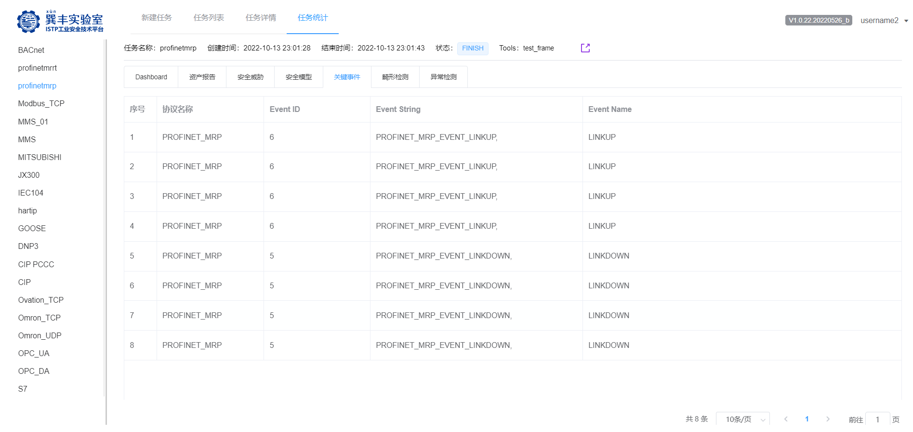

# 1. 关键事件（设备）-ISTP内网平台与竞品对比报告

## 1.1. ISTP内网平台关键事件（设备）能力

### 1.1.1. 测试范围

ISTP内网平台支持13+种协议关键事件识别，关键事件识别测试覆盖31种工业协议,覆盖10+厂商40款设备，具体关键事件-协议测试范围见下表；关键事件-设备范围见下表。

| **ID** | **协议名称**   |
|--------|----------------|
| 1      | BACnet         |
| 2      | CIP            |
| 3      | CIP PCCC       |
| 4      | COAP           |
| 5      | DNP3           |
| 6      | GOOSE          |
| 7      | hartip         |
| 8      | IEC104         |
| 9      | JX300          |
| 10     | MITSUBISHI     |
| 11     | MMS            |
| 12     | Modbus_TCP     |
| 13     | Omron_TCP      |
| 14     | Omron_UDP      |
| 15     | OPC_DA         |
| 16     | OPC_UA         |
| 17     | Ovation_TCP    |
| 18     | profinetdcp    |
| 19     | profinetmrp    |
| 20     | profinetmrrt   |
| 21     | profinetptcp   |
| 22     | RSSP-1         |
| 23     | S7             |
| 24     | S7 PLUS        |
| 25     | srtp           |
| 26     | Focas          |
| 27     | xhican         |
| 28     | ht_2000r_tcp   |
| 29     | na_rtu_oil_tcp |
| 30     | Etrol SL304    |
| 31     | gdw3761        |

| ID  | 厂商       | 设备数量 |
|-----|------------|----------|
| 1   | Siemens    | 10       |
| 2   | Schneider  | 6        |
| 3   | RockWell   | 6        |
| 4   | GE         | 1        |
| 5   | ABB        | 1        |
| 6   | OMRON      | 6        |
| 7   | MITSUBISHI | 3        |
| 8   | FANUC      | 1        |
| 9   | 上海新华   | 1        |
| 10  | 丹东华通   | 1        |
| 11  | 南大傲拓   | 1        |
| 12  | 安控       | 1        |
| 13  | 海为       | 1        |
| 14  | Delta      | 1        |

### 1.1.2. 测试结果

ISTP内网平台支持27种协议关键事件识别，协议关键事件识别能力已展示到ISTP内网服务平台中（平台地址：<http://istp.qianxin-inc.cn/>
），目前识别结果如下图所示。

#### 1.1.2.1. Bacnet 

#### 1.1.2.2. CIP

#### 1.1.2.3. CIP PCCC

#### 1.1.2.4. COAP

#### 1.1.2.5. DNP3

#### 1.1.2.6. Hartip

#### 1.1.2.7. IEC104

#### 1.1.2.8. JX300

#### 1.1.2.9. MMS

#### 1.1.2.10. Modbus_TCP

#### 1.1.2.11. Omron_TCP

#### 1.1.2.12. Omron_UDP

#### 1.1.2.13. OPC_UA

#### 1.1.2.14. Profinetdcp

#### 1.1.2.15. Profinetmrp

#### 1.1.2.16. Profinetmrrt

#### 1.1.2.17. Profinetptcp

#### 1.1.2.18. S7

#### 1.1.2.19. S7 PLUS

#### 1.1.2.20. Srtp

#### 1.1.2.21. Focas

#### 1.1.2.22. Xhican

#### 1.1.2.23. ht_2000r_tcp

#### 1.1.2.24. na_rtu_oil_tcp

#### 1.1.2.25. Etrol SL304

#### 1.1.2.26. RSSP-1

#### 1.1.2.27. gdw3761

## 1.2. 竞品关键事件识别能力

针对上述关键事件分别在5款竞品上测试，并分析5款竞品对上述关键事件识别的支持情况，具体如下。

注：5款竞品分别为

1)  威努特.工控安全监测与审计系统.MA5612

2)  六方云.工业审计系统 LinSec-A2000

3)  绿盟.工控安全审计系统（SAS-ICSNX3-310A-C-NDE-02）

4)  启明星辰.天阗工控安全监测与审计系统NT3000-ICS300-HD

5)  长扬科技.工业监测审计系统INA-1000X-2F4E

### 1.2.1. 威努特关键事件识别能力

威努特支持11种协议关键事件识别，包括S7、CIP COMM、CIP Logix5000、CIP
PCCC

、FINS_TCP、FINS_UDP、Modbus
TCP、OPC_DA、MMS、IEC104、DNP3协议，如下图所

示。

图：S7协议

图：CIP协议

图：FINS协议

图：Modbus协议

图：IEC104协议

图：DNP3协议

图：OPC协议

图：MMS协议

### 1.2.2. 六方云关键事件识别能力

六方云支持4种协议关键事件识别，包括S7、Modbus TCP、Modbus
UMAS、GE-SRTP协议，如下图所示。

图：S7协议、GE-SRTP协议

图：Modbus TCP协议

图：Modbus UMAS协议（解析为Modbus TCP）

### 1.2.3. 绿盟关键事件识别能力

绿盟支持7种协议关键事件的识别，包括S7、CIP COMM、CIP PCCC、Modbus
TCP、OPC_DA、IEC104、DNP3，如下图所示。

图：S7协议

图：CIP协议

图：Modbus TCP协议、DNP3协议

图：IEC104、OPC DA

### 1.2.4. 长扬科技关键事件识别能力

长扬科技不支持协议关键事件的识别。

### 1.2.5. 启明星辰关键事件识别能力

启明星辰支持3种协议关键事件的识别，包括CIP COMM、Modbus
TCP、IEC104，如下图所示。

图：CIP COMM

图：Modbus TCP

图：IEC104

## 1.3. ISTP内网平台和竞品能力对比分析

基于上述测试结果，关键事件识别能力由强到弱，依次为ISTP\>威努特\>绿盟\>六方云\>启明星辰\>长扬科技，对比分析结果见下表。

| **ISTP与竞品** | **协议关键事件识别数量** |
|----------------|--------------------------|
| 长扬科技       | 0                        |
| 启明星辰       | 3                        |
| 六方云         | 4                        |
| 绿盟           | 7                        |
| 威努特         | 11                       |
| ISTP           | 27                       |
