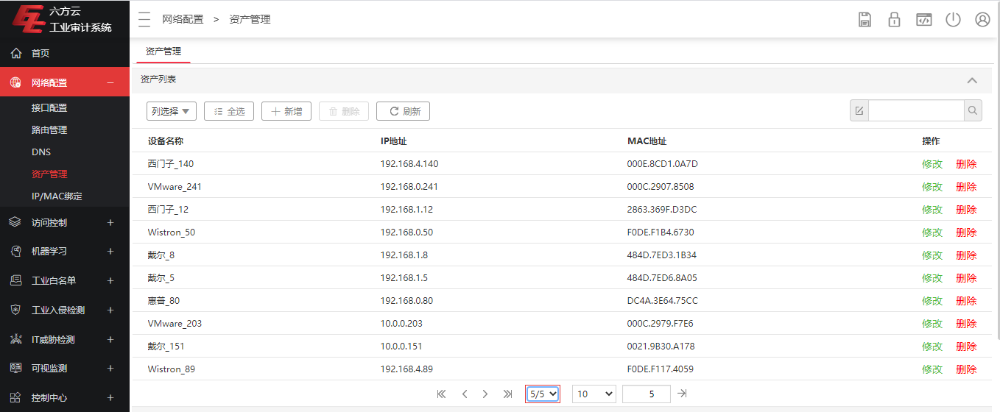

# 1. 资产识别-ISTP内网平台与竞品对比报告

## 1.1. ISTP内网平台资产被动识别能力

### 1.1.1. 测试范围

ISTP内网平台支持14+厂商26+款设备的资产被动识别能力，具体可支持资产的IP地址、MAC地址、厂商、系列及型号等信息的识别。测试资产覆盖16个厂商69款设备,具体测试范围见下表。

| 序号 | 厂商       | 资产                                        |
|------|------------|---------------------------------------------|
| 1    | SIEMENS    | Siemens.S7_200_Smart_CPU_st30               |
| 2    |            | Siemens.S7_200_Smart_CPU_st40               |
| 3    |            | Siemens.S7_300_CPU_314c-2_PNDP              |
| 4    |            | Siemens.S7_300_CPU_314c-2                   |
| 5    |            | Siemens.S7_300_CPU_315-2_PNDP               |
| 6    |            | Siemens.S7_300_CPU_315F-2                   |
| 7    |            | Siemens.S7_300_CPU_317-2_PNDP               |
| 8    |            | Siemens.S7_400_CPU_412-5h_PNDP              |
| 9    |            | Siemens.S7_400_CPU_412-5H                   |
| 10   |            | Siemens.S7_400_CPU_414-5h                   |
| 11   |            | Siemens.S7-400_CPU417-5H PN/DP              |
| 12   |            | Siemens.S7_1200_CPU_1212c_DCDCRly           |
| 13   |            | Siemens.S7_1200_CPU_1214C_ACDCRLY           |
| 14   |            | Siemens.S7_1200_CPU_1214c_DCDCDC            |
| 15   |            | Siemens.S7_1200_CPU_1215c_DCDCDC            |
| 16   |            | Siemens.SIMATIC S7-1500.CPU 1515-2 PN       |
| 17   |            | Siemens.S7-1500_CPU_1516-3_PNDP             |
| 18   |            | Siemens.CP_343-1_advanced                   |
| 19   |            | Siemens.CP_343-1                            |
| 20   |            | Siemens.CP_443-1_advanced                   |
| 21   |            | Siemens.CP_443-1                            |
| 22   |            | Siemens.CP_1543-1                           |
| 23   |            | Siemens.SINUMERIK_808D                      |
| 24   | Schneider  | Schneider.TM218_LADE40DRPHN                 |
| 25   |            | Schneider.M340_CPU340-20                    |
| 26   |            | Schneider.M340_BMXP342020                   |
| 27   |            | Schneider.M340.NOE0100(P3420102)            |
| 28   |            | Schneider.M580.BMEP582040                   |
| 29   |            | Schneider.Quantum_CPU_31110                 |
| 30   |            | Schneider.Quantum_CPU_65150                 |
| 31   |            | Schneider.Premium.TSXP571634M               |
| 32   | Rockwell   | RockWell_AB.CompactLogix_1769-L33ER         |
| 33   |            | RockWell_AB.CompactLogix_1769-L35E          |
| 34   |            | RockWell_AB.ControlLogix_1756_EN2T_C        |
| 35   |            | RockWell_AB.ControlLogix_1756-EN2T_D        |
| 36   |            | RockWell_AB.ControlLogix_1756-EN2T_D\_CASIA |
| 37   | ABB        | ABB.AC800F.PM802F                           |
| 38   |            | ABB.AC800M.PM856                            |
| 39   | GE         | GE.VersaMax_IC200CPUE05.Private             |
| 40   | HollySys   | HollySys.DCS.MACS                           |
| 41   |            | HollySys.NuclearPower.HEROS_RTS             |
| 42   |            | HollySys.NuclearPower.NB220                 |
| 43   |            | HollySys.NuclearPower.NM-DP                 |
| 44   |            | HollySys.NuclearPower.NM220                 |
| 45   |            | HollySys.PLC.LK220                          |
| 46   |            | HOLLiAS MACS-KK-CU01                        |
| 47   | HoneyWell  | Honey.Controller.C300                       |
| 48   |            | Honey.Firewall.FTE_Control_Firewall         |
| 49   | MITSUBISHI | MITSUBISHI.LCPU.L06CPU                      |
| 50   |            | MITSUBISHI.MELSEC-L.L02CPU                  |
| 51   |            | MITSUBISHI.QCPU.Q02HCPU                     |
| 52   |            | MITSUBISHI.QCPU.Q03UDECPU                   |
| 53   | OMRON      | OMRON.CJ2M.CPU31                            |
| 54   |            | OMRON.CJ2M.CPU35                            |
| 55   |            | OMRON.CP.CP1H-XA40DT-D                      |
| 56   |            | OMRON.CP.CP1H.XA40DR_A                      |
| 57   |            | OMRON.CP1L-EL20DR-D                         |
| 58   |            | OMRON.CP1L-EL20DT-D                         |
| 59   |            | OMRON.CP1L-EM40DR-D                         |
| 60   | Etrol      | Etrol.RTU_PLC.Super32                       |
| 61   |            | Etrol.RTU.SuperE32L601                      |
| 62   |            | Etrol.RTU.SL304                             |
| 63   | 华通       | HUATONG.2000R_CS                            |
| 64   | NA         | NA.PLC.CPU401-0401                          |
| 65   |            | NA.RTU.CPU401.1101                          |
| 66   | BR         | BR.X20.CP1484                               |
| 67   | DCCE       | DCCE.MAC.MAC1000ProgramableController       |
| 68   | MOXA       | MOXA.RemoteIO.E1242                         |
| 69   | Phoenix    | Phoenix.100.ILC330ETH                       |

### 1.1.2. 测试结果

上述资产被动识别能力已展示到ISTP内网服务平台中（平台地址：<http://istp.qianxin-inc.cn/>
），目前识别结果如下图所示。

图1：SIEMENS资产被动识别能力

图2：Schneider资产被动识别能力

图3：Rockwell资产被动识别能力

图4：ABB资产被动识别能力

图5：GE资产被动识别能力

图6：HollySys资产被动识别能力

图7：Honeywell资产被动识别能力

图8：MITSUBISHI资产被动识别能力

图9：OMRON资产被动识别能力

图10：Etrol/华通/NA资产被动识别能力

图11：BR资产被动识别能力

图12：DCCE资产被动识别能力

图13：MOXA资产被动识别能力

图14：Phoenix资产被动识别能力

## 1.2. 竞品资产被动识别能力

针对上述资产分别在5款竞品上测试，并分析5款竞品对上述资产识别的支持情况，具体如下。

注：5款竞品分别为

1)  威努特.工控安全监测与审计系统.MA5612

2)  六方云.工业审计系统 LinSec-A2000

3)  绿盟.工控安全审计系统（SAS-ICSNX3-310A-C-NDE-02）

4)  启明星辰.天阗工控安全监测与审计系统NT3000-ICS300-HD

5)  长扬科技.工业监测审计系统INA-1000X-2F4E

### 1.2.1. 威努特资产识别能力

威努特支持资产的IP地址、MAC地址信息识别，如下图所示。

### 1.2.2. 六方云资产识别能力

六方云支持资产的厂商、IP地址、MAC地址信息识别，共识别到8个厂商，包括西门子、施耐德、ABB、罗克韦尔、
MOXA、三菱、欧姆龙和Honeywell，如下图所示。

### 1.2.3. 绿盟资产识别能力

绿盟支持资产的厂商、IP地址、MAC地址信息识别，共识别到4个厂商，包括Siemens、Schneide、Rockwell和Omron，如下图所示。

### 1.2.4. 长扬科技资产识别能力

长扬科技支持资产的厂商、IP地址、MAC地址信息识别，共识别到4个厂商，包括Siemens、HollySys、Honeywell和MITSUBISHI，如下图所示。

### 1.2.5. 启明星辰资产识别能力

启明星辰不支持资产被动识别

## 1.3. ISTP内网平台和竞品能力对比分析

基于上述测试结果，资产被动识别能力由强到弱，依次为ISTP\>六方云\>绿盟、长扬科技\>威努特\>启明星辰，对比分析结果见下表。

| **ISTP与竞品** | **IP地址** | **MAC地址** | **厂商** | **系列** | **型号** | **识别厂商/数量** |
|----------------|------------|-------------|----------|----------|----------|-------------------|
| 威努特         | √          | √           | /        | /        | /        | 0/69              |
| 六方云         | √          | √           | √        | /        | /        | 8/69              |
| 绿盟           | √          | √           | √        | /        | /        | 4/69              |
| 长扬科技       | √          | √           | √        | /        | /        | 4/69              |
| 启明星辰       | /          | /           | /        | /        | /        | 0/0               |
| ISTP           | √          | √           | √        | √        | √        | 16/69             |
